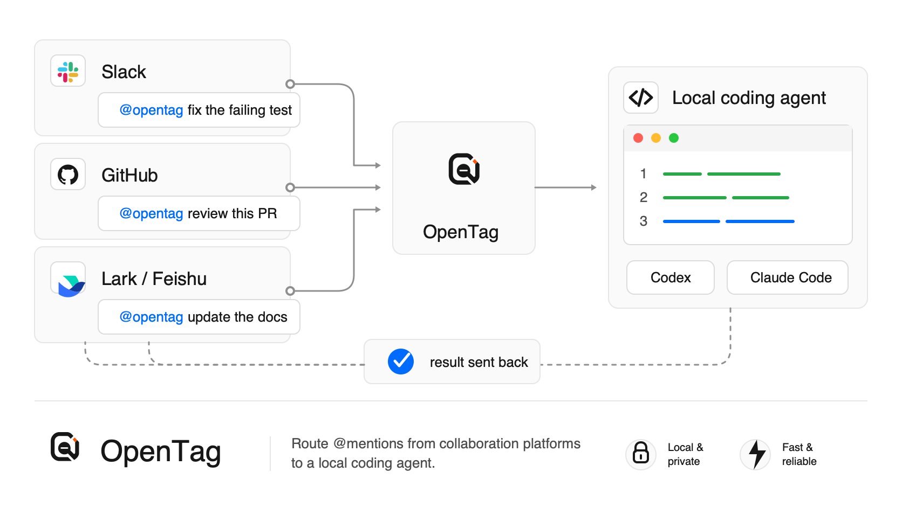
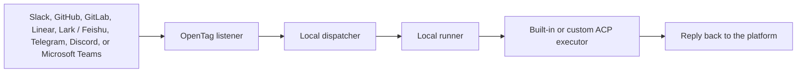

<p align="center">
  <picture>
    <source media="(prefers-color-scheme: dark)" srcset="./assets/readme-logo-dark.png">
    <source media="(prefers-color-scheme: light)" srcset="./assets/readme-logo-light.png">
    
  </picture>
</p>

<p align="center">
  <b>English</b> ·
  <a href="./README.zh-CN.md">简体中文</a>
</p>

# OpenTag

**[opentag.im](https://opentag.im)**

**Turn an existing work thread into a governed agent work loop.**

[](https://github.com/amplifthq/opentag/releases)
[](https://www.npmjs.com/package/@opentag/cli)
[](https://github.com/amplifthq/opentag/actions/workflows/ci.yml)
[](https://github.com/amplifthq/opentag/actions/workflows/ci.yml)
[](https://github.com/amplifthq/opentag/actions/workflows/ci.yml)
[](https://nodejs.org/)
[](#license)

OpenTag lets your team mention a coding agent from the collaboration platforms they already use. It turns that source thread into a bounded, auditable run: OpenTag curates the context packet, checks permissions and executor capability, runs an ACP coding agent locally, records an agent work ledger, and returns concise artifacts and safe next actions to the same thread.

The concrete setup still connects Slack, GitHub, GitLab, Linear, Lark / Feishu, Telegram, Discord, or Microsoft Teams to a local coding agent. The product boundary is broader than a connector: OpenTag is source-thread-native, local-first, and executor-neutral, so work stays where it already has context while the agent's inputs, authority, outputs, and callbacks remain reviewable.

## Demo

Mention OpenTag in Slack, approve the suggested action, and get a real GitHub pull request.

https://github.com/user-attachments/assets/86edc4e1-7de9-4d07-a0ba-847fa6438191



## Source-Thread Action Receipts

OpenTag treats the thread where a request starts as the approval surface for agent-proposed system-of-record mutations. When an agent suggests a change, OpenTag renders a compact receipt that shows what will change, whether it is ready to apply, and which decision is safe now.

`Apply` appears only when the dispatcher confirms a configured adapter can execute the action. Otherwise the receipt shows setup or attention needed, and the local audit trail stays available through commands such as `opentag status --run <run_id>`.

Each run also keeps a local agent work ledger: the source event, admission decision, context packet snapshot, executor capability snapshot, produced artifacts, callback delivery, and final outcome stay available through status and dispatcher audit APIs without flooding the human thread.

## Quick Start

Requires Node.js 22 or newer.

```bash
npm install -g @opentag/cli@latest
opentag setup
```

No global install for one-off terminal-mode checks:

```bash
npx @opentag/cli setup
```

For background service mode, prefer the global install above so the service definition points at a stable CLI path instead of an `npx` temporary location.

`opentag setup` is the main entry point. It walks through the practical choices needed to run OpenTag locally:

1. Which language should the CLI use?
2. Where should OpenTag listen?
3. Which coding agent should OpenTag use?
4. Which local project should OpenTag work on?
5. Which platform credentials should OpenTag save?
6. How should OpenTag keep running?

After setup saves the config, choose how OpenTag should run:

1. Keep running after I close this terminal (recommended)
2. Run only in this terminal
3. Do not start now

For scripted setup, use `--service` to choose the recommended background mode without the final prompt:

```bash
opentag setup --service
```

`--service` installs and starts the local background service after setup. Background service mode uses LaunchAgent on macOS and `systemd --user` on Linux; on other platforms, use terminal mode with `opentag start` for now. If you skip startup or stop OpenTag later, run `opentag start` manually for terminal mode or `opentag service start` for background mode.

Once OpenTag is running, mention it from the connected platform:

```text
@opentag investigate this
```

OpenTag runs the selected coding agent locally and replies back through that platform.

## Ask Your Agent

If you use Codex or Claude Code and do not want to set this up by hand, start a new agent session and paste:

```text
Help me set up OpenTag from https://github.com/amplifthq/opentag.

Use the published OpenTag CLI. Please:
1. Check that Node.js 22 or newer is available.
2. Install or run the published OpenTag CLI.
3. Run opentag setup and help me choose Slack, GitHub, GitLab, Linear, Lark / Feishu, Telegram, Discord, or Microsoft Teams, a coding agent, and a local project.
4. When platform credentials are needed, open the matching setup guide in the repository and walk me through it.
5. When setup asks how OpenTag should run, choose the recommended background service option. Then verify with opentag service status and opentag doctor. If service mode is unsupported or I choose terminal mode, use opentag start and keep that terminal open.

Do not invent credentials or secrets. Ask me before entering any token, app ID, channel ID, repository, or project path.
```

Agents can also follow the full agent-readable setup checklist in [Agent-readable install guide](docs/agent-install.md).

## Platform Guides

Use the guide for the platform you choose in `opentag setup`.

| Platform | Best first path | Guide |
| --- | --- | --- |
| Slack | Use Socket Mode for local development | [Slack setup](docs/platforms/slack.en.md) |
| GitHub | Use a repository webhook and GitHub token | [GitHub setup](docs/platforms/github.en.md) |
| GitLab | Use a project Note Hook and GitLab access token | [GitLab setup](docs/platforms/gitlab.en.md) |
| Linear | Use a workspace webhook and OAuth App install | [Linear setup](docs/platforms/linear.en.md) |
| Lark / Feishu | Scan the Personal Agent QR code from setup | [Lark / Feishu setup](docs/platforms/lark.en.md) |
| Telegram | Use BotFather token with local getUpdates polling | [Telegram setup](docs/platforms/telegram.en.md) |
| Discord | Use a bot token with local Gateway delivery | [Discord setup](docs/platforms/discord.en.md) |
| Microsoft Teams | Use an Azure Bot and public HTTPS tunnel to the local dispatcher (relay mode is not supported) | [Microsoft Teams setup](docs/platforms/teams.en.md) |

## What Runs Locally

`opentag setup` can install and start the recommended background service, run OpenTag in the current terminal, or save config without starting. `opentag setup --service` skips the final prompt and installs plus starts the background service on macOS or Linux. Both service and terminal modes start:

- a local dispatcher
- a local runner for the project you selected
- the selected platform listener

Stop terminal mode with:

```text
Ctrl-C
```

Stop background service mode with:

```bash
opentag service stop
```

OpenTag stores local config here:

```text
~/.config/opentag/config.json
```

Runtime state and isolated worktrees default to:

```text
~/.local/state/opentag
```

## Privacy

OpenTag's CLI path is local-first.

- There is no OpenTag cloud service in the local CLI flow.
- Platform credentials are stored on your computer with private file permissions.
- Codex, Claude Code, Cursor, OpenCode, Hermes, and OpenClaw run through ACP against your local checkout. OpenClaw cancellation is currently best effort.
- Platform APIs receive only the messages needed to acknowledge, reply, and apply actions you approve.

## Supported Coding Agents

| Coding agent | Status | Notes |
| --- | --- | --- |
| Codex | Ready when `npx` and login are available | Pinned Registry package `@agentclientprotocol/codex-acp@1.1.2` |
| Claude Code | Ready when `npx` and login are available | Pinned Registry package `@agentclientprotocol/claude-agent-acp@0.59.0` |
| Cursor | Ready when Cursor CLI is installed and logged in | Uses the installed `cursor-agent acp` command |
| OpenCode | Ready when `npx` and provider configuration are available | Pinned official package `opencode-ai@1.18.1`; ACP launches in pure mode so external plugins cannot write non-protocol data to stdout |
| Hermes | Ready when installed | Uses `hermes -p <profile> acp` with a configured local provider |
| OpenClaw | Ready when installed and its Gateway is configured | Uses the local `openclaw acp` bridge; cancellation is currently best effort and does not claim termination of Gateway-owned tool subprocesses |
| Echo | Dev/test only | Does not run a real coding agent |

## Commands

| Command | What it does |
| --- | --- |
| `opentag setup` | Create or update local OpenTag config, then offer to start it |
| `opentag setup --service` | Create or update local OpenTag config, then install and start the background service |
| `opentag start` | Start the local OpenTag stack in the current terminal |
| `opentag pair` | Pair this local runner with a remote relay |
| `opentag service install` | Install the OpenTag background service |
| `opentag service start` | Start the installed background service |
| `opentag service stop` | Stop the installed background service |
| `opentag service restart` | Restart the installed background service |
| `opentag service status` | Show background service status and runtime readiness |
| `opentag service logs` | Show recent background service logs |
| `opentag service uninstall` | Uninstall the OpenTag background service |
| `opentag service autostart enable` | Enable background service login autostart |
| `opentag service autostart disable` | Disable background service login autostart |
| `opentag status` | Show local config and runtime status; add `--run <run_id>` or `--channel provider:account/conversation` for scoped detail |
| `opentag cancel` | Request cancellation for a run or the active run in a source container |
| `opentag doctor` | Check dispatcher, bindings, checkouts, and executors |
| `opentag ingest` | Ingest a fenced local external agent progress or completion event |
| `opentag ingest-template` | Print a shell template or manifest for local external agent hook ingest |
| `opentag platforms` | List platform setup support and runtime capabilities |
| `opentag executors` | List available coding agents and runtime capabilities |
| `opentag maintenance prune-source-deliveries` | Prune stale source delivery replay keys after their runs are terminal |
| `opentag config path` | Print the local config path |
| `opentag config show` | Print redacted local config |

## Uninstall

Remove the global CLI package:

```bash
npm uninstall -g @opentag/cli
```

Remove local OpenTag config and state:

```bash
rm -rf ~/.config/opentag ~/.local/state/opentag
```

## How It Works



The important boundary: platforms receive messages, OpenTag coordinates the run, and the coding agent executes on your machine.

The default loop is artifact-first rather than chat-first: a final reply should compress the outcome, link to artifacts such as reports, patches, pull request intents, or next actions, and point back to local audit/status for detail.

## Developer Docs

- [Platform setup guides](docs/platforms/README.md)
- [Configuration](docs/configuration.md)
- [Hook ingest contract](docs/hook-ingest.md)
- [Adapter authoring](docs/adapter-authoring.md)
- [Real integration smoke test](docs/real-integration-smoke-test.md)
- [Live E2E smoke harness](docs/live-e2e-smoke-harness.md)
- [Replay harness](docs/replay-harness.md)
- [Agent Work Protocol](docs/agent-work-protocol.md)
- [ACP-First Agent Runtime and Channel Integration](docs/acp-first-agent-runtime-design.md)
- [Local npm release guide](docs/npm-release.md)

## Development

From source:

```bash
corepack pnpm install
corepack pnpm test
corepack pnpm typecheck
corepack pnpm build
```

Install the local development command:

```bash
corepack pnpm opentag-dev
opentag-dev setup
```

## Packages

Current public release: `v0.6.0`. The npm package family is published under the `@opentag` scope.

| Package | Purpose |
| --- | --- |
| [`@opentag/cli`](https://www.npmjs.com/package/@opentag/cli) | Setup and local runtime command line interface |
| [`@opentag/local-runtime`](https://www.npmjs.com/package/@opentag/local-runtime) | In-process local dispatcher, runner, and platform runtime |
| [`@opentag/core`](https://www.npmjs.com/package/@opentag/core) | Protocol schemas, types, mention parsing, and JSON Schema exports |
| [`@opentag/client`](https://www.npmjs.com/package/@opentag/client) | Dispatcher HTTP client |
| [`@opentag/slack`](https://www.npmjs.com/package/@opentag/slack) | Slack Socket Mode, Events API handling, and thread replies |
| [`@opentag/github`](https://www.npmjs.com/package/@opentag/github) | GitHub webhook handling, comments, PR helpers, and action application |
| [`@opentag/gitlab`](https://www.npmjs.com/package/@opentag/gitlab) | GitLab webhook handling, note replies, merge request helpers, and action application |
| [`@opentag/linear`](https://www.npmjs.com/package/@opentag/linear) | Linear webhook handling, issue comments, and issue action application |
| [`@opentag/lark`](https://www.npmjs.com/package/@opentag/lark) | Lark / Feishu ingress, Personal Agent registration, and replies |
| [`@opentag/telegram`](https://www.npmjs.com/package/@opentag/telegram) | Telegram polling/webhook normalization, bot replies, and source-thread controls |
| [`@opentag/discord`](https://www.npmjs.com/package/@opentag/discord) | Discord Gateway/webhook slash-command interactions and channel replies |
| [`@opentag/teams`](https://www.npmjs.com/package/@opentag/teams) | Microsoft Teams Bot Framework ingest, channel replies, and action apply |
| [`@opentag/runner`](https://www.npmjs.com/package/@opentag/runner) | Executor contracts plus the generic ACP host and built-in launch profiles |
| [`@opentag/store`](https://www.npmjs.com/package/@opentag/store) | SQLite persistence |
| [`@opentag/dispatcher`](https://www.npmjs.com/package/@opentag/dispatcher) | Embeddable dispatcher and callback sinks |

## License

OpenTag is licensed under the MIT License. See [LICENSE](LICENSE).
