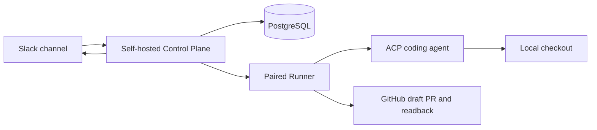

<p align="center">
  <picture>
    <source media="(prefers-color-scheme: dark)" srcset="./assets/readme-logo-dark.png">
    <source media="(prefers-color-scheme: light)" srcset="./assets/readme-logo-light.png">
    
  </picture>
</p>

<p align="center"><b>English</b> · <a href="./README.zh-CN.md">简体中文</a></p>

# OpenTag

**Your persistent AI teammate in Slack, running on a computer you control.**

[](https://github.com/amplifthq/opentag/actions/workflows/ci.yml)
[](./LICENSE)

OpenTag gives an engineering channel a teammate that remains reachable through
your self-hosted Control Plane, even when its paired computer is offline. Mention
it in Slack to queue work; when the Runner is ready, it invokes your coding agent
through ACP against the local checkout and reports status, decisions, and evidence
back in the same thread.

Your source code, local checkout and worktrees, coding-agent login/session, and
GitHub credential stay on the Runner. Slack credentials and the Control Plane's
service credentials stay on the Control Plane. It keeps coordination truth—not
a copy of your development machine.

## Quick start

### 1. Start the self-hosted presence

Prerequisites: Docker Compose, PostgreSQL through the included Compose profile,
and a public HTTPS origin that Slack can reach.

```bash
git clone https://github.com/amplifthq/opentag.git
cd opentag/deploy/compose
cp .env.example .env
docker compose --env-file .env up --build
```

Before the last command, replace every placeholder in `.env` and create the
file-backed Slack and relay-content secrets described in the
[Compose guide](deploy/compose/README.md).

### 2. Pair the computer where work happens

```bash
npm install -g @opentag/cli@0.11.0
opentag setup --relay https://relay.example.com
opentag start
```

Setup configures and pairs one Runner, GitHub Project Target, and ACP executor.
The paired-only runtime requires the trusted self-hosted Control Plane URL and
bootstrap pairing credential; it has no standalone local mode.
When prompted, enter the exact `OPENTAG_SLACK_PROJECT_TARGET_ID` used by the
active Slack binding; setup registers it through the Runner credential and
verifies the Control Plane readback before pairing completes.
If this machine ran a pre-reset OpenTag checkout, point `OPENTAG_CONFIG_HOME`
and `OPENTAG_STATE_DIR` at new empty directories. The paired Runner does not
reinterpret or rewrite an earlier config or SQLite database.
Use `opentag pair` only to finish an interrupted pairing or pair an existing
unpaired configuration. Verify the exact installation before the first real
request:

```bash
opentag doctor
opentag status
```

### 3. Work with the teammate in Slack

```text
@OpenTag investigate the failing check and propose a fix
```

If the Runner is offline, the request remains visibly queued. If work needs a
decision, Slack shows the exact action that needs attention. A provider timeout
or ambiguous side effect remains `outcome_unknown`; OpenTag does not invent a
success or blindly replay it.

## Why a teammate, not another agent dashboard

- **Present in the channel** — the self-hosted relay receives Slack requests and
  can explain that the Runner is offline instead of disappearing with the laptop.
- **Works where the code already lives** — the coding agent runs on the paired,
  user-controlled computer with its approved local Project Target.
- **Keeps one conversation** — requests, queue state, approvals, blockers, and
  final evidence return to the originating Slack thread.
- **Reports facts, not theater** — executor output, Run state, GitHub publication,
  and provider delivery remain separate facts with separate evidence.
- **Writes only through explicit authority** — draft PR publication is a distinct,
  governed stage; OpenTag does not auto-merge or let chat text broaden access.

## How it works


```mermaid
flowchart LR
  S[Slack channel] --> C[Self-hosted Control Plane]
  C --> P[(PostgreSQL)]
  C --> R[Paired Runner]
  R --> A[ACP coding agent]
  A --> W[Local checkout]
  R --> G[GitHub draft PR and readback]
  C --> S
```

Slack is the only Source App in the supported team profile. GitHub is a Project
Target plus an optional publication and evidence provider; it is not a second
request inbox. One paired Runner is the execution owner. The Control Plane owns
the canonical Run, Attempt, lease, approval, delivery journal, and terminal
assessment.

The console exposes Agent Presence as a read-only projection of facts that
already exist: active Slack binding, Project Target, fresh Runner readiness, and
the binding's current Run. It adds no second lifecycle or mutable presence state.

## Presence states

| State | What it means |
| --- | --- |
| `available` | Slack binding, Project Target, Runner, and fresh readiness all exist. |
| `queued` | A request is durably waiting for the paired Runner. |
| `working` | The current fenced Attempt is assigned or running on a ready Runner. |
| `needs_attention` | A decision, reconciliation, or conflicting active work needs a human. |
| `offline` | The binding exists, but the Runner has no fresh readiness receipt. |
| `setup_required` | The Slack binding, Project Target, or Runner is incomplete. |

These states are projections, not commands. They cannot claim, retry, cancel, or
settle work.

## Deliberately narrow

The current product path is:

```text
Slack presence → self-hosted Control Plane → one paired Runner
→ one ACP coding agent → optional GitHub draft PR/evidence → Slack
```

This repository does not currently claim managed hosting, high availability,
other Source Apps, GitHub webhook ingress, multi-Runner scheduling, ambient
memory, automatic merge, or a general software-factory planner. There is no
`local_direct` compatibility mode: the supported product always pairs a Runner
with the self-hosted Control Plane.

## AI agent integration

OpenTag's Runner launches configured coding agents through ACP and keeps raw tool
output out of the team thread. The repository includes an agent-readable install
guide and an OpenTag skill so Codex, Claude Code, and other coding agents can help
with local setup without asking users to paste secrets into chat.

- [Agent-readable install guide](docs/agent-install.md)
- [ACP integration](docs/acp-agent-integration.md)
- [OpenTag skill](skills/opentag/SKILL.md)

## Verify the repository

```bash
corepack pnpm install --frozen-lockfile
corepack pnpm typecheck
corepack pnpm test
corepack pnpm build
```

These checks prove local source behavior only. They do not prove a deployed
relay, a live Slack delivery, a GitHub publication, or installation-level
availability.

## Documentation

- [Compose installation](deploy/compose/README.md)
- [Slack Source App setup](docs/platforms/slack.en.md)
- [GitHub Project Target and publication](docs/platforms/github.en.md)
- [Control Plane deployment](docs/control-plane-deployment.md)
- [Always-on ingress with local execution](docs/adr/0004-always-on-channel-ingress-local-execution.md)
- [Configuration reference](docs/configuration.md)
- [Team-relay canary](docs/testing/team-relay-canary.md)

## Contributing

Contributions are welcome. See [CONTRIBUTING.md](CONTRIBUTING.md) for the local
development workflow and pull-request checks.

## License

[MIT](./LICENSE)
