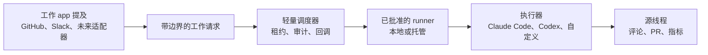

<p align="center">
  <picture>
    <source media="(prefers-color-scheme: dark)" srcset="./assets/readme-logo-dark.png">
    <source media="(prefers-color-scheme: light)" srcset="./assets/readme-logo-light.png">
    
  </picture>
</p>

<p align="center">
  <a href="./README.md">English</a> ·
  <b>简体中文</b>
</p>

# OpenTag

**在工作真正发生的应用里 @ 你的 agent —— 开源实现。**

[](#状态)
[](https://github.com/amplifthq/opentag/releases)
[](https://www.npmjs.com/package/@opentag/core)
[](https://www.typescriptlang.org/)
[](https://nodejs.org/)
[](#许可证)

Claude Tag 让这套交互变得直观：在工作已经发生的地方提及（mention）一个 agent，结果就回到同一个线程里。OpenTag 是它的开源版本：工作线程里的一次提及会变成一个带边界的运行（scoped run），一个经过批准的本地或托管 runner 执行 Claude Code、Codex 或你自己的 agent，结果带着审计轨迹返回到源线程。

OpenTag 不是又一个 AI 工作台。它把 agent 带到你已经在用的工作项线程里。

> OpenTag 与 Anthropic 没有关联。它是对 Claude Tag 所揭示的 agent 提及工作流的一个开源实现。


真实的烟雾测试已经验证了：

- GitHub issue → OpenTag → 本地 Claude Code → 提交分支 → pull request → GitHub 回调
- Slack 线程 → OpenTag → 本地 Claude Code → Slack 最终回调（过程进度仅记录在审计中）
- 模型建议的下一步 → 源线程回复 `apply 1` → 审批决策 → 应用计划或 child run fallback

## 快速开始

需要 Node 22.x 和 pnpm 9.x。

```bash
pnpm install
pnpm test
pnpm smoke:protocol
pnpm smoke:slack-protocol
pnpm build
```

本地 app 与 runner 的配置：把 `.env.example` 复制为 `.env`，并替换其中的占位值。

烟雾测试会启动一个进程内（in-process）的调度器（dispatcher），使用临时 SQLite 数据库，并通过 client SDK 跑通整条协议链路。想体验完整的本地 runner 闭环，从 [examples/github-to-echo](examples/github-to-echo/README.md) 开始；想走产品演示路径，用 [examples/github-to-pr](examples/github-to-pr/README.md)。

## 为什么选择 OpenTag

- **把 agent 带到工作线程** —— 从 GitHub、Slack 或未来的工作 app 适配器里提及一个已批准的 agent，而不是把上下文复制到另一个独立的 AI 聊天工作台。
- **掌控执行发生的位置** —— 用 `opentagd` 把编码工作留在本地，或使用实现了相同认领（claim）与回调契约的托管/自定义 runner。
- **使用任意已批准的执行器（executor）** —— 内置适配器覆盖 `echo`、`claude-code` 和 `codex`；自定义 runner 可以实现同样的契约。
- **只返回结果，不返回噪音** —— 人类线程收到有用的确认和最终结果，而详细过程留在审计事件和指标里。
- **把模型建议变成安全动作** —— 最终回调可以渲染标签、review 请求、后续运行或 PR 工作等建议下一步；用户在同一个源线程里批准、应用、拒绝或继续。
- **治理对外写操作** —— 仓库绑定、权限范围、上下文包（context packet）和审计轨迹让 agent 的权限边界变得明确。

## 工作原理



1. 入口（ingress）适配器把平台评论或 app 提及归一化成一个统一的工作请求。
2. 调度器校验范围、持久化运行记录、管理租约（lease），并记录审计事件。
3. 本地或托管的 runner 只认领它被明确绑定去处理的工作。
4. 执行器在映射到的代码检出（checkout）里完成工作，并返回结构化结果。
5. 回调适配器更新源线程，但不会刷屏。
6. 如果模型返回建议动作，用户可以在源线程回复 `approve 1`、`apply label`、`continue 1` 或 `reject 1`；OpenTag 会记录审批、创建应用计划、执行已支持的适配器写操作，或在动作还需要模型继续处理时创建带上一轮上下文的 child run。

## 为什么团队可以信任这个闭环

- **有边界的认领** —— runner 只认领明确绑定给它的仓库或频道。
- **本地优先的执行** —— 仓库访问、构建工具、凭据和私有上下文都可以留在用户自己的检出里。
- **分支隔离** —— 编码执行器在 `opentag/<runId>` 分支或 worktree 上工作，而不是直接写入目标分支。
- **脏工作区保护** —— 当本地检出处于不安全状态时，Codex 和 Claude Code 执行器会拒绝运行。
- **显式的对外写操作** —— pull request、状态变更、标签以及其他系统级改动都需要显式的能力授权或配置。
- **安静的回调** —— 源线程只收到确认、阻塞项和最终结果；常规进度默认仅保留在审计中。
- **可审计的上下文** —— 工作线程（Work Thread）、上下文包（Context Packet）和审计轨迹（Audit Trail）会保留：请求了什么、包含了什么、由谁运行、之后发生了什么。

## 当前可用 / 实验性 / 未来

| 领域 | 状态 | 说明 |
| --- | --- | --- |
| GitHub | 当前可用 | Issue 评论、PR review 评论、回调，以及在配置后由本地守护进程运行创建 pull request |
| Slack | 当前可用 | App 提及、频道到仓库的绑定、线程回调，以及仅审计的常规进度 |
| 本地守护进程 | 当前可用 | 轮询、心跳、基于租约的认领、仓库绑定，以及脏工作区保护 |
| 执行器 | 当前可用 | `echo`、Claude Code（`claude --print`）、Codex（`codex exec`），以及自定义执行器契约 |
| 协议运行时 | 当前可用 | 工作线程、上下文包、审计轨迹、运行准入（run admission）、安静回调、建议动作、源线程审批、应用计划、child-run fallback 和指标 |
| Telegram 和 Lark | 实验性适配器 | 归一化器、入口 app 和回调辅助函数都已具备；把它们当作适配器扩展面，而不是 v0 的主黄金路径 |
| 托管多租户控制平面 | 未来加固 | 调度器目前刻意保持轻量；面向生产的多租户托管还需要更多运维加固 |

OpenTag 的协议层刻意保持轻薄：强模型可以提出更丰富的下一步，OpenTag 负责限制副作用，把这些建议变成可审计、可批准、可回放的结构化意图。更长期的协议词汇在 [Agent Work Protocol](docs/agent-work-protocol.md) 里：能力契约、策略解析、建议变更、审批、应用计划（apply plan）、适配器编译器和血缘（lineage）。

对 v0 产品集成来说，优先使用源线程原生路径：在源线程渲染建议动作，并用 `@opentag/client` 的 `submitThreadAction` 提交用户回复。底层的 proposal、approval、apply-plan、policy-rule 和 mutation-mapping HTTP route 仍是面向适配器作者和运行时测试的实验性协议 API，不是主产品入口。

## 软件包

当前公开发布版本：`v0.1.0`。npm 包族发布在 `@opentag` scope 下。

```bash
pnpm add @opentag/core @opentag/client @opentag/dispatcher @opentag/github @opentag/slack @opentag/runner @opentag/store
```

| 软件包 | 用途 |
| --- | --- |
| [`@opentag/core`](https://www.npmjs.com/package/@opentag/core) | 协议 schema、类型、提及解析，以及 JSON Schema 导出 |
| [`@opentag/client`](https://www.npmjs.com/package/@opentag/client) | 面向入口 app、runner、管理初始化和测试的调度器 HTTP 客户端 |
| [`@opentag/dispatcher`](https://www.npmjs.com/package/@opentag/dispatcher) | 可嵌入的 Hono 调度器与回调 sink |
| [`@opentag/github`](https://www.npmjs.com/package/@opentag/github) | GitHub 事件归一化、评论渲染、PR 辅助函数和变更辅助函数 |
| [`@opentag/slack`](https://www.npmjs.com/package/@opentag/slack) | Slack 事件归一化、线程键（thread key）和回调辅助函数 |
| [`@opentag/store`](https://www.npmjs.com/package/@opentag/store) | 针对运行、审计事件、租约、策略和指标的 SQLite/Drizzle 持久化 |
| [`@opentag/runner`](https://www.npmjs.com/package/@opentag/runner) | 执行器契约，外加 echo、Claude Code 和 Codex 适配器 |

可运行的 app 位于 `apps/dispatcher`、`apps/opentagd`、`apps/github-probot` 和 `apps/slack-events`。

## 示例与指南

- [GitHub to echo](examples/github-to-echo/README.md) —— 手动跑通的端到端、GitHub 形态的本地 runner 闭环。
- [GitHub to PR](examples/github-to-pr/README.md) —— 从 GitHub issue 提及到本地执行、pull request、回调和审计证据的产品演示路径。
- [Embedded dispatcher](examples/embedded-dispatcher/README.md) —— 在另一个 Node 服务里内嵌 OpenTag。
- [Custom runner](examples/custom-runner/README.md) —— 用 `@opentag/client` 和 `@opentag/runner` 构建第三方 runner。
- [Configuration](docs/configuration.md) —— 映射调度器、守护进程、入口、回调和 runner 的配置。
- [Adapter authoring](docs/adapter-authoring.md) —— 在不改变执行模型的前提下新增工作 app 适配器。
- [Real integration smoke test](docs/real-integration-smoke-test.md) —— 真实的 GitHub 和 Slack 配置、触发与调试顺序。
- [Design](docs/design.md) —— 产品方向、系统形态、包边界和 v0 范围。
- [Agent Work Protocol](docs/agent-work-protocol.md) —— 上下文包、安静回调、审批、血缘和治理语义。
- [Versioning](docs/versioning.md) —— 发布与包版本规则。

## Agent Skill

为任意受支持的 agent 安装 OpenTag skill：

```bash
npx skills add https://github.com/amplifthq/opentag --skill opentag --agent '*'
```

## 状态

OpenTag 是一个年轻的 v0 项目，面向本地评估、集成实验和早期 SDK 反馈。当前代码库已经跑通了最早的 GitHub 和 Slack 适配器闭环：ingress → dispatcher → runner → callback，包含包级别的 SDK 使用和真实的本地烟雾测试。

接下来的工作方向：

- 更完善的托管初始化流程
- GitHub Project 中状态与优先级的字段映射
- 更多工作台适配器和适配器编译器
- 针对特定适配器的上下文包脱敏与分类钩子
- 面向多租户调度器部署的生产加固

## 社区交流

欢迎扫码加入 OpenTag 微信交流群，一起讨论用法、反馈问题、参与共建：

<p align="center">
  
</p>

> 群二维码会定期更新。如果已经失效，欢迎到 [GitHub Issues](https://github.com/amplifthq/opentag/issues) 留言，我们会更新最新的入群方式。

## 许可证

OpenTag 基于 MIT 许可证开源。详见 [LICENSE](LICENSE)。
