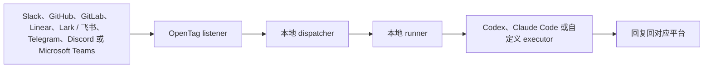

<p align="center">
  <picture>
    <source media="(prefers-color-scheme: dark)" srcset="./assets/readme-logo-dark.png">
    <source media="(prefers-color-scheme: light)" srcset="./assets/readme-logo-light.png">
    
  </picture>
</p>

<p align="center">
  <a href="./README.md">English</a> ·
  <b>简体中文</b>
</p>

# OpenTag

**[opentag.im](https://opentag.im)**

**把现有协作线程变成一个可授权、可审计、可回放的 agent 工作回路。**

[](https://github.com/amplifthq/opentag/releases)
[](https://www.npmjs.com/package/@opentag/cli)
[](https://github.com/amplifthq/opentag/actions/workflows/ci.yml)
[](https://github.com/amplifthq/opentag/actions/workflows/ci.yml)
[](https://github.com/amplifthq/opentag/actions/workflows/ci.yml)
[](https://nodejs.org/)
[](#许可证)

OpenTag 让团队可以在已经使用的协作软件里提及一个 coding agent。它会把这个源线程变成一个有边界、可审计的 run：OpenTag 组装 context packet，检查权限和 executor capability，在你的电脑上运行 Codex 或 Claude Code，记录 agent work ledger，然后把简洁的产物和安全下一步回复回同一个 thread。

具体 setup 仍然会把 Slack、GitHub、GitLab、Linear、Lark / 飞书、Telegram、Discord 或 Microsoft Teams 连接到本地 coding agent。但 OpenTag 不只是 connector：它保持 source-thread-native、local-first、executor-neutral，让工作留在已有上下文里，同时让 agent 看到了什么、被允许做什么、产出了什么、回调到了哪里都可以复盘。

## 演示

在 Slack 里提及 OpenTag，审批建议动作，然后得到一个真实的 GitHub pull request。

https://github.com/user-attachments/assets/86edc4e1-7de9-4d07-a0ba-847fa6438191


## 源线程操作回执

OpenTag 把请求发生的原始 thread 当成审批 agent 建议变更的地方。agent 提出要修改系统记录时，OpenTag 会渲染一个简洁的 action receipt，说明将要改什么、现在是否可以 apply，以及当前最安全的决策是什么。

只有 dispatcher 确认已有 adapter 可以执行该 action 时，OpenTag 才会显示 `Apply`。否则 receipt 会显示需要 setup 或需要注意的原因，同时保留本地 audit 入口，例如 `opentag status --run <run_id>`。

每个 run 也会保留本地 agent work ledger：source event、admission decision、context packet snapshot、executor capability snapshot、产物、callback delivery 和最终结果都可以通过 status / audit API 查看，而不会把 agent 内部过程刷到人类 thread。

## 快速开始

需要 Node.js 20 或更新版本。

```bash
npm install -g @opentag/cli@latest
opentag setup
```

一次性终端模式检查可以不全局安装：

```bash
npx @opentag/cli setup
```

如果要使用后台服务模式，建议优先全局安装，这样生成的服务定义会指向稳定的 CLI 路径，而不是 `npx` 的临时目录。

`opentag setup` 是主要入口。它会逐步询问：

1. CLI 使用哪种语言？
2. OpenTag 要监听哪个平台？
3. OpenTag 要使用哪个 coding agent？
4. OpenTag 可以操作哪个本地项目？
5. OpenTag 要保存哪些平台凭据？
6. OpenTag 应该如何持续运行？

setup 保存配置后，可以选择运行方式：

1. 关闭终端后继续运行（推荐）
2. 只在当前终端里运行
3. 暂时不启动

脚本化 setup 可以使用 `--service` 直接选择推荐的后台服务模式：

```bash
opentag setup --service
```

`--service` 会在 setup 后安装并启动本地后台服务。后台服务模式在 macOS 上使用 LaunchAgent，在 Linux 上使用 `systemd --user`；其他平台暂时使用终端模式，通过 `opentag start` 运行。如果当时跳过启动，或者后来停止了 OpenTag，可以用 `opentag start` 进入终端模式，或用 `opentag service start` 启动后台服务。

OpenTag 启动后，在已连接的平台里提及它：

```text
@opentag investigate this
```

OpenTag 会在本地运行你选择的 coding agent，并通过对应的平台回复结果。

## 让 Agent 帮你

如果你已经在用 Codex 或 Claude Code，但不熟悉 CLI，可以新开一个 agent session，直接粘贴：

```text
请帮我从 https://github.com/amplifthq/opentag 设置 OpenTag。

请使用已发布的 OpenTag CLI。请你：
1. 检查这台电脑是否已经安装 Node.js 20 或更高版本。
2. 安装或运行已发布的 OpenTag CLI。
3. 运行 opentag setup，并帮我选择 Slack、GitHub、GitLab、Linear、Lark / 飞书、Telegram、Discord 或 Microsoft Teams、coding agent，以及本地项目。
4. 如果需要平台凭据，请打开仓库里对应的平台设置教程，并一步一步带我完成。
5. setup 询问 OpenTag 应该如何运行时，请选择推荐的后台服务选项。然后用 opentag service status 和 opentag doctor 验证设置是否成功。如果当前平台不支持 service 模式，或者我选择终端模式，请运行 opentag start 并保持那个终端打开。

不要编造凭据或密钥。输入任何 token、app ID、channel ID、repository 或 project path 之前，都要先问我。
```

## 平台教程

在 `opentag setup` 里选择哪个平台，就看对应教程。

| 平台 | 推荐首选路径 | 教程 |
| --- | --- | --- |
| Slack | 本地开发优先使用 Socket Mode | [Slack 配置](docs/platforms/slack.zh-CN.md) |
| GitHub | 使用 repository webhook 和 GitHub token | [GitHub 配置](docs/platforms/github.zh-CN.md) |
| GitLab | 使用 project Note Hook 和 GitLab access token | [GitLab 配置](docs/platforms/gitlab.zh-CN.md) |
| Linear | 使用 workspace webhook 和 OAuth App 安装 | [Linear 配置](docs/platforms/linear.zh-CN.md) |
| Lark / 飞书 | 在 setup 里扫码创建 Personal Agent | [Lark / 飞书配置](docs/platforms/lark.zh-CN.md) |
| Telegram | 使用 BotFather token 和本地 getUpdates polling | [Telegram 配置](docs/platforms/telegram.zh-CN.md) |
| Discord | 使用 bot token 和本地 Gateway 接收 | [Discord 配置](docs/platforms/discord.zh-CN.md) |
| Microsoft Teams | 使用 Azure Bot 和公网 HTTPS tunnel 连接本地 dispatcher（暂不支持 relay 模式） | [Microsoft Teams 配置](docs/platforms/teams.zh-CN.md) |

## 本地会运行什么

`opentag setup` 可以安装并启动推荐的后台服务，也可以在当前终端运行 OpenTag，或者只保存配置暂不启动。`opentag setup --service` 会跳过最后的选择，并在 macOS 或 Linux 上安装和启动后台服务。service 模式和终端模式都会启动：

- 本地 dispatcher
- 绑定到你所选项目的本地 runner
- 已选择的平台监听器

停止终端模式：

```text
Ctrl-C
```

停止后台服务：

```bash
opentag service stop
```

OpenTag 本地配置默认写到：

```text
~/.config/opentag/config.json
```

Runtime state 和隔离 worktree 默认写到：

```text
~/.local/state/opentag
```

## 隐私和本地优先

OpenTag 的 CLI 路径是本地优先的。

- 本地 CLI 流程里没有 OpenTag cloud service。
- 平台凭据保存在你的电脑上，并使用私有文件权限。
- Codex、Claude Code 和 Hermes 会通过 ACP 在你的本地 checkout 上运行。
- 平台 API 只会收到 OpenTag 用来确认、回复和执行已审批 action 所需的消息。

## 支持的 Coding Agent

| Coding agent | 状态 | 说明 |
| --- | --- | --- |
| Codex | 已支持 | 内置 `codex-acp`，复用现有 Codex 登录 |
| Claude Code | 已支持 | 内置 `claude-agent-acp`，复用现有 Claude 登录 |
| Hermes | 安装后支持 | 使用 `hermes -p <profile> acp` 和已配置的本地 provider |
| Echo | 仅开发/测试 | 不运行真实 coding agent |

## 常用命令

| 命令 | 用途 |
| --- | --- |
| `opentag setup` | 创建或更新本地 OpenTag 配置，并询问是否立即启动 |
| `opentag setup --service` | 创建或更新本地 OpenTag 配置，并安装、启动后台服务 |
| `opentag start` | 在当前终端启动本地 OpenTag stack |
| `opentag pair` | 将本地 runner 与远程 relay 配对 |
| `opentag service install` | 安装 OpenTag 后台服务 |
| `opentag service start` | 启动已安装的后台服务 |
| `opentag service stop` | 停止已安装的后台服务 |
| `opentag service restart` | 重启已安装的后台服务 |
| `opentag service status` | 查看后台服务状态和 runtime readiness |
| `opentag service logs` | 查看近期后台服务日志 |
| `opentag service uninstall` | 卸载 OpenTag 后台服务 |
| `opentag service autostart enable` | 启用后台服务的登录自启动 |
| `opentag service autostart disable` | 禁用后台服务的登录自启动 |
| `opentag status` | 查看本地配置和运行状态；可以加 `--run <run_id>` 或 `--channel provider:account/conversation` 查看局部详情 |
| `opentag cancel` | 请求取消某个 run，或取消 source container 中的 active run |
| `opentag doctor` | 检查 dispatcher、bindings、checkout 和 executor |
| `opentag ingest` | 上报经过 active-attempt fence 校验的本地外部 agent 进度或完成事件 |
| `opentag ingest-template` | 打印本地外部 agent hook ingest 的 shell 模板或 manifest |
| `opentag platforms` | 查看平台 setup 支持状态 |
| `opentag executors` | 查看可用 coding agent |
| `opentag maintenance prune-source-deliveries` | 清理已终结 run 的过期 source delivery 重放 key |
| `opentag config path` | 输出本地配置文件路径 |
| `opentag config show` | 输出脱敏后的本地配置 |

## 卸载

移除全局 CLI 包：

```bash
npm uninstall -g @opentag/cli
```

删除本地 OpenTag 配置和状态：

```bash
rm -rf ~/.config/opentag ~/.local/state/opentag
```

## 工作方式



最重要的边界是：平台负责接收和回复消息，OpenTag 负责任务调度，coding agent 在你的电脑上执行。

## 开发者文档

- [平台配置教程](docs/platforms/README.md)
- [配置说明](docs/configuration.md)
- [Hook ingest contract](docs/hook-ingest.md)
- [适配器开发](docs/adapter-authoring.md)
- [真实集成 smoke test](docs/real-integration-smoke-test.md)
- [Live E2E smoke harness](docs/live-e2e-smoke-harness.md)
- [Replay harness](docs/replay-harness.md)
- [Agent Work Protocol](docs/agent-work-protocol.md)
- [本地 npm 发布指南](docs/npm-release.md)

## 本地开发

从源码运行：

```bash
corepack pnpm install
corepack pnpm test
corepack pnpm typecheck
corepack pnpm build
```

安装本地开发命令：

```bash
corepack pnpm opentag-dev
opentag-dev setup
```

## 软件包

当前公开发布版本：`v0.5.0`。OpenTag 的 npm 包发布在 `@opentag` scope 下。

| 包 | 用途 |
| --- | --- |
| [`@opentag/cli`](https://www.npmjs.com/package/@opentag/cli) | setup 和本地 runtime CLI |
| [`@opentag/local-runtime`](https://www.npmjs.com/package/@opentag/local-runtime) | 进程内本地 dispatcher、runner 和平台 runtime |
| [`@opentag/core`](https://www.npmjs.com/package/@opentag/core) | 协议 schema、类型、mention 解析和 JSON Schema 导出 |
| [`@opentag/client`](https://www.npmjs.com/package/@opentag/client) | Dispatcher HTTP client |
| [`@opentag/slack`](https://www.npmjs.com/package/@opentag/slack) | Slack Socket Mode、Events API 和回复 |
| [`@opentag/github`](https://www.npmjs.com/package/@opentag/github) | GitHub webhook、评论、PR helper 和 action apply |
| [`@opentag/gitlab`](https://www.npmjs.com/package/@opentag/gitlab) | GitLab webhook、note 回复、MR helper 和 action apply |
| [`@opentag/linear`](https://www.npmjs.com/package/@opentag/linear) | Linear webhook、issue comment 回复和 issue action apply |
| [`@opentag/lark`](https://www.npmjs.com/package/@opentag/lark) | Lark / 飞书入口、Personal Agent 注册和回复 |
| [`@opentag/telegram`](https://www.npmjs.com/package/@opentag/telegram) | Telegram polling/webhook 规范化、bot 回复和 source-thread controls |
| [`@opentag/discord`](https://www.npmjs.com/package/@opentag/discord) | Discord Gateway/webhook slash-command interactions 和频道回复 |
| [`@opentag/teams`](https://www.npmjs.com/package/@opentag/teams) | Microsoft Teams Bot Framework 入口、频道回复和 action apply |
| [`@opentag/runner`](https://www.npmjs.com/package/@opentag/runner) | Executor 契约，以及 Echo、Claude Code、Codex 适配器 |
| [`@opentag/store`](https://www.npmjs.com/package/@opentag/store) | SQLite 持久化 |
| [`@opentag/dispatcher`](https://www.npmjs.com/package/@opentag/dispatcher) | 可嵌入 dispatcher 和 callback sink |

## 许可证

OpenTag 基于 MIT License 开源。详见 [LICENSE](LICENSE)。

## 交流微信群

🎉 欢迎大家在群里交流：
• 使用体验/bug 反馈
• 功能建议/场景需求
• 开源贡献与共创想法

我们会在群里同步项目进展和版本更新。欢迎大家一起玩、一起提 issue、一起把 OpenTag 做得更好！👏


