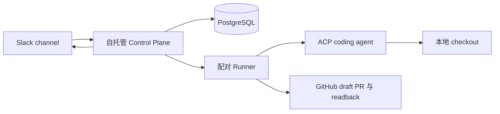

<p align="center">
  <picture>
    <source media="(prefers-color-scheme: dark)" srcset="./assets/readme-logo-dark.png">
    <source media="(prefers-color-scheme: light)" srcset="./assets/readme-logo-light.png">
    
  </picture>
</p>

<p align="center"><a href="./README.md">English</a> · <b>简体中文</b></p>

# OpenTag

**常驻 Slack、运行在你自己电脑上的 AI teammate。**

[](https://github.com/amplifthq/opentag/actions/workflows/ci.yml)
[](./LICENSE)

OpenTag 让工程频道拥有一个长期可找到的 teammate。自托管 Control Plane 保持在线，
即使配对电脑暂时离线，也能接收 Slack 请求并明确显示等待状态。Runner 就绪后，它通过
ACP 在本地 checkout 调用你的 coding agent，再把状态、决策和证据送回同一条讨论串。

源代码、本地 checkout 与 worktree、coding-agent 登录态/会话，以及 GitHub 凭据都留在
Runner。Slack 凭据和 Control Plane 自身的服务凭据留在 Control Plane。Control Plane
保存的是协调事实，而不是开发电脑的副本。

## 快速开始

### 1. 启动自托管 presence

需要 Docker Compose、内置 Compose 配置所使用的 PostgreSQL，以及 Slack 可访问的公网
HTTPS origin。

```bash
git clone https://github.com/amplifthq/opentag.git
cd opentag/deploy/compose
cp .env.example .env
docker compose --env-file .env up --build
```

执行最后一条命令前，替换 `.env` 中的全部占位值，并按
[Compose 指南](deploy/compose/README.md) 创建 Slack 与 relay-content 的文件型 secret。

### 2. 配对真正执行工作的电脑

```bash
npm install -g @opentag/cli@0.11.0
opentag setup --relay https://relay.example.com
opentag start
```

Setup 会配置并配对一个 Runner、GitHub Project Target 和 ACP executor。paired-only
runtime 必须使用可信的自托管 Control Plane URL 和 bootstrap pairing credential；它
没有可独立运行的本地模式。提示 Project Target ID 时，必须输入 active Slack binding 使用的
`OPENTAG_SLACK_PROJECT_TARGET_ID`；setup 会用 Runner credential 注册，并在 Control
Plane readback 精确一致后才完成 pairing。如果这台机器运行过 reset 之前的 OpenTag，
请把 `OPENTAG_CONFIG_HOME` 和 `OPENTAG_STATE_DIR` 指向新的空目录；paired Runner
不会解释或改写旧配置与 SQLite 数据库。只有 pairing 被中断，或已有配置仍未配对时，
才需要单独运行 `opentag pair`。第一条真实请求前，先核验这次安装：

```bash
opentag doctor
opentag status
```

### 3. 在 Slack 与 teammate 一起工作

```text
@OpenTag 调查失败的 check，并提出修复方案
```

Runner 离线时，请求会保持可见的排队状态；需要决策时，Slack 会显示需要关注的精确
动作。Provider 超时或外部副作用不明确时，结果保持 `outcome_unknown`；OpenTag 不会
虚构成功，也不会盲目重放。

## 为什么是 teammate，而不是又一个 agent dashboard

- **长期在频道里** — 自托管 relay 接收 Slack 请求；电脑离线时，它会解释等待原因，
  而不是跟着笔记本一起消失。
- **在代码真正所在的地方工作** — coding agent 运行于配对、由用户控制的电脑，只能
  访问批准过的本地 Project Target。
- **保持一条对话** — 请求、排队、审批、阻塞和最终证据都回到原 Slack 讨论串。
- **报告事实，不表演“正在工作”** — executor 输出、Run 状态、GitHub 发布和 provider
  delivery 是不同事实，各自需要证据。
- **只有明确授权才能写外部系统** — draft PR 发布是独立受治理阶段；OpenTag 不会自动
  merge，也不会让聊天文本扩大权限。

## 工作原理


```mermaid
flowchart LR
  S[Slack channel] --> C[自托管 Control Plane]
  C --> P[(PostgreSQL)]
  C --> R[配对 Runner]
  R --> A[ACP coding agent]
  A --> W[本地 checkout]
  R --> G[GitHub draft PR 与 readback]
  C --> S
```

当前团队配置只有 Slack 是 Source App。GitHub 是 Project Target，以及可选的发布与证据
provider，不是第二个请求入口。一个配对 Runner 拥有执行权；Control Plane 拥有唯一的
Run、Attempt、lease、审批、delivery journal 与终态判断。

控制台中的 Agent Presence 只是现有事实的只读投影：active Slack binding、Project
Target、最新 Runner readiness，以及该 binding 的当前 Run。它没有新增第二套生命周期，
也没有可变 presence 状态。

## Presence 状态

| 状态 | 含义 |
| --- | --- |
| `available` | Slack binding、Project Target、Runner 与最新 readiness 都存在。 |
| `queued` | 请求已持久接收，正在等待配对 Runner。 |
| `working` | 当前 fenced Attempt 已分配或正在 ready Runner 上执行。 |
| `needs_attention` | 决策、reconciliation 或冲突中的 active work 需要人工处理。 |
| `offline` | binding 存在，但 Runner 没有有效的 readiness receipt。 |
| `setup_required` | Slack binding、Project Target 或 Runner 尚未配完整。 |

这些状态只是投影，不能 claim、retry、cancel 或 settle 任何工作。

## 刻意收窄的产品边界

当前唯一产品主路径是：

```text
Slack presence → 自托管 Control Plane → 一个配对 Runner
→ 一个 ACP coding agent → 可选 GitHub draft PR/证据 → Slack
```

本仓库当前不宣称 managed hosting、高可用、其他 Source App、GitHub webhook ingress、
多 Runner 调度、ambient memory、自动 merge 或通用 software-factory planner。系统不再
提供 `local_direct` 兼容模式；当前产品始终把 Runner 配对到自托管 Control Plane。

## AI agent 集成

OpenTag Runner 通过 ACP 启动配置的 coding agent，并阻止原始 tool output 淹没团队讨论串。
仓库提供 agent-readable 安装指南和 OpenTag skill，让 Codex、Claude Code 等 coding agent
可以协助本地安装，而不要求用户把 secret 粘贴进聊天。

- [Agent-readable 安装指南](docs/agent-install.md)
- [ACP 集成](docs/acp-agent-integration.md)
- [OpenTag skill](skills/opentag/SKILL.md)

## 验证仓库

```bash
corepack pnpm install --frozen-lockfile
corepack pnpm typecheck
corepack pnpm test
corepack pnpm build
```

这些命令只证明本地源码行为，不证明已部署 relay、真实 Slack delivery、GitHub 发布或
安装级可用性。

## 文档

- [Compose 安装](deploy/compose/README.md)
- [Slack Source App 配置](docs/platforms/slack.zh-CN.md)
- [GitHub Project Target 与发布](docs/platforms/github.zh-CN.md)
- [Control Plane 部署](docs/control-plane-deployment.md)
- [Always-on ingress 与本地执行](docs/adr/0004-always-on-channel-ingress-local-execution.md)
- [配置参考](docs/configuration.md)
- [Team-relay canary](docs/testing/team-relay-canary.md)

## 参与贡献

欢迎贡献。请阅读 [CONTRIBUTING.md](CONTRIBUTING.md) 了解本地开发流程与 PR 检查。

## License

[MIT](./LICENSE)
