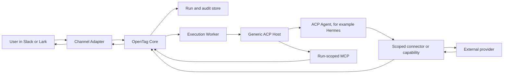
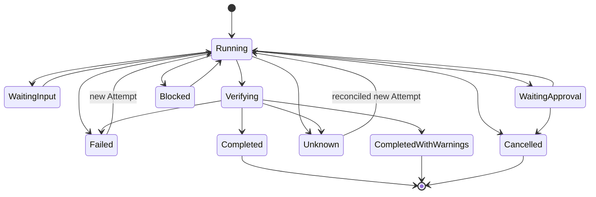

# ACP-First Agent Runtime and Channel Integration

## Status

- **Decision:** Accepted target architecture
- **Date:** 2026-07-12
- **Scope:** OpenTag Core, Channel adapters, ACP execution, permissions, approvals, presentation, and Worker boundaries
- **Replaces:** The target direction of `opentag.executor.v1` and the `stdio-jsonl-basic` executor profile

The first ACP runtime, governed permission path, native Slack/Lark channel normalization, and Balanced lifecycle presentation now implement this architecture. Remaining sections distinguish durable design invariants from follow-on breadth.

When this document conflicts with older design material about executor runtime, Channel ownership, repository requirements, or Run/session lifecycle, this document controls the target architecture. Existing documents remain useful records of the current implementation and earlier decisions.

OpenTag is an open-source, deployment-neutral system. The architecture supports local and self-hosted operation, keeps infrastructure choices replaceable, and does not require a repository, a specific chat platform, or a specific agent implementation.

## Executive decision

OpenTag owns the durable, governed **Run**. An agent executes a disposable **Attempt** through the standard [Agent Client Protocol (ACP) v1](https://agentclientprotocol.com/protocol/v1/overview). Slack, Lark, and other collaboration surfaces connect through a small OpenTag Channel protocol because ACP does not define channel event ingestion or message presentation.

The resulting split is:

- **Channel adapters** translate platform events into normalized OpenTag input and render OpenTag presentation back to the platform.
- **OpenTag Core** owns bindings, durable Run state, policy, approvals, capability grants, actions, artifacts, and evidence.
- **Execution Workers** create isolated execution envelopes, host ACP sessions, expose run-scoped context and tools, and report normalized results.
- **ACP agents** perform reasoning and work inside the envelope. Hermes is one supported ACP agent, not a privileged runtime.
- **Connectors and credential brokers** provide observable, scoped access to external systems without placing raw credentials in Run data or prompts.

The most important UX rule is:

> If OpenTag has no governance decision to make, the user should not have to interact with OpenTag.

## Context

Hermes already connects directly to Slack and Lark, and it can also act as an ACP agent. OpenTag should not replace working channel connectivity merely to insert another hop. Its value is the governed work loop that direct bot-to-agent wiring does not consistently provide:

- durable work state across agent process failures;
- explicit channel-to-agent and resource bindings;
- policy-driven capability grants;
- approval of material actions;
- independently verifiable receipts and evidence;
- interchangeable ACP agents without rewriting Channel integration;
- a quiet, consistent presentation layer across channels and agents.

This also means OpenTag must not make an ordinary one-message task slower or noisier than direct agent use. Governance is a selective control path, not a mandatory conversational ceremony.

## Goals

1. Use a standard agent runtime protocol instead of maintaining a custom executor event protocol.
2. Keep OpenTag authoritative for durable Run state while treating agent sessions as replaceable execution Attempts.
3. Support Slack, Lark, and additional channels without coupling channel code to any agent implementation.
4. Support Hermes and additional ACP agents through one Generic ACP Host.
5. Make repository work an optional specialization rather than a core assumption.
6. Allow agents to retain useful execution ability while keeping material external mutations scoped, observable, and auditable.
7. Keep setup understandable: choose a Channel, Agent, Connections, and Mode.
8. Keep the architecture implementable as a modular monolith plus an independent Worker.
9. Preserve quiet, source-thread-native interaction.
10. Make local and self-hosted operation first-class.

## Non-goals

This design does not attempt to:

- define a universal ontology for every external resource or action;
- copy an organization's identity graph into OpenTag;
- persist chain-of-thought or a complete raw ACP transcript;
- guarantee exactly-once execution across arbitrary external systems;
- depend on vendor-specific live-steering or session-resume extensions;
- introduce a message bus, workflow engine, or microservice fleet for the first implementation;
- make bot display names, Slack app names, or Lark app names part of execution identity;
- turn every channel message into a Run;
- require every action to be executed by OpenTag itself;
- require a Git repository, issue tracker, or code review system.

## Design principles

### One durable owner

OpenTag is the sole authority for Run state. ACP session state is useful execution state, but it is not the durable system of record.

### Protocols have narrow jobs

- `opentag.integration.v1` describes roles, discovery, bindings, and capabilities.
- `opentag.channel.v1` carries channel events and presentation commands.
- ACP v1 carries agent session setup, prompts, updates, permission requests, and cancellation.
- MCP optionally exposes structured run-scoped context and connector tools.
- The Control Plane–Worker contract carries leases, fencing, status, artifacts, and evidence.

No one protocol is stretched to cover all five jobs.

### Protocol is separate from transport

An executor manifest declares `agent-client-protocol` with `protocolVersion: 1`. A binding separately declares `stdio`. The transport is not embedded in the protocol name.

### Authority is an intersection

An agent's effective capability is never inferred from how capable the model or process appears to be. It is the intersection of independently administered boundaries:

```text
effective capability
  = channel allowance
  ∩ channel-to-agent binding
  ∩ agent profile/runtime allowance
  ∩ run-scoped grant
```

### Observable material effects

OpenTag does not need to execute every operation. It does need a trustworthy way to authorize, identify, reconcile, and verify material external mutations.

### Progressive complexity

The default experience exposes a few understandable choices. Advanced policy, connection custody, worker placement, and approval rules remain available without being required during basic setup.

## System shape



The Control Plane and Worker may run on the same machine in a simple deployment. They remain logically and process-separated so a Worker can be isolated or moved without changing agent or channel protocols.

## Protocol boundaries

### Integration manifest: `opentag.integration.v1`

The integration manifest remains the discovery and configuration layer. It declares which roles an integration can provide and how each role starts. It is not an event-stream protocol.

Agent declaration:

```json
{
  "protocol": "opentag.integration.v1",
  "id": "hermes",
  "label": "Hermes",
  "bindings": {
    "hermesAcp": {
      "kind": "stdio",
      "command": "hermes",
      "args": ["acp"]
    }
  },
  "roles": {
    "agent": {
      "protocol": "agent-client-protocol",
      "protocolVersion": 1,
      "binding": "hermesAcp",
      "workspace": { "sessionCwd": "required" }
    }
  }
}
```

`workspace.sessionCwd: "required"` is a manifest attestation that the Agent's
real file tools honor the ACP session `cwd`. It is not negotiated runtime proof
and does not turn `cwd` into a sandbox. The integration schema rejects an ACP
Agent role when this required attestation is absent, before the Generic ACP Host
is constructed. Integrators make it only after worktree and scratch conformance
tests pass.

A Hermes integration may also declare a Channel role, but the two roles use isolated runtime profiles and processes.

### Channel protocol: `opentag.channel.v1`

ACP does not define Slack or Lark event intake, thread mapping, message actions, interactive cards, or delivery acknowledgements. OpenTag therefore keeps a deliberately small Channel protocol.

The Channel adapter has two responsibilities:

1. Normalize provider events into OpenTag Input Events.
2. Apply OpenTag Presentation Commands to the provider.

The protocol should carry provider identifiers as opaque strings and avoid a platform-independent imitation of every Slack or Lark concept.

Conceptual input:

```ts
interface ChannelInputEvent {
  protocol: "opentag.channel.v1";
  eventId: string;
  occurredAt: string;
  trigger: "mention" | "command" | "message_action" | "bound_thread_reply" | "automation";
  source: {
    kind: "channel_message";
    channel: ChannelRef;
    thread?: ThreadRef;
    actor: ActorRef;
  };
  text?: string;
  attachments?: ChannelAttachmentRef[];
  replyTarget: ChannelReplyTarget;
}
```

Conceptual output:

```ts
interface ChannelPresentationCommand {
  protocol: "opentag.channel.v1";
  commandId: string;
  replyTarget: ChannelReplyTarget;
  operation: "create" | "update" | "reply";
  presentation: RunPresentation;
}
```

Platform-specific payloads may exist behind adapter capabilities, but they do not leak into Core Run semantics.

### Executor protocol: ACP v1

The Generic ACP Host is the ACP client. The agent is the ACP server process.

The [ACP v1 lifecycle](https://agentclientprotocol.com/protocol/v1/overview) already provides the runtime primitives OpenTag needs:

- initialization and capability negotiation;
- optional authentication;
- `session/new` and optional session loading;
- `session/prompt` and streamed session updates;
- permission requests;
- cancellation.

ACP uses JSON-RPC 2.0. For the first implementation, OpenTag uses ACP over stdio and should build on the official [TypeScript SDK](https://github.com/agentclientprotocol/typescript-sdk) instead of maintaining hand-written protocol types.

The ACP Host is responsible for:

- spawning the configured agent command;
- completing ACP initialization;
- creating a session with an absolute `cwd`;
- attaching optional run-scoped MCP servers;
- converting the normalized Input Snapshot into an agent prompt;
- collecting session updates into internal Attempt events;
- mediating permission requests against OpenTag policy and approval state;
- sending cancellation when an Attempt is redirected or stopped;
- collecting outputs, artifacts, and reported evidence;
- terminating the process when the Attempt ends.

ACP session loading, resuming, and closing are optional capabilities in the [session setup specification](https://agentclientprotocol.com/protocol/v1/session-setup). OpenTag may use them as an optimization, but correctness cannot depend on them.

ACP cancellation is advisory at the protocol layer. After a bounded grace period, the Worker may terminate the agent process and execution envelope. Fencing prevents late output from that terminated Attempt from changing the Run.

### Run-scoped MCP

ACP requires agents to support stdio MCP servers supplied during session creation. OpenTag uses this standard extension point for optional structured context and tools.

The run-scoped MCP may expose resources such as:

- the immutable Input Snapshot;
- current Run summary and output contract;
- granted resource references;
- approved action proposals;
- prior verified checkpoint summaries;
- artifact metadata;
- connector tools allowed by current grants.

The baseline remains prompt plus `cwd`. An ACP-conformant agent that does not use OpenTag-specific MCP resources must still be able to complete a simple Run.

OpenTag does not add custom ACP methods for Run state, approvals, or artifacts.

### Control Plane–Worker contract

The Worker contract is an OpenTag internal scheduling boundary, not an agent protocol. It contains:

- attempt lease and expiry;
- fencing token;
- execution envelope specification;
- immutable Input Snapshot reference;
- profile and capability references;
- heartbeat and normalized status;
- artifact and evidence submission;
- action reconciliation requests;
- terminal Attempt result.

ACP remains local between the Worker and agent process. This avoids exposing agent stdio across a network and keeps filesystem and process control with the Worker that owns the execution envelope.

## Core model

The core model intentionally stays small.

### Binding

A **Binding** connects one managed Channel scope to one Agent Profile, a default policy, and allowed Connections.

It answers: when an eligible event occurs here, which governed execution configuration owns it?

### Profile

A **Profile** describes how an agent or channel runtime starts and which capabilities the runtime may request. Human-friendly bot names are metadata only; they do not select an executor.

### ConnectionRef

A **ConnectionRef** identifies a configured external connection without containing its raw credentials. It includes provider, custody mode, capability metadata, and a broker reference.

### Run

A **Run** is the durable governed unit of work. It contains:

- goal;
- source and reply target;
- immutable Input Snapshot reference;
- resource grants;
- policy and autonomy mode;
- output contract;
- Attempt history;
- Actions;
- Artifacts and evidence;
- durable status.

A Run does not require a repository or work item.

### Attempt

An **Attempt** is one bounded execution of a Run by one agent session in one execution envelope. Attempts are replaceable; their verified outputs contribute to the Run.

### Grant

A **Grant** authorizes a structured capability for a bounded scope and lifetime. Grants are revocable and normally bound to a Run or Attempt.

### Action

An **Action** is a material external operation whose identity and result must survive retries. It carries a stable action ID, an idempotency or correlation key when supported, a proposal hash when approval is required, and reconciliation state.

### Artifact

An **Artifact** is durable output or evidence: a file, patch, report, structured result, provider receipt, verification record, or Input Snapshot.

Approval and evidence are records attached to Grants, Actions, or Artifacts. They do not require top-level domain objects in the first implementation.

## A Run is not a repository task

OpenTag's current engineering-oriented model remains a useful specialization, not the definition of a Run.

Examples of valid Runs include:

- prepare a code change in a Git workspace;
- update a Linear work item;
- summarize a channel thread and publish a document;
- investigate an incident using logs and a Kubernetes connection;
- collect information from the web and produce a report;
- reconcile a set of records in a database through an approved connector;
- coordinate a release across multiple provider APIs.

Resource and action kinds are namespaced strings owned by adapters, for example:

```text
github.repository
github.pull_request.create
linear.issue
linear.issue.update
slack.channel
lark.document.create
kubernetes.deployment.restart
postgres.query.read
```

Core understands grant, proposal, approval, action, receipt, and evidence semantics. It does not need to understand every provider's domain model.

For a repository Run, the Worker creates a repository workspace such as a worktree. For a non-repository Run, it creates a scratch working directory. In both cases the ACP `cwd` is absolute and scoped to the Attempt.

## Run and Attempt lifecycle



An agent reporting completion ends the Attempt. It does not by itself mark the Run successful. OpenTag evaluates the Run's Output Contract and evidence first.

Run statuses are:

- `running`
- `waiting_input`
- `waiting_approval`
- `verifying`
- `completed`
- `completed_with_warnings`
- `blocked`
- `failed`
- `cancelled`
- `unknown`

Evidence has an assurance state:

- **verified:** OpenTag or a trusted connector independently checked it;
- **reported:** the agent or provider reported it, but OpenTag did not independently verify it;
- **unverifiable:** the effect cannot be checked with the available connection and must not be represented as verified.

### Failure and retry

If an agent crashes after changing its workspace, OpenTag preserves the workspace delta and collected evidence. It does not silently treat an unknown partial workspace as a trusted checkpoint.

A new Attempt begins from the latest verified checkpoint. Reusing or loading the previous ACP session is an optional performance optimization only.

If a material external action may have occurred but its outcome is uncertain, the Action becomes `unknown`. Automatic retries stop until reconciliation determines whether the provider applied the operation.

## Triggering and follow-ups

A Channel adapter creates a Run only for deterministic triggers:

- explicit mention;
- explicit command;
- provider message action;
- reply in an already bound Run thread;
- an administrator-configured automation rule.

An LLM may help interpret a triggered request, but it cannot promote an ordinary background message into a Run by itself.

When a follow-up arrives during execution, it becomes a normalized Input Event.

- By default, OpenTag queues it for the next safe ACP prompt turn.
- An explicit **stop and redirect** cancels the current Attempt and starts a new Attempt using a new immutable Input Snapshot and the latest verified checkpoint.

The design does not depend on an agent-specific mid-turn steering API.

## Input and context retention

Every Run starts from a minimal immutable Input Snapshot containing only:

- the triggering event;
- the current thread content selected by deterministic collection rules;
- explicitly referenced attachments;
- normalized source and reply identifiers;
- collection time and provenance.

The content store is separate from the durable audit ledger. The audit ledger stores decisions, references, hashes, status changes, approvals, receipts, and verification outcomes. It does not need to retain a complete copy of channel history.

OpenTag does not persist hidden chain-of-thought. Raw ACP updates are retained only when they are necessary for a user-visible artifact, an operational diagnostic with an explicit retention policy, or a durable governance record.

## Identity and channel authorization

The first implementation uses channel-scoped authorization, not a canonical cross-provider identity system.

An authorized administrator creates a Binding for a Slack or Lark Channel scope. Eligible members of that scope inherit the Binding's baseline ability to start Runs. OpenTag stores the raw provider, tenant, channel, and actor identifiers on each event and decision for audit.

Bot presence alone is not authority. Adding an app to a Channel does not automatically create a managed Binding or grant access to an Agent Profile and Connections.

The two permission domains stay separate:

- A Channel administrator configures platform app scopes and where the bot may be used.
- An Agent administrator configures the agent runtime, filesystem/process envelope, and maximum runtime capabilities.
- An OpenTag administrator binds the Channel scope to an Agent Profile, Connections, and policy.

OpenTag does not duplicate Slack/Lark membership administration or an agent's internal permission configuration.

## Managed Channel ownership

Exactly one adapter owns a managed Channel scope at a time.

The binding pins a bounded, control-character-free provider `applicationId` and
an optional `botId`. Native adapters copy these values only from verified event
metadata or configured runtime identity into normalized event metadata. The
dispatcher rejects the Run before admission when a managed identity is absent
or different. A bot display name is never an ownership key.

In managed mode, a Hermes Channel runtime forwards eligible events to OpenTag and does not execute them directly. If OpenTag is unavailable, the adapter fails closed and reports that governed execution is unavailable. It must not silently fall back to direct Hermes execution because that would bypass policy and audit.

This rule applies equally to an OpenTag-native Channel adapter. Hermes-based and native adapters implement the same Channel protocol; they are drivers behind one architecture, not separate control paths.

## Hermes integration

Hermes can participate in two independent roles.

### Hermes as Channel adapter

Hermes Gateway can reuse its existing Slack and Lark connectivity to implement `opentag.channel.v1`.

It holds only Channel credentials and forwards normalized events and presentation acknowledgements. It does not receive executor capabilities or external Connections intended for agent work.

### Hermes as ACP executor

The Generic ACP Host starts `hermes acp` over stdio. Hermes binds its tools to the ACP session's `cwd`, as described in the [Hermes ACP documentation](https://hermes-agent.nousresearch.com/docs/user-guide/features/acp/).

The executor process receives only the Attempt envelope, run-scoped prompt/MCP context, and granted capabilities. It does not receive Slack or Lark app credentials.

### Required isolation

Even when both roles run on one machine, they use separate:

- processes;
- configuration profiles;
- environment variables;
- credential sets;
- logs;
- lifecycle supervision.

The integration manifest may package both roles for discoverability. Runtime isolation is still mandatory.

## Connections, credentials, and capability delegation

### Credential boundary

Core sees references, never raw secrets:

```ts
interface ConnectionRef {
  id: string;
  provider: string;
  custody: "agent" | "opentag" | "operator";
  brokerRef: string;
  declaredCapabilities: string[];
}

interface CapabilityGrant {
  id: string;
  connectionId: string;
  capability: string;
  resourceScope: Record<string, unknown>;
  runId: string;
  attemptId?: string;
  expiresAt?: string;
  constraints?: Record<string, unknown>;
}
```

Raw credentials must never appear in:

- Run records;
- ACP prompts;
- MCP resources;
- integration manifests;
- logs;
- approval payloads;
- audit events.

The credential vault and broker are pluggable interfaces. An operator may back them with local storage, an existing secret manager, or an isolated Worker-side service without changing Core objects.

### Connection custody modes

Three modes may coexist:

- **Agent-managed:** reuse a connector already configured inside Hermes or another agent. Assurance is limited to what that runtime can report or what OpenTag can independently observe.
- **OpenTag-managed:** a configured broker issues a scoped credential or presents a connector/MCP tool backed by the connection.
- **Operator-managed:** the credential remains in an operator-controlled vault or Worker environment; OpenTag handles only an opaque reference and receipt.

If a provider cannot issue a sufficiently scoped credential, OpenTag exposes a brokered Connector or MCP tool instead of handing the agent a long-lived raw token.

### Preserve agent capability

Push, deploy, publish, and other material operations do not always have to be executed by OpenTag. The agent may perform them when it receives a scoped, revocable, Attempt-bound capability.

The governance requirement is that the operation is observable:

- it has a stable Action ID;
- policy evaluated the exact capability and scope;
- any required approval refers to an immutable proposal hash;
- the provider operation uses an idempotency key or correlation identifier when available;
- a provider or connector receipt is captured;
- OpenTag can reconcile and verify the final state.

Unobservable external write access is unavailable by default. This protects governance without reducing agents to text-only planners.

## Policy, autonomy, and approvals

### Autonomy modes

OpenTag exposes three understandable modes:

- **Ask:** request approval for actions outside a narrow safe baseline.
- **Auto:** proceed inside deterministic policy and ask only for actions classified as requiring attention. This is the default.
- **Autonomous:** proceed without interactive approval inside administrator-defined hard limits.

`Autonomous` never means unrestricted. Channel, Binding, Profile, Connection, and Run limits continue to apply.

### Approval interaction

When OpenTag needs a decision, the primary choices are:

- **Allow once** — issue a capability for the proposed action only;
- **Allow for this run** — issue the structured capability for the remainder of the current Run;
- **Deny** — reject the proposal and return the decision to the agent.

Persistent policy changes are explicit administrator operations. They are not mixed into the ordinary approval prompt.

“Similar actions” must be represented by a deterministic structured capability, provider, resource scope, and constraint set. It must not be based on LLM semantic similarity.

An ACP permission request is input to OpenTag policy, not a pre-authorized action and not a UI payload. The ACP Host normalizes it into a capability or Action proposal. Auto may resolve it silently when policy already permits the exact request; otherwise the Channel Presentation Layer renders one OpenTag approval. The user must not receive both an ACP-native prompt and an OpenTag prompt for the same decision.

The ACP Host selects only a response option that is no broader than the OpenTag decision. An agent option such as `allow_always` may satisfy **Allow for this run** inside the disposable agent process, but it does not create a persistent OpenTag policy rule.

### Approval integrity

An action proposal is immutable and versioned. Its content hash covers material fields such as:

- action kind;
- provider and connection;
- target resource scope;
- intended mutation;
- relevant artifact version;
- constraints.

Any material change creates a new proposal and invalidates the previous approval.

The default rule is one authorized approver, with the first valid terminal decision winning. Quorum and separation-of-duties policies may be added as optional policy modules without changing the core lifecycle.

## Limits and guardrails

The default user-facing budget setting is **No custom limit**. Users do not need to estimate money, wall-clock time, or action count before starting ordinary work.

Internal safety and reliability guardrails are always present:

- bounded Worker lease;
- heartbeat and lost-Worker detection;
- retry ceiling;
- Attempt process and resource isolation;
- stable Action IDs;
- fencing tokens;
- idempotency and reconciliation rules;
- cancellation handling;
- separation of active Attempt compute time from total Run lifetime.

These are operational invariants, not configuration burdens placed on the user.

## Presentation and noise control

Raw ACP session updates never go directly to Slack or Lark. OpenTag owns the Channel Presentation Layer and converts runtime events into four tiers:

- **silent:** internal progress, tool details, heartbeats, and routine retries;
- **status:** meaningful phase change suitable for updating an existing Run Card;
- **attention-required:** approval, missing input, blocked state, or uncertain action;
- **terminal:** completed, completed with warnings, failed, cancelled, or unknown.

Each Run has one mutable **Run Card** in its source thread. OpenTag updates that card for meaningful status and terminal changes. A separate message is reserved for an attention-required decision or receipt that must remain independently actionable.

Notification detail is independent of autonomy:

- **Quiet** — attention and terminal events only;
- **Balanced** — significant status, attention, and terminal events;
- **Detailed** — additional normalized progress, still without raw ACP output.

The default pairing is **Auto + Balanced**.

Channel adapters may render a Run Card as native Slack blocks, a Lark card, or plain Markdown. The semantic model remains the same.

## User setup

The basic setup surface contains four choices:

1. **Channel** — where governed work may be triggered.
2. **Agent** — which ACP Agent Profile executes Attempts.
3. **Connections** — which external resources may be granted.
4. **Mode** — Ask, Auto, or Autonomous.

The default path does not ask the user to configure:

- a canonical principal record;
- a policy DSL;
- a custom budget;
- a Worker identifier;
- ACP transport details;
- message presentation rules;
- a repository when the task does not need one.

Advanced configuration is available behind these defaults rather than exposed as required ceremony.

## Reliability semantics

OpenTag provides at-least-once scheduling of Attempts. It does not claim exactly-once execution across Worker failures and external providers.

### Leases and fencing

Each Attempt dispatch includes a lease and monotonically unique fencing token. Core rejects late updates from a stale Worker after the lease is reassigned.

### Material action identity

Each material Action has a stable identity that survives:

- Worker retry;
- ACP session restart;
- agent process crash;
- approval wait;
- provider timeout;
- reconciliation.

### Unknown is a real state

When the system cannot determine whether a material effect occurred, it records `unknown`. It does not convert uncertainty into success, failure, or an automatic retry.

## Security invariants

1. Adding a bot to a Channel does not create an OpenTag Binding.
2. A managed Channel has one active adapter owner.
3. Managed adapters fail closed; they do not fall back to direct agent execution.
4. Channel credentials never enter an executor process.
5. Executor capabilities never enter a Channel runtime.
6. Raw connection credentials never enter durable Run content or prompts.
7. ACP permission interaction is not the authority boundary; OpenTag policy and the execution envelope are.
8. The ACP `cwd` is a working directory, not a sandbox. A manifest declaration attests that real Agent tools honor it; Worker isolation and grants enforce the boundary.
9. Material external mutations require stable action identity and an observable receipt or reconciliation path.
10. A stale Worker cannot update a reassigned Attempt.
11. Agent completion cannot bypass Output Contract verification.
12. OpenTag does not retain hidden chain-of-thought.

## Minimal first implementation

The first coherent vertical slice contains:

- Hermes Channel Adapter implementing `opentag.channel.v1` for one provider;
- Generic ACP Host over stdio;
- Hermes ACP conformance smoke test;
- an OpenClaw 2026.7.1 candidate gate for the second real ACP Agent, currently
  blocked because Gateway cancellation does not stop the in-flight shell tool;
- Ask and Auto autonomy modes;
- Balanced Run Card presentation;
- local or co-located Control Plane and Worker with the process boundary preserved;
- one repository Run and one non-repository Run;
- one real external mutation using proposal, approval, Action ID, receipt, and verification;
- crash recovery proving that a Run survives a lost ACP process without duplicating the material Action.

Native adapters for every Channel, complex identity graphs, multi-Run workflows, distributed schedulers, and advanced approval policies are deliberately deferred.

## Acceptance scenarios

### Ordinary task parity

A user mentions the managed bot with a simple information or artifact request. The Channel adapter creates the Run, the ACP agent completes it, and OpenTag posts the useful result. No approval appears because no governed decision is required.

Success criterion: the one-message workflow is not meaningfully worse than direct Hermes use.

### Material external mutation

The agent proposes a scoped external mutation. OpenTag presents the exact action, the user selects **Allow once**, the broker issues the bounded capability, the agent or connector executes it, and OpenTag records and verifies the provider receipt.

Success criterion: the user can distinguish proposal, authorization, execution, and verification without reading runtime logs.

### Agent crash

The ACP process exits after preparing artifacts and before completing the Run. OpenTag preserves the Run and verified artifacts, starts a new Attempt from the last verified checkpoint, and does not duplicate any uncertain material Action.

Success criterion: durable Run correctness does not depend on ACP session persistence.

### Agent interchangeability

An administrator changes a Binding from Hermes ACP to a second ACP Agent Profile. The Slack or Lark Channel integration is unchanged.

Success criterion: Channel code and source-thread UX require no agent-specific changes.

### Governed service outage

The managed Channel adapter cannot reach OpenTag. It reports governed execution as unavailable and does not invoke Hermes directly.

Success criterion: an outage cannot silently bypass policy.

## Removal of the custom executor protocol

The former `opentag.executor.v1` and `stdio-jsonl-basic` implementation was removed by direct replacement. No dual-protocol compatibility layer remains.

The completed replacement:

1. uses `agent-client-protocol`, `protocolVersion: 1`, a required session-cwd attestation, and a separate `stdio` binding in Agent manifests;
2. hosts ACP through the Generic ACP Host;
3. maps ACP session updates into internal Attempt events instead of Core domain or channel events;
4. supplies execution context through the Input Snapshot, prompt, absolute `cwd`, and optional run-scoped MCP;
5. removes the custom request/event types, parser assumptions, fixtures, and supported-contract documentation;
6. preserves integration references, artifact verification, append-only Run history, and source-thread callbacks;
7. models disposable Attempts beneath the durable Run.

Adapters implement ACP only; the removed custom names may appear solely in migration notes.

## Implementation mapping

### Manifest schema

- `opentag.integration.v1` declares Agent and Channel roles;
- Agent roles select ACP v1 through a named stdio binding;
- names, commands, arguments, and resource capabilities remain declarative.

### Core lifecycle

- Attempt is disposable beneath the durable Run;
- material Actions have stable identity, fencing, receipts, and uncertainty;
- the append-only ledger remains authoritative.

### Generic ACP Host

- initializes ACP, creates a session, prompts, handles updates and permissions,
  cancels, and terminates;
- attaches an absolute `cwd` and optional run-scoped MCP;
- normalizes ACP output into Attempt events.

### Capability and action path

- ConnectionRef, Grant, proposal, and Action boundaries are structured;
- governed mutations use proposal hashing, scoped approval, receipt capture, and
  reconciliation.

### Channel protocol and adapters

- native Slack and Lark normalize `opentag.channel.v1` independently;
- managed ownership is exclusive to the configured application identity;
- Channel and Agent processes and credentials remain isolated;
- Balanced delivery uses one lifecycle Run Card and audit-only routine ACP
  progress.

### Removed prototype

- the former protocol parser, runtime contract, and obsolete fixtures are gone;
- no dormant compatibility shim remains.

## Alternatives considered

### Keep the custom stdio JSONL executor protocol

Rejected because it duplicates ACP lifecycle, permission, cancellation, capability negotiation, and session semantics while making every agent integration OpenTag-specific.

### Use ACP for Channel integration

Rejected because ACP models client-agent sessions, not Slack/Lark event ownership, thread mapping, app interactions, or platform presentation.

### Let Hermes own the durable Run

Rejected because Run durability, policy, and receipts would become executor-specific and switching agents would change system semantics.

### Make OpenTag execute every material action

Rejected because it unnecessarily limits agent capability and duplicates working agent integrations. Scoped delegation with observable receipts preserves both usefulness and governance.

### Give the agent raw long-lived provider credentials

Rejected because scope, revocation, audit, and incident containment become weak. Use short-lived scoped credentials or brokered connectors instead.

### Create a canonical principal for every Channel user on first sight

Rejected for the first implementation because Channel membership plus an explicit administrator-created Binding provides the needed authorization boundary with far less setup and identity complexity.

### Require repository and work item references

Rejected because OpenTag's governance model applies to many kinds of agent work. Repository and issue-tracker objects remain optional adapters and resource grants.

### Introduce distributed workflow infrastructure immediately

Rejected because a modular Control Plane, durable database, transactional outbox where needed, and independent Worker can satisfy the first reliability requirements with fewer moving parts.

## Consequences

### Positive

- Agent integrations converge on a standard protocol.
- Channel integrations become reusable across agents.
- Hermes retains its useful Channel and execution capabilities without controlling OpenTag policy.
- Durable Run correctness survives agent process and session loss.
- Repository and non-repository work share one small governance model.
- Users see approvals and status only when they matter.
- External side effects have explicit identity, receipts, and uncertainty handling.
- The system can run locally or in an operator-controlled deployment with the same boundaries.

### Costs

- OpenTag must implement a correct ACP client host and conformance suite.
- Channel adapters still require a small OpenTag-specific protocol.
- Observable action execution requires connector and credential-broker work.
- Run→Attempt and Action reconciliation add state-machine complexity.
- Some agent-managed connectors can provide only reported, not independently verified, assurance.

These costs are intentional: they are concentrated in protocol hosts and adapters so Core remains small and agent-neutral.

## Decision checklist

The implementation conforms to this design only if all of the following remain true:

- OpenTag owns Run state; ACP owns only an Attempt session.
- The Agent role uses standard ACP rather than custom runtime events.
- Channel integration is separate from agent execution.
- Hermes Channel and Agent roles are isolated.
- A managed Channel fails closed.
- Repository is optional.
- Raw credentials do not enter Run content or prompts.
- Material effects are scoped, identifiable, reconcilable, and evidenced.
- Approval is bound to an immutable proposal.
- Auto + Balanced is the default experience.
- No custom budget is required by default.
- Raw ACP progress is not posted to users.
- The first implementation remains a modular core plus Worker and adapters.
