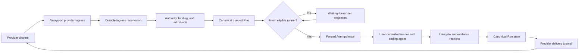

# ADR 0004: Keep Channel Ingress Always-On While Execution Remains Local

- Status: Accepted; implementation pending
- Date: 2026-08-18
- Decision owners: OpenTag maintainers

## Context

OpenTag currently supports two deployment shapes:

- local-direct mode, where the dispatcher, runner, and selected platform
  listener run on one user-controlled machine; and
- relay mode, where a remote dispatcher receives some provider events and a
  paired local runner claims authorized work.

Local-direct mode is valuable because it is simple and keeps provider
credentials, source, context, and execution on one machine. It cannot,
however, provide an always-available channel experience. If the machine is
asleep, powered off, disconnected, or no longer running the OpenTag service,
the platform listener is unavailable at the same time as the runner. The
system cannot receive a mention, record a cancellation, answer a status
request, or tell the user that execution is unavailable.

This is not specific to Slack:

- Slack Socket Mode, Lark/Feishu long connection, and Discord Gateway depend
  on a live local WebSocket;
- Telegram polling depends on one live poller with authoritative update
  offsets;
- GitHub, GitLab, Linear, Microsoft Teams, and the webhook modes of Slack,
  Telegram, and Discord depend on a public endpoint that currently may be a
  tunnel to the local process;
- provider retries and retained source messages are not an OpenTag durable
  admission guarantee.

The local dispatcher also acknowledges a newly created Run before a runner
claims it. A source-thread acknowledgement therefore proves receipt, not that
an executor is running. Rendering an unconditional message such as
`Working on it.` before an eligible runner has claimed and started an Attempt
is an optimistic availability claim.

The repository already has the primitives needed for a correct design:

- Channel adapters normalize provider events and render semantic
  presentations;
- provider delivery is journaled independently from Run state;
- queued Runs, deterministic routing decisions, runner readiness, capacity,
  leases, fencing, cancellation, interruption, and timeout semantics already
  have canonical owners;
- the optional Node/PostgreSQL Control Plane is the shared identity, ingress,
  runner-directory, hosted-coordination, and audit boundary;
- relay mode keeps code and coding-agent execution on user-controlled runners.

The missing piece is a channel-wide availability contract: a provider event
must be durably received by an always-on ingress owner before a user-visible
receipt is claimed, and an unavailable runner must leave an authorized Run in
an explainable queued state rather than make the ingress disappear or discard
the request.

## Decision

OpenTag will separate **channel availability** from **execution locality**.

For installations that require offline-safe channel behavior, one always-on
Control Plane or self-hosted relay outside the paired Runner's availability
fault domain owns provider ingress, durable receipt, source-thread status
delivery, queued admission, cancellation, and runner claim coordination. A
relay on the same machine as the Runner remains `local_direct` for availability
claims, even if it runs as a background service. The selected coding agent
continues to execute only on an authorized local or otherwise user-controlled
runner unless an explicit execution policy names an additional eligible
runner.

Admission and placement are separate decisions. Admission freezes the trusted
principal, Work Thread, Project Target, one configured Runner/Executor
affinity, execution policy, and queue deadline, but it does not require that
Runner to be currently ready. Placement occurs only when the affined Runner
claims the queued Run and the coordinator validates current readiness,
authority, Project Target binding, capability, credential generation, and
capacity before creating a fenced Attempt.

The first offline-safe profile has exactly one paired Runner affinity. An
affinity limits who may later claim the Run; it does not assign the Run, prove
that the Runner is online, or grant execution ownership. Multi-runner candidate
sets and fallback remain a later policy extension.

Local-direct mode remains supported. It is an explicitly lower-availability
mode and must not claim that mentions are received while its platform listener
is offline.

### Deployment modes

| Mode | Ingress owner | Execution owner | Offline receipt | Durable wait | Required product wording |
| --- | --- | --- | --- | --- | --- |
| `local_direct` | Local OpenTag process | Local runner | No | No provider-independent guarantee | Works while this machine and OpenTag service are online |
| `paired_relay` | User-operated always-on relay outside the Runner fault domain | Paired user-controlled runner | Yes | Yes | Runner-offline-safe within the declared relay envelope; relay is not implicitly HA; execution remains local or user-controlled |
| `managed_relay` | Managed OpenTag Control Plane outside the Runner fault domain | Paired user-controlled runner | Yes | Yes | Runner-offline-safe within the verified managed envelope; execution remains local or user-controlled |

Availability mode and execution policy are independent. Selecting a relay
does not authorize hosted code execution, and a local runner becoming
unavailable does not silently broaden the eligible runner set.

### Initial delivery tranche

The first supported product tranche consists of:

- `local_direct` for trial and single-machine use, with no offline receipt or
  durable-wait claim; and
- `paired_relay` through the same open-source relay deployed on infrastructure
  selected by the user, with the relay outside the paired Runner's fault
  domain.

The repository may provide Docker Compose, VPS, or deployment-platform
templates for `paired_relay`, but those templates are wrappers around the same
relay implementation and are not separate sources of protocol or lifecycle
truth.

The first exact offline-safe certification profile is deliberately narrow:

- Slack is the source-thread ingress and status surface;
- GitHub is the repository and publication target, not a second ingress
  surface in this profile;
- one paired local Runner is the only eligible execution target; and
- one configured ACP Harness performs coding-agent execution.

Slack is the first Source App, not part of the lifecycle model. Source App
packages may own transport connection or webhook handling, provider response
validation, provider identity and thread mapping, bounded context retrieval,
native presentation rendering, and provider I/O. They must not own or
reimplement ingress reservation, Admission, Run or Attempt state, runner
selection, claim/lease/fencing, cancellation, approval policy, evidence,
completion, provider-delivery journaling, retry authority, or terminal
settlement. Those remain provider-neutral relay and governance authorities.

Every later Source App must enter through one versioned adapter contract and
the same conformance suite. App capabilities are declared explicitly; an
unsupported capability produces a typed unsupported or attention outcome
rather than silent emulation. Adding or migrating an App must be achievable by
adding its adapter, capability declaration, transport tests, fixtures, and
composition wiring without changing canonical lifecycle code or another App's
implementation.

Provider transport acknowledgement is allowed only after one transaction has
committed the verified Ingress Reservation, its immutable payload digest or
recoverable payload reference, and one idempotent Ingress Processing
Obligation. A crash before that commit produces no acknowledgement and leaves
provider retry responsible for redelivery. A crash after commit but before the
ack converges when the same provider delivery ID and digest recover the stored
reservation; the same ID with a different digest is a conflict and cannot
overwrite it. After acknowledgement, Admission and Source Resolution no longer
depend on the webhook, socket, or polling handler remaining alive: a recovery
worker leases the obligation and drives it to admitted, rejected,
misconfigured, temporarily unavailable, or another closed Source Resolution.
Admission creates provider delivery intents through a separate durable outbox,
so a crash before source-thread presentation cannot erase the canonical Run or
require the provider to resend the original delivery.

The profile accepts a trusted Invocation while its paired Runner is offline,
but durable waiting is finite. Admission freezes one queue claim deadline from
the binding's bounded policy. Runner heartbeat, relay or Runner restart,
status reads, configuration changes, reconnect, and operator recovery do not
extend or replace it. Before the deadline, a currently eligible Runner may
claim only after fresh Placement checks. At or after the deadline, an
unstarted Run settles terminally as timed out, no catch-up execution occurs,
and later work requires a new attributable Invocation and Admission.
Cancellation and truthful status remain available while the Run waits.

Attempt lease expiry authorizes automatic retry only when durable evidence
proves that no material action could have started. A new Attempt always receives
a new lease and fence and remains bounded by the original Run deadline. Once an
External Operation Intent exists, or any external side effect may have crossed
its execution boundary without an authoritative receipt, the Run retains the
operation identity and reconciliation evidence and enters `outcome_unknown`.
The coordinator creates no replacement Attempt and performs no automatic
replay. A later authoritative success or failure receipt may settle the exact
operation; an Agent summary, process exit, timeout, stale lease, or absent
callback cannot substitute for that receipt.

A transient disconnect may resume the same Attempt only while its original
lease and fence remain current and the Runner reattests the exact workspace
identity. Once the lease expires, that Attempt is permanently stale. If no
external side effect may have started, its isolated workspace is preserved as
`interrupted` evidence rather than classified as `outcome_unknown`; if an
external effect cannot be excluded, the stricter unknown-outcome rule applies.
No new Attempt automatically continues, adopts, cleans, resets, stashes, or
deletes the stale workspace. An authorized retry creates a fresh isolated
workspace from the frozen revision under a new Attempt and fence. The old
workspace remains available only for attributable human inspection, patch
export, evidence preservation, and explicit cleanup after those obligations
settle.

Every source-thread presentation is a separate Provider Delivery Intent with a
stable semantic identity, exact target, idempotency key, and frozen delivery
deadline. A known retryable failure may use bounded retry. When a Provider
write may already have succeeded, the delivery worker first reconciles the
exact channel, thread, resource, and idempotency identity; unresolved ambiguity
settles the delivery as `outcome_unknown` and prohibits blind replay. Newer
canonical Run truth supersedes or coalesces obsolete undelivered intermediate
presentations, so a terminal summary may replace pending `received` or
`running` messages instead of emitting a stale sequence. Deadline expiry
abandons or escalates the presentation obligation without changing, reopening,
or falsifying the Run state.

An authorized, idempotent cancellation command immediately removes future
execution authority but does not claim that an Agent process has stopped or an
external side effect did not occur. Before claim, cancellation terminally
invalidates the queued Run. After claim, the coordinator records cancellation,
invalidates the current lease, fence, and outstanding execution capabilities,
and requests best-effort stop; stale or late settlement cannot reopen the Run.
An Attempt stop observation is evidence only. If a material action may already
have crossed its boundary without an authoritative receipt, cancellation leaves
the exact operation in `outcome_unknown` for reconciliation. Cancellation is
not reversible; later work requires a new attributable Invocation and Run.

Source-channel membership grants only the participation allowed by the binding
policy and never implies material-action authority. In the first Slack profile,
an authorized ordinary member may invoke read-only work and view safe status or
evidence. Every context addition remains independently attributable and cannot
rewrite an admitted Run's objective, principal, Project Target, Runner
affinity, permission ceiling, Completion Contract, or deadline; a changed
request becomes a Follow-up or new Run. Cancellation is limited to the original
requester or an explicitly capable Project Operator or administrator. Material
approval or rejection is limited to configured Approvers and is not inherited
from channel membership or requester status. Binding changes require
installation or organization administration, and no source message or approval
may broaden repository, network, secret, publication, or execution authority
beyond the frozen policy. Guests receive only the safe projection allowed by
explicit policy and otherwise cannot invoke, cancel, approve, or rebind.

The first profile is explicit-invocation only. It does not perform ambient
channel monitoring, proactive participation, standing instructions,
cross-thread or cross-channel memory, autonomous follow-up, or scheduled work.
Admission freezes one immutable same-thread Source Context Envelope containing
the trigger plus at most the preceding 20 messages and at most 64 KiB of
decoded text, with provider identities, versions, provenance, digest, and
truncation recorded. Attachment metadata may be retained, but attachment-body
custody is disabled by default and requires a later explicit capability and
policy. The relay retains encrypted readable execution content while the Run is
nonterminal and for at most seven days after terminal settlement; a content-free
replay tombstone may remain for 90 days. Verified source deletion revokes reads
and invalidates affected nonterminal intent instead of partially rewriting the
frozen Envelope and continuing execution. Ambient memory, proactive behavior,
and schedules require a later independent consent, retention, budget, and
evaluation profile.

The default v1 publication policy is `proposal_only`. A read-only Run completes
only with an inspectable report artifact and its cited evidence. A code-change
Run reaches `proposal_ready` only after execution succeeds, an immutable
Publication Candidate records the final workspace tree and patch digests,
required local verification evidence passes, and no material operation remains
unknown. This does not claim that a branch, pull request, check result, review,
or merge exists. Draft-pull-request Publication is opt-in: the binding policy
must already allow it and a configured Approver must approve the exact
Candidate, repository, remote, frozen base, owned Run Branch, and operation
digest before any push or pull-request write. `pull_request_ready` requires an
authoritative receipt bound to the exact repository, pull request, and head plus
the configured checks for that head. Source message text cannot broaden the
Publication Policy. V1 never auto-merges, force-pushes, writes a target branch,
rebases, deletes a remote branch, adopts an unknown branch, waives an unknown
outcome, or approves its own change.

`managed_relay` remains an intended deployment mode, not an initial service
offering. It must not be presented as available until the self-hosted profile
has passed exact-deployment failure tests for durable ingress, relay restart,
offline Runner queueing and reconnection, fenced claim recovery, cancellation,
provider delivery recovery, backup/restore, and truthful degraded-state
reporting. A managed offering additionally requires verified tenant isolation,
data residency, encryption and key custody, retention and deletion, operator
and break-glass access, availability envelope, and support boundaries. The
existence of Control Plane source code or a deployment template satisfies none
of those gates by itself.

### Architectural invariants

| Invariant | Required behavior |
| --- | --- |
| Durable reservation precedes transport acknowledgement | The provider is not told to stop retrying until its authenticated delivery is durably reserved. |
| Admission precedes user-visible receipt | OpenTag does not present a request as `received` until Admission created or idempotently recovered its canonical Run. An ingress reservation alone is not a user-visible receipt. |
| Receipt is not execution | `received` and `queued` do not mean claimed or running. `running` requires an explicit, currently fenced runner transition. |
| Admission is not placement | Admission may create a queued Run while its single affined Runner is offline. Only a current claim that passes placement checks may create an Attempt. |
| Trusted invocations are not silent | Every authenticated, recognized Invocation for a known installation produces one durable Source Resolution. Only input that cannot be verified or safely attributed may be silently dropped. |
| Backpressure preserves truth and control | Verified duplicate events reuse prior accounting; new work consumes durable tenant quota atomically; overload produces a safe Source Resolution; cancellation, status, deletion, and remediation retain protected capacity. |
| One generation-fenced ingress owner | One provider installation has one current owner generation for receive, verification, and bounded reply authority. Relay mode disables the matching local listener; stale or ambiguous generations fail closed. |
| Owner transfer never creates dual production authority | The current owner drains and relinquishes receive before a candidate receives reservation-only custody; only a coordinator compare-and-set grants full Admission, reply, and control authority. |
| Transport-acknowledged transfer custody cannot disappear | Every event acknowledged while parked under a pending transfer remains durably bound to that transfer until ownership advances and the event settles. V1 abort cannot discard or reassign it. |
| Custody commit is the transfer point of no return | The first candidate acknowledgement or offset advance that ends normal Provider redelivery to the old owner prohibits direct restoration of the old generation. The candidate retains bounded reservation custody until ownership advances. |
| Ownership generations move only forward | Abort before reservation custody commits may retain the old generation; after custody or ownership commits, recovery and rollback advance through higher generations, never a decrement or reuse. |
| Installation revocation is a hard fence | Verified uninstall, deauthorization, or administrator disconnect advances credential and ingress-owner generations, blocks new work and Provider I/O, and invalidates unstarted work without impersonating human cancellation. |
| Emergency posture is independent and ordered | `normal`, `admission_paused`, `execution_frozen`, and `provider_io_quarantined` progressively remove authority under their own generation without masquerading as runtime health, ownership transfer, or installation revocation. |
| Emergency controls survive work suspension | Status, cancellation, deletion, security remediation, operator access, and revocation remain available wherever the current posture still permits their required Provider I/O; internal protected controls survive Provider-I/O quarantine. |
| Recovery never resurrects intent | Clearing an emergency posture advances its generation but never resets a deadline, restarts interrupted work, replays an approval or Provider control, resends an old delivery, or authorizes local takeover. |
| Offline-safe is verified, not configured | A provider instance earns the capability only after exact-deployment tests prove durable receipt, recovery, delivery, and offline-Runner behavior under the declared failure envelope. |
| Capability, certification, and health stay separate | Adapter features, exact-installation offline-safe certification, and current operational health are reported independently. No Provider-wide badge, configured flag, or healthy heartbeat substitutes for exact verification. |
| Shared release qualification is exact and non-inheritable | Stage A-D progression binds one Provider type, adapter version, deployed head, region, availability profile, and critical policy digest. Changing any member creates a new Release Qualification Key that starts again at Stage A. |
| Installation rollout identity is independently fenced | Each rollout unit additionally binds one installation, endpoint/configuration digest, ingress mode, Ingress Owner generation, and credential generation. A local change stales and re-canaries that unit without resetting its unchanged Release Qualification Key. |
| Rollout evidence levels do not substitute | Stage A, exact-installation canary, cohort observation, adapter GA, certification, and current health each prove a different claim; no result silently confers another. |
| Cohort promotion is manual and evidence-gated | Early production cohorts are bounded, frozen, observed, and explicitly approved. Adapter general availability never certifies an installation. |
| Rollout automation only narrows authority | A gate breach may pause Admission, freeze execution, or quarantine Provider I/O, but cannot resume work, advance a cohort, transfer ownership, roll back generation, or enable local takeover. |
| Managed custody is region-pinned | Each Managed Relay Installation has one immutable Data Residency Region. Provider plaintext, readable execution content, backups, and their effective key material remain inside it. |
| Regional loss grants no fallback authority | Total regional loss is outside the v1 envelope and cannot activate another region, a local listener, or another Runner. OpenTag never claims receipt for a delivery it did not durably reserve. |
| Region migration is quiescent replacement | A generation-fenced Regional Authority Migration creates a new target-region Installation only after the source is quiescent and Provider replay is fenced. It copies no nonterminal intent or readable source content. |
| Encryption is tenant-, purpose-, and object-separated | Each Organization has a region-pinned KEK family with distinct purpose lineages, and every secret or content object has its own DEK. Credentials, source content, attachments, and audit/replay material cannot unwrap one another. |
| Decryption authority is exact and ephemeral | Every decrypt binds workload identity, tenant, object, purpose, region, applicable Installation and generation, and short expiry. Runner access is additionally Attempt-fenced and single-use; no workload receives a long-lived master key. |
| Key-service failure fails before acknowledgement | If the relay cannot verify and encrypt a delivery under the exact regional key authority, it neither reserves nor ACKs it, advances no polling offset, and emits no `received`. |
| Crypto-shred preserves domain isolation | Secret revocation destroys only the applicable credential lineage within 24 hours; content deletion destroys its object keys; neither action silently destroys unrelated data nor retains a decryptable backup. |
| Humans have no standing plaintext authority | Support and operator roles expose safe metadata only. Provider secrets are never human-viewable, and knowing an object or Run ID grants no decrypt authority. |
| Break-glass is customer-authorized and dual-controlled | One exact non-secret object may be viewed for at most 30 minutes only after current Organization-admin approval and two distinct OpenTag security-responder approvals under MFA and managed-device checks. |
| Break-glass is read-only and non-transitive | Controlled viewing cannot list or export tenant objects, expose keys, mutate lifecycle or authority, send Provider I/O, approve execution, or extend a deadline. Every view is separately fenced and audited. |
| Legal access is not support access | Legally compelled disclosure uses an independent authority, minimization, and audit process; it cannot be invoked through or represented as customer-support break-glass. |
| Tenant scope is derived, never caller-selected | Organization authority comes only from a verified Provider Installation, authenticated OpenTag session, or controlled workload identity. Payload fields, URL parameters, display labels, and global IDs cannot choose it. |
| Tenant identity is composite everywhere | Persistent records, references, replay keys, jobs, leases, deliveries, and encrypted objects bind Organization plus local identity. A bare Run, object, event, or Provider ID is never sufficient runtime authority. |
| Database isolation is defense in depth | Explicit predicates, composite keys, transaction-local tenant context, and PostgreSQL RLS agree. Runtime roles cannot bypass RLS, own protected tables, run migrations, or perform cross-tenant scans. |
| Async and storage authority remains tenant-fenced | Jobs, claims, caches, object metadata, wrapped-key context, and KMS authorization preserve the same Organization, region, purpose, Installation, and generation scope; caches never become authority. |
| Tenant mismatch is a security incident | Any scope disagreement fails closed without an existence oracle, creates no work or Provider send, and quarantines every safely attributable implicated Installation rather than guessing the intended tenant. |
| One queue authority | Authorized work waits as a canonical queued Run. There is no provider-specific shadow task queue. |
| Admitted Runs are immutable | Later same-scope Invocations become independently attributable Follow-up Requests; they never rewrite the active Run's command, principal, policy snapshots, or digest. |
| Cross-channel identity is explicit | Different Provider installations and source threads remain separate by default. Only an authorized generation-fenced link or a single-use signed handoff token can establish shared Work Thread identity. |
| Linking shares exclusion, not ambient authority | Linked anchors share one Run Scope for future work, but source context, presentation, actor authority, histories, and existing intent remain source-bound and immutable. |
| Unlink drains before scope split | `pending_unlink` blocks new Admission while existing linked-scope intent and controls settle. Only a quiescent coordinator transition may create independent future scopes. |
| Source context is bounded and frozen | Admission binds one encrypted same-thread Source Context Envelope with explicit provenance and truncation; later edits and out-of-scope history cannot rewrite it. |
| Source withdrawal invalidates rather than mutates | Verified deletion of content used by a nonterminal Envelope revokes reads and invalidates affected intent. OpenTag never partially redacts the admitted Envelope and then executes it. |
| Attachment bodies require explicit custody | Attachment custody is disabled by default. When explicitly enabled, every required attachment is bounded, inspected, scanned, encrypted, version-frozen, and captured before Admission. |
| Retention is lifecycle-bound | Execution content remains while required, then expires independently from content-free audit and replay tombstones. Deletion cannot make an old delivery executable again. |
| Follow-up promotion fails closed | Only a succeeded predecessor permits automatic promotion. Every other terminal or unresolved outcome pauses the follow-up queue until an authorized actor or operator acts. |
| Follow-up intent is finite | Every Follow-up has an enqueue-derived promotion deadline that never resets. Expiry is terminal, and promotion cannot create a Run whose claim deadline exceeds the original intent window. |
| Automatic start is finite | A queued Run may start without source reconfirmation only before its Admission-frozen queue claim deadline and only after all current Placement checks pass. Expiry is terminal and cannot be renewed or reversed. |
| Placement failures have a closed disposition | Temporary eligibility failures keep the Run queued, authority or integrity failures invalidate it terminally, and only an exact-action policy gate may enter `needs_approval`. |
| Approval is exact, finite, and Attempt-bound | Approval binds one current fenced Attempt, immutable action and target digests, authority ceiling, and non-renewable deadline. It is consumed once and never survives a changed Attempt or control boundary. |
| One lifecycle owner | One hosted coordinator owns claim, retry, cancellation, and terminal settlement for a hosted Run. |
| Pull-based local execution | Eligible runners claim work; the relay does not reach into a local machine or manufacture local readiness. |
| Readiness is composite | A fresh heartbeat alone is insufficient; runner, executor, Project Target, policy, capacity, and protocol compatibility must all pass. |
| Runner trust begins with device proof | Pairing starts locally with one-time proof of a device public key and current Organization-admin approval of exact scope. Provider channel messages and process colocation cannot create Runner authority. |
| Device credentials mint sessions, not execution | The protected device key only authenticates issuance of a short-lived scoped Runner session. Claim still requires current readiness and coordinator Placement; Provider credentials never enter the Runner credential. |
| Project Target paths are local authority | A Provider request may select only an already approved Project Target ID. The local root mapping and allowlist remain Runner-side and cannot be supplied or overridden by Slack, GitHub, Lark, or another Provider payload. |
| Target version resolution freezes once | Admission freezes either an authoritative exact revision or the explicit `resolve_at_claim` rule. The first valid Placement under `resolve_at_claim` atomically freezes one exact revision for all retries and later Attempts. |
| Workspace proof precedes execution ownership | A current Runner signs a Workspace Attestation for repository identity, exact revision, isolation, cleanliness, containment, policy, and credential generation. The coordinator creates no Attempt until it validates that proof. |
| Execution never cleans user work | The default execution workspace is an Attempt-scoped worktree or equivalent, separate from the user's interactive checkout. OpenTag never resets, cleans, force-checks-out, implicitly stashes, overwrites, or deletes user work to become eligible. |
| Unknown workspaces are never adopted | Reconnect may reuse a workspace only when its Attempt, Fencing Token, and workspace identity remain current. Otherwise evidence is preserved and a new isolated workspace is created; an unknown directory is never taken over. |
| Ingress availability and execution isolation are orthogonal | Provider offline-safe certification proves durable channel behavior, not local sandbox enforcement. Every Run separately freezes and discloses its Execution Isolation Profile. |
| Restricted execution is the default | Governed local execution defaults to `sandboxed_restricted`. An unavailable enforcement mechanism fails closed and never silently selects `unsandboxed_local`. |
| Unsandboxed execution is explicit and truthful | Only a local owner or Organization administrator may enable `unsandboxed_local` for a Project Target. Provider messages cannot request it, and every Run surface discloses it. |
| Host authority is denied, not inherited | Sandboxed execution sees only the Attempt workspace, approved read-only toolchains, and explicitly granted resources. Home directories, ambient environment, Keychain, SSH agent, Docker socket, metadata services, browser state, and undeclared host sockets remain unavailable. |
| Network authority is frozen and destination-exact | Network is denied unless the Admission-frozen Egress Profile authorizes the exact destination. DNS, resolved address, proxy, TLS, scheme, port, or capability drift fails closed. |
| Approval cannot enlarge the egress ceiling | Exact-action approval may consume an Admission-frozen approval-eligible rule, but cannot add a destination or capability outside the frozen Egress Profile. Message text is never approval. |
| Secrets are operation-brokered | A Secret Reference yields only a short-lived, Attempt-, fence-, target-, executor-, purpose-, and operation-bound local grant. Secret bytes never become ambient parent-shell state or hosted Run data. |
| Source-control powers remain separate | Fetch, push, pull-request creation, pull-request update, and merge are distinct capabilities and credentials. Read authority never implies write or merge authority. |
| External writes are journaled before effects | A coordinator-owned External Operation Intent and one-use operation capability precede every material external write. Success requires an authoritative receipt or safe reconciliation; ambiguity becomes `outcome_unknown`. |
| Revocation reaches every execution capability | Cancellation, timeout, disconnect, credential or policy generation change, and revocation invalidate outstanding filesystem, network, secret, source-control, and external-operation capabilities. Possible crossed side effects are reconciled, never replayed blindly. |
| Execution and Publication are separate | Executor success produces local evidence only. A frozen Publication Policy and independent Publisher authority are required before any branch or pull-request mutation. |
| Proposal-only is the default | A Run produces an immutable Publication Candidate without remote writes unless Admission explicitly authorizes pull-request Publication. |
| Publication owns only its Run Branch | One coordinator-owned Branch Ownership Record binds an exact remote branch to one Organization, Run, target, repository, remote, base, policy, and expected head. A name match alone grants no ownership. |
| Publication never rewrites unknown history | V1 prohibits target-branch writes, merge, force-push, remote branch deletion, automatic rebase, and takeover of unknown or human branches. |
| Publication retry reconciles first | A push, pull-request creation, or update with ambiguous outcome is observed by exact repository/resource/head identity before retry. Unresolved ambiguity becomes `outcome_unknown`, never a second publication. |
| Base drift changes the evidence claim | Default pull-request Publication may disclose `base_advanced`; strict-base policy blocks as `publication_base_changed`. Neither path treats frozen-base tests as proof of a newer merge result. |
| Completion is exact-head and layered | Execution success, candidate readiness, branch publication, pull-request creation, checks, review, merge, and Work Thread completion are distinct facts. Completion evidence must bind one exact pull-request head. |
| Completion has one authority | Only the hosted coordinator evaluates the Admission-frozen Completion Contract and writes the terminal Run transition. Agent, Runner, Publisher, Provider state, and presentation are evidence producers or projections. |
| Defaults stop before human merge | Proposal-only defaults to verified proposal readiness; pull-request Publication defaults to exact-head readiness for review. Review and Provider-observed merge are stricter optional contracts, and v1 never auto-merges. |
| Later drift does not rewrite history | A changed or closed pull request creates a superseding assessment and current Work Thread projection. It never mutates the historical exact-head Completion Assessment or terminal Run fact. |
| Completion waivers are exact | A waiver is one-use, expiring, attributable, and bound to one eligible gate and exact Candidate or pull-request head. It cannot waive unknown outcome or grant Publication or merge authority. |
| Cleanup follows durable publication evidence | A workspace is cleaned only after required local artifact, Publication Receipt, and audit evidence settle. Unknown Publication outcome preserves minimum reconciliation evidence. |
| Reconnect never revives an Attempt | A reconnecting or rotated Runner needs a fresh session, Lease, and Fencing Token. Old-process status is evidence only and cannot continue or settle stale execution. |
| Runner revocation does not reroute intent | Revocation advances credential generation, stops active Attempts with outcome reconciliation, and invalidates exclusively affined unstarted intent as `affinity_revoked`; a replacement device inherits nothing. |
| No implicit fallback | A local-required Run never falls back to a managed executor without a new explicit policy or human decision. |
| Provider delivery is separate | A Run state transition and a Slack/Lark/GitHub/etc. message delivery have separate durable outcomes. |
| Delivery obligations are finite | Every Provider Delivery Intent has an immutable semantic class, stable idempotency identity, frozen deadline, and closed lifecycle. Deadline expiry abandons presentation without changing the Run. |
| Admitted work has a durable status projection | Every admitted Run has a recoverable source-side receipt or status anchor. A reaction or ephemeral message may assist but is never the sole evidence that OpenTag accepted work. |
| Status projection is not lifecycle authority | Status text, cards, comments, reactions, and delivery outcomes project canonical state but never determine or overwrite it. Controls bind authenticated Run or Invocation identity and recheck current authority. |
| Human-channel noise is bounded | Providers with in-place updates use one status anchor. Providers without updates emit at most receipt or waiting, action-required, and terminal persistent messages; routine progress remains queryable rather than posted. |
| Current truth supersedes stale presentation | Retries coalesce obsolete intermediate status and expired controls. An undelivered receipt overtaken by terminal state becomes one truthful terminal summary, not a stale sequence. |
| No guessed delivery fallback | OpenTag retries only the authorized source path or an explicitly preconfigured fallback presentation path. Delivery failure never licenses destination discovery or ambient cross-channel messaging. |
| Unknown side effects block replay | Potential external writes with unknown provider outcome are reconciled or escalated, never blindly repeated. |
| Local custody remains narrow | Source checkout, worktree, source-control credentials, coding-agent credentials, and full execution context remain runner-side. |
| Local independence remains real | A user can choose local-direct mode without configuring or probing a Control Plane. |

## System shape



The Control Plane is not a hosted agent. It is an availability, authority,
coordination, and projection boundary around user-controlled execution.

## Authority and ownership

| Concern | Canonical owner | Non-owner projections or producers |
| --- | --- | --- |
| Provider installation and credential generation | Provider-ingress module | Setup UI, CLI, operator console |
| Ingress owner and ownership generation | Provider-ingress module | Local listener, relay workers, setup and doctor surfaces |
| Webhook/connection identity and replay reservation | Provider-ingress module | Provider transport |
| Channel and Project Target binding | Runner-directory/channel-binding module | Source-thread commands after authenticated authorization |
| Tenant Authority Context derivation | Provider ingress, OpenTag auth boundary, and controlled workload issuer | Verified installation, authenticated session, or workload identity; caller fields cannot override it |
| Cross-channel Work Thread link and binding generation | Runner-directory/channel-binding module | Binding administrators after both source anchors prove current installation and Project Target authority |
| Run admission and idempotency | Hosted-run coordinator | Provider ingress submits a bounded admission command |
| Queued waiting state | Hosted-run coordinator through canonical Run status | Provider-specific status cards/comments |
| Runner device identity, pairing, session, and credential generation | Runner directory | Local device initiates proof; current Organization administrator approves exact scope |
| Project Target policy and local root mapping | Runner directory owns the approved policy identity; the paired Runner owns the allowlisted local mapping | Organization administrators approve target scope; Provider messages may reference only the approved Project Target ID |
| Runner/executor readiness | Runner directory from signed/fenced readiness receipts | Console and source-thread doctor views |
| Target version binding | Hosted-run coordinator | Admission supplies a Provider-proved exact revision or an explicit `resolve_at_claim` rule; one current Workspace Attestation may freeze the latter |
| Workspace Attestation | Current paired Runner device | Hosted-run coordinator validates the signature and every frozen/current fence before Attempt creation |
| Execution Isolation and Egress Profile policy | Governance policy evaluator; hosted-run coordinator freezes the exact digests on Admission | Local owners and Organization administrators configure Project Target ceilings; Provider messages cannot broaden them |
| Execution Isolation Attestation and launch receipt | Current paired Runner and its enforcement adapter | Hosted-run coordinator validates pre-Claim proof and fenced post-Claim launch evidence |
| Attempt Secret Grant and secret bytes | Runner-local Secret Broker | Hosted-run coordinator authorizes the exact purpose; executor receives only the operation-scoped delivery channel |
| External Operation Intent and reconciliation state | Hosted-run coordinator | Current fenced Runner executes once; authoritative external-system evidence settles or reconciles it |
| Publication Policy and Candidate acceptance | Hosted-run coordinator | Admission freezes policy; current fenced Runner submits immutable local result evidence after executor settlement |
| Run Branch Ownership Record and expected remote head | Hosted-run coordinator | Publisher observes exact source-control resources but cannot claim ownership from a branch name |
| Publication execution | Selected Publisher adapter under one-use capabilities | Coding Agent proposes content; Provider-specific source-control adapter performs only the authorized operation |
| Publication Receipt and remote resource truth | Source-control Provider, recorded by hosted-run coordinator | Publisher and source-thread presentations project the authoritative repository, branch, pull-request, operation, and head identities |
| Completion Contract and terminal assessment | Hosted-run coordinator | Project Target policy supplies the configured contract; Completion engine evaluates immutable evidence but cannot write terminal state |
| Check, review, and merge truth | Source-control Provider, recorded as exact-subject evidence | Completion engine normalizes and evaluates only evidence for the frozen repository, pull request, and head |
| Completion Gate Waiver | Hosted-run coordinator after an authorized exact-gate decision | Provider controls and operator UI submit bounded requests but cannot enlarge the contract or source-control authority |
| Current Work Thread completion projection | Hosted-run coordinator from immutable assessments and later Provider evidence | Source-thread status and consoles render the current projection without rewriting historical outcomes |
| Routing decision | Governance routing evaluator plus hosted-run coordinator | Status and audit projections |
| Claim, retry, cancellation authorization, terminal Run state | Hosted-run coordinator | Source actors, operators, Runner receipts, provider evidence, job workers |
| Attempt stop observation | Current fenced Runner | Hosted-run coordinator validates and projects the observation |
| Attempt execution | Selected user-controlled runner | Control Plane observes lifecycle receipts |
| External provider mutation outcome | Delivery journal/provider observation | Run events and source-thread summaries |
| Source-thread presentation | Provider delivery adapter | The provider remains authoritative for accepted delivery |

Provider ingress must not edit hosted-run tables directly. It verifies and
normalizes an event, reserves replay identity, derives a trusted tenant-bound
principal and Project Target, then calls the hosted coordinator's idempotent
admission interface.

### Admission, affinity, and placement

**Admission** creates the canonical Run. It proves that the request is
authenticated, authorized, bound to one Work Thread and Project Target, and
safe to retain under a frozen policy and deadline. It freezes the Project
Target ID, Target Policy Digest, target-version resolution rule, Execution
Isolation Profile Digest, Egress Profile Digest where applicable, source-control
capability ceiling, approval-eligible boundaries, and Publication Policy Digest
including mode, remote/base identity, branch ownership rules, base-drift policy,
and one Completion Contract Digest including mode, required check identities,
review requirement, waiver policy, and categorical automatic-merge denial. It
may succeed without a fresh Runner readiness receipt or runtime attestation.

**Runner affinity** is the frozen eligibility constraint on that Run. In the
first offline-safe profile it names exactly one configured Runner and Executor.
It is not evidence that either is online, and it is not an Attempt assignment.

**Placement** creates the Attempt. The affined Runner polls for work, resolves
the approved local target, prepares an isolated workspace, and signs a
Workspace Attestation plus an Execution Isolation Attestation. The hosted
coordinator validates current Runner and Executor readiness, Project Target and
policy digests, the frozen exact revision or permitted first resolution,
workspace identity and isolation, enforceable execution/egress profiles,
credential generation, relay capability, capacity, and policy consistency
before issuing the fenced lease. The executor does not run until a post-Claim
fenced sandbox-launch receipt matches both attestations. No readiness receipt,
configured path, installed container runtime, or executor declaration is frozen
as admission truth.

### Cross-channel Work Thread binding

The default source anchor is the exact organization, Provider installation, and
source-thread tuple. It receives a distinct canonical Work Thread, so OpenTag
does not infer cross-channel identity from command text, time, repository,
display name, email, or an account link. Normal duplicate recovery requires the
same stable Provider delivery or message identity and digest.

```ts
type SourceAnchor = {
  organizationId: string;
  installationId: string;
  provider: string;
  sourceThreadKey: string;
};

type RunScope = {
  organizationId: string;
  projectTargetId: string;
  canonicalWorkThreadId: string;
  resolvedBindingGeneration: number;
};

type CrossChannelWorkThreadBinding = {
  organizationId: string;
  projectTargetId: string;
  canonicalWorkThreadId: string;
  anchors: SourceAnchor[];
  workThreadBindingGeneration: number;
  state: "active" | "pending_unlink" | "unlinked";
};
```

A binding administrator may link two verified anchors only after both prove
current installation and Project Target authority and neither source scope has a
nonterminal Run or Follow-up. The compare-and-set advances
`workThreadBindingGeneration`. Existing history, Runs, Follow-ups, permission
snapshots, and Source Context Envelopes remain unchanged. Future Invocations
from every active linked anchor resolve to one `RunScope`, enforcing one active
Run and one ordered Follow-up queue across those channels.

An explicit cross-channel handoff uses an OpenTag-signed, single-use, short-
lived token bound to the originating Invocation or Run, destination installation
and source anchor, actor authority, Project Target, purpose, and binding
generation. A copied Run ID or account mapping is insufficient. Token replay,
destination mismatch, expiry, or generation mismatch fails closed.

Linking shares execution exclusion only. Each Admission captures context solely
from its originating Provider thread, and presentations return solely to that
Invocation's source unless a separate authorized cross-channel presentation
policy exists. Cancellation, approval, promotion, and other controls re-prove
the governed subject at the destination or require explicit administrator
authority.

An authorized unlink request moves the binding to `pending_unlink`; it does not
split the Run Scope immediately. New Admission from every linked anchor is
blocked. Existing Runs, Follow-ups, cancellation, approval, status, and
reconciliation remain available under the frozen old generation. A new trusted
Invocation receives `binding_change_pending`, creates no Run, and is never
replayed automatically after unlink.

The coordinator completes unlink only when the old canonical Work Thread has no
nonterminal Run or Follow-up, unresolved external outcome, or incomplete control
operation. One compare-and-set then advances `workThreadBindingGeneration`,
closes the old link, assigns independent canonical Work Threads for future
anchor routing, and reopens Admission. The initial profile has no
`force_unlink`; an administrator must cancel or settle blocking work first.

If a linked Provider installation is revoked, only intent originating from that
installation follows `installation_revoked`. Work from still-valid anchors is
not cancelled, but all anchors remain closed to new Admission until the shared
scope drains and unlink completes. No history, Envelope, permission, status
message, Follow-up, or audit record is copied or migrated.

## State and terminology

This design does not introduce a second top-level Run status vocabulary.
Existing canonical Run and Attempt states remain authoritative.

### Canonical Run lifecycle

```text
queued
  -> assigned
assigned
  -> running | needs_approval
running
  -> needs_approval
needs_approval
  -> running
queued | assigned | running | needs_approval
  -> succeeded | failed | cancelled | interrupted | timed_out
```

An unavailable runner leaves the Run in `queued`. The reason is captured by
the current routing decision, not encoded as another queue.

### User-facing availability projection

| Projection | Canonical evidence |
| --- | --- |
| `received` | Admission created or idempotently recovered the canonical Run |
| `waiting_for_runner` | Run is `queued`; current routing decision has no eligible candidate |
| `starting` | A current fenced Attempt exists, but `running` has not been accepted |
| `running` | Current fenced Attempt accepted the running transition |
| `waiting_for_approval` | A current fenced Attempt has an unexpired pending Approval Request |
| `approval_granted_waiting_for_runner` | The exact request was approved, but the current bound Attempt has not consumed it |
| `approval_consumed` | The current bound Attempt atomically consumed the one-time grant |
| `approval_expired` | The immutable approval deadline passed before valid consumption |
| `approval_invalidated` | The Attempt, action, target, authority, policy, credential, or Installation binding changed before consumption |
| `completed` | Canonical completion policy accepts the outcome and evidence |
| `failed` | Run or governed completion failed with a known outcome |
| `cancelled` | A human cancellation or coordinator-owned authority/integrity invalidation won before terminal completion; the terminal reason distinguishes them |
| `interrupted` | Attempt/Run was interrupted and retry was not safely selected |
| `timed_out` | Queue or execution deadline expired |

`waiting_for_runner` is a semantic presentation state and query projection. It
does not require adding a new canonical Run status.

`ingress_reserved` is an internal provider-delivery processing state, not a
user-facing availability projection. It proves that authenticated delivery
processing is replay-safe; it does not prove that authorization or Admission
succeeded, and it must not render as `received`.

### Placement dispositions and reason codes

Every failed Placement check has one closed disposition rather than becoming an
unstructured `no_eligible_runner` error.

```ts
type RetryablePlacementReason =
  | "runner_offline"
  | "runner_draining"
  | "executor_unavailable"
  | "project_target_not_ready"
  | "workspace_isolation_unavailable"
  | "sandbox_runtime_unavailable"
  | "secret_broker_unavailable"
  | "approved_egress_unavailable"
  | "credential_resolution_unavailable"
  | "capacity_exhausted"
  | "protocol_incompatible";

type RunInvalidationReason =
  | "installation_revoked"
  | "authorization_revoked"
  | "binding_changed"
  | "policy_revoked"
  | "affinity_revoked"
  | "identity_mismatch"
  | "target_version_changed"
  | "target_identity_mismatch"
  | "workspace_not_isolated"
  | "execution_policy_changed"
  | "sandbox_policy_mismatch"
  | "source_content_deleted"
  | "integrity_failure";

type ApprovalPlacementReason =
  | "exact_action_approval_required"
  | "exact_egress_approval_required";
```

Retryable failures keep the Run `queued` under its original claim deadline and
may recover automatically. A transient inability to allocate a new isolated
worktree uses `workspace_isolation_unavailable` and never attempts to clean or
take over an existing directory. Credential rotation is retryable when the
Runner's identity and frozen affinity are unchanged; explicit Runner or
affinity revocation is not. A temporarily unavailable enforcement adapter,
Secret Broker, or already authorized egress route may wait only under the
original deadline and cannot degrade to ambient host access.

An invalidation reason makes the coordinator compare-and-set the unstarted Run
to `cancelled`; it cannot later return to the queue or inherit restored content,
replacement content, or different authority. `source_content_deleted` is
selected only from a verified withdrawal bound to the exact Provider
installation, thread, object, and version. It is never attributed to a user or
operator cancellation. `installation_revoked` requires an authenticated
Provider deauthorization or authorized OpenTag administrator disconnect for the
exact installation; transient Provider failure cannot select it. An approval
reason moves only the exact admitted action to `needs_approval`. Approval cannot
change the principal, target, Runner affinity, command, digest, or permission
ceiling. `target_version_changed` means the exact Admission-frozen or previously
claim-frozen revision no longer matches. `target_identity_mismatch` means the
canonical repository or allowed remote identity does not match the target
policy. `workspace_not_isolated` means the Runner proved that execution would
require an unsafe shared checkout, destructive cleanup, or a path/symlink escape.
`execution_policy_changed` means the current Project Target no longer permits
the Admission-frozen execution ceiling. `sandbox_policy_mismatch` means the
Runner's attested or launched enforcement boundary differs from the frozen
profile. None of these conditions permits resolving a newer revision, changing a
local path, cleaning user work, enabling ambient host access, or selecting
`unsandboxed_local` automatically.

The approval disposition is evaluated only after every non-approval Placement
check passes. It may create a fenced, non-executing Attempt so the Approval
Request has a concrete current execution owner; it never grants that Attempt
permission to perform the action before valid consumption.

```ts
type ApprovalRequestRecord = {
  approvalRequestId: string;
  organizationId: string;
  runId: string;
  attemptId: string;
  fencingTokenDigest: string;
  originatingActorId: string;
  projectTargetId: string;
  targetResourceVersion: string;
  actionDigest: string;
  permissionCeilingDigest: string;
  executionIsolationProfileDigest: string;
  egressProfileDigest?: string;
  egressDestinationDigest?: string;
  sourceControlCapability?: string;
  externalOperationDigest?: string;
  expectedSideEffectClass: string;
  requestedAt: string;
  approvalDeadline: string;
  state:
    | "pending"
    | "granted"
    | "consumed"
    | "denied"
    | "expired"
    | "invalidated";
  decisionActorId?: string;
  decisionAt?: string;
  consumedAt?: string;
};
```

The managed default is `approvalDeadline = requestedAt + 30 minutes`. A Binding
may shorten it; an extension is bounded by deployment policy. Offline time,
retry, redelivery, and operator observation never reset or extend it. An
authorized approval received while the Runner is offline compare-and-sets the
record to `granted`; that is a one-time coordinator fact, not an action receipt.

Consumption succeeds only for the original live Attempt and fencing token while
the action digest, target resource version, permission ceiling, Binding, Policy,
Credential generations, Installation, Execution Isolation Profile, Egress
Profile, destination, source-control capability, and External Operation Intent
remain current. An egress approval is valid only for a rule already marked
approval-eligible inside the Admission-frozen maximum. The compare-and-set to
`consumed` is atomic and one-time. Attempt lease expiry, Runner or Executor
replacement, any bound digest or generation change, Installation revocation, or
deadline expiry terminally invalidates the request. Retry, requeue, Follow-up
promotion, cross-channel handoff, and another destination cannot inherit it.

Denial, Run cancellation, or authority revocation wins over an unconsumed grant
through the coordinator's single compare-and-set boundary. A new Attempt or
changed action creates a new Approval Request and requires a new decision. The
delivery journal owns Provider button create/update and click-delivery outcomes,
but neither delivery nor click receipt proves coordinator approval. An expired
or invalid button returns safe current status and creates no request or action.

For `exact_egress_approval_required`, the decision actor must be a current local
owner or Organization administrator with `egress:approve`. A Provider card may
present safe status but cannot carry or infer this decision from message text,
reaction, link click, or ordinary Run approval. Consumption opens only the exact
destination/action already listed as approval-eligible in the frozen Egress
Profile.

Provider messages render only a safe category and next action. Routing and
terminal logic use the closed disposition and reason code; sensitive identity,
tenant, policy, binding, and integrity details remain in restricted audit.

`outcome_unknown` remains an external-operation or delivery outcome, not a new
Run status. It blocks unsafe completion or replay and can coexist with an
interrupted Run.

### Trusted invocations and source resolutions

An **Invocation** is an authenticated, recognized request for OpenTag action
from a known provider installation and source identity. It is not a Run: an
Invocation may be admitted, rejected, or classified as requiring setup without
creating execution state.

Every trusted Invocation produces exactly one durable **Source Resolution**
intent. The resolution kind is closed and safe to expose:

| Resolution | Meaning | Creates a Run |
| --- | --- | --- |
| `accepted` | Admission succeeded and placement evaluation may begin | Yes |
| `waiting_for_runner` | Admission succeeded but the affined Runner cannot currently be placed | Yes |
| `follow_up_queued` | A distinct Invocation was durably queued behind the active Run with its own promotion deadline | No; it may later enter a new Admission |
| `binding_change_pending` | The source anchor's linked Work Thread is draining before unlink; the request is not retained for later execution | No |
| `setup_required` | The installation is known but the channel, repository, or Project Target is not configured | No |
| `not_authorized` | The installation and target are known but the actor is not permitted to invoke execution | No |
| `invalid_request` | The invocation is recognized but its command or bounded input is invalid | No |
| `rate_limited` | The actor and installation exceeded the short-window Invocation rate; a safe retry time is available | No |
| `queue_full` | The Run Scope, installation, or organization has no free nonterminal intent slot | No |
| `storage_quota_exceeded` | Required attachment bytes could not obtain an atomic organization storage reservation | No |
| `temporarily_unavailable` | A trusted invocation could not complete Admission because a required internal dependency failed, the installation entered `admission_paused`, or an owner-transfer activation gate excluded the source before the Admission commit | No |

Invalid signatures, unknown installations, forged tenant identity, expired
replay windows, and inputs without safe reply authority are not trusted
Invocations. They may be rejected at the transport boundary or silently
dropped, and they never trigger a source reply to attacker-controlled data.

`not_authorized`, `setup_required`, and `temporarily_unavailable` presentations
use generic copy and disclose no Runner identifiers, bindings, organization
details, policy internals, secret generations, or administrator identities.
Providers with private or ephemeral replies should prefer them for rejection.
Public fallback replies are rate-limited and contain only the safe resolution.

A durable Source Resolution is an intent, not proof of provider delivery. The
delivery journal separately records the corresponding Provider Delivery
Intent's closed state and evidence. Only `accepted` proves Provider acceptance;
no delivery state proves that a human saw the presentation.

## Ingress lifecycle

Every offline-safe provider follows the same durable sequence while retaining
provider-specific authentication and acknowledgement rules.

1. **Bound request limits.** Reject oversized, malformed, or unsupported input
   before expensive work and without logging raw bodies or credentials.
2. **Verify provider authority.** Verify the exact signature, token, JWT,
   public key, app identity, tenant, and replay timestamp required by the
   provider before trusting payload identity.
3. **Resolve installation.** Select a tenant-scoped provider installation and
   credential generation without trusting tenant identifiers supplied only as
   unverified payload data.
4. **Normalize a source envelope.** Preserve provider delivery identity,
   source-thread identity, actor identity, command text, callback target, and
   stable resource pointers required for admission. Preserve any signed cross-
   channel handoff token as a bounded control claim, never as message content.
   Capture an encrypted,
   immutable Source Context Envelope containing the trigger, thread root, and a
   bounded preceding same-thread window with provenance and truncation state.
5. **Reserve durably.** Insert an ingress-delivery record keyed by
   organization, installation, provider delivery identity, and payload digest.
6. **Acknowledge the provider transport.** Return the provider-required
   transport response only after durable reservation. A challenge or deferred
   interaction response remains provider-specific.
7. **Apply durable backpressure.** After replay detection, evaluate the
   actor/installation rate, Run Scope follow-up depth, installation and
   organization intent counts, and any attachment storage reservation. A limit
   produces one durable `rate_limited`, `queue_full`, or
   `storage_quota_exceeded` resolution and no Run.
8. **Process idempotently.** A durable worker or bounded synchronous path
   resolves channel/Project Target binding and the configured Runner/Executor
   affinity. It resolves the source anchor to its current canonical Work Thread
   and binding generation, validating and consuming any explicit handoff token.
   Admission freezes the Project Target ID, Target Policy Digest, and either the
   Provider-proved exact revision or an explicit `resolve_at_claim` rule; an
   unproved request cannot silently become latest-head execution. Admission also
   freezes the Execution Isolation and Egress Profile digests, source-control
   ceiling, Secret Reference set, and any exact-approval-eligible boundaries.
   A `pending_unlink` binding produces `binding_change_pending` and no Admission.
   If the Invocation depends on attachments, it enforces the binding's
   explicit custody policy and completes every required capture, inspection,
   scan, encrypted write, digest, and version freeze before submitting the
   admission command. Current Runner readiness is not required.
9. **Resolve the trusted Invocation.** If the coordinator creates or
   idempotently recovers the canonical Run, enqueue `accepted` or
   `waiting_for_runner`. Otherwise enqueue the applicable safe rejection or
   availability resolution. A reserved delivery rejected before Admission
   creates no `received` presentation; an untrusted input creates no source
   resolution.
10. **Place and claim.** The affined Runner polls, prepares an isolated
    workspace, and signs Workspace and Execution Isolation Attestations. The
    coordinator evaluates current readiness, validates the target, exact
    revision, policy, isolation, containment, enforcement probe, execution and
    egress digests, credential generation, and both signatures, atomically
    freezes the first exact revision for `resolve_at_claim`, and creates one
    fenced Attempt only when every placement check passes. The Runner then
    launches the exact sandbox and submits a matching fenced launch receipt
    before `running`, secret resolution, network access, or executor invocation.
11. **Project lifecycle.** Update one source-thread status anchor where the
    provider supports update-in-place, then emit the evidence-backed final
    presentation.

### Crash recovery between receipt and admission

Provider ingress reservation uses a bounded processing lease. If the process
crashes after reservation but before admission settlement, another worker may
recover the expired processing lease and replay the same idempotent admission
command. The stable admission request ID is derived from the trusted source
identity, not generated anew on each retry.

No user-visible `received` presentation is created during this gap. Recovery
must first obtain the same created or replayed Admission result, after which the
delivery journal may idempotently create the source receipt.

A duplicate with the same provider delivery ID and payload digest returns the
stored outcome. The same delivery ID with a different digest is a conflict and
must not be interpreted as a retry.

## Runner device trust, pairing, and sessions

Runner pairing begins on the candidate device. `opentagd` generates a device
key pair in the OS Keychain, Secure Enclave, or equivalent protected store and
creates a one-time, short-lived challenge proving possession of the public key.
The challenge itself has no Organization, polling, Claim, decrypt, or execution
authority. Slack, GitHub, Lark, and every other Provider channel are excluded
from pairing creation, approval, rotation, revocation, and transfer authority.

A current Organization administrator approves the exact Runner ID, device
public key, Project Target set, Executor set, maximum capability digest, and
challenge expiry through the administrator surface. The Runner Directory stores
only the public key, bounded scope, credential generation, state, and audit
facts. The device private key is never uploaded or represented as configuration
plaintext.

```ts
type RunnerPairingChallenge = {
  id: string;
  candidateDevicePublicKey: string;
  proofOfPossessionDigest: string;
  requestedRunnerName?: string;
  state: "pending" | "approved" | "denied" | "expired" | "consumed";
  createdAt: string;
  expiresAt: string;
};

type RunnerDeviceRecord = {
  organizationId: string;
  runnerId: string;
  devicePublicKey: string;
  credentialGeneration: number;
  allowedProjectTargetIds: string[];
  allowedExecutorKinds: string[];
  maximumCapabilityDigest: string;
  state: "active" | "revoked";
  pairedByOrganizationActorId: string;
  pairedAt: string;
  revokedAt?: string;
  revocationReason?: "administrator_revoke" | "device_lost" | "key_compromise";
};

type RunnerSessionCapability = {
  id: string;
  organizationId: string;
  runnerId: string;
  runnerCredentialGeneration: number;
  devicePublicKeyDigest: string;
  projectTargetId: string;
  executorKind: string;
  protocolVersion: string;
  capabilityDigest: string;
  issuedAt: string;
  expiresAt: string;
};
```

The active device key signs a fresh server challenge to obtain a short-lived
`RunnerSessionCapability`. Session scope cannot exceed the approved device
record and does not itself authorize a Claim. Heartbeat, poll, Claim, decrypt,
Attempt receipt, and callback paths recheck Organization, Runner, device-key
digest, credential generation, Project Target, Executor, protocol version,
capability digest, expiry, and their operation-specific authority. Runner
credentials include no Provider verification or reply secret and grant no
Provider send, Ingress Owner transfer, emergency-posture recovery, Approval
decision, human cancellation, or coordinator terminal-write authority.

Credential rotation advances generation and immediately invalidates old
sessions, readiness receipts, Claims, Workspace and Execution Isolation
Attestations, Sandbox Launch Receipts, decrypt and Secret Grants, network/source-
control/operation capabilities, and callbacks. Still-valid
queued intent affined to the same active Runner may later pass fresh Placement
under the new generation, but no active or expired Attempt survives rotation.
A reconnect likewise needs a new session, Lease, and Fencing Token; old-process
status may be stored only as diagnostics or authoritative external-outcome
evidence for its exact operation.

Explicit revocation or reported device loss advances generation, blocks new
sessions, Claims, decrypts, Secret Grants, network/source-control access, and
operation capabilities, and requests fenced stop for active Attempts. A clean
stop records the real interruption; possible material external effects become
`outcome_unknown` and are never retried automatically. In the single-
Runner-affinity v1 profile, every unstarted Run and Follow-up exclusively bound
to that Runner is invalidated as `affinity_revoked` and is not reassigned.

A replacement device always receives a new Runner ID, even if its display name,
Project Target, Executor, or human owner matches. It inherits no queue affinity,
Lease, Attempt, Approval, Fencing Token, Managed Decryption Grant, Attempt Secret
Grant, sandbox/egress capability, External Operation capability, session, or
credential generation. Pairing request, approval, denial, expiry, session
issuance, rotation, revocation, Claim, rejection, and stale-credential use are
content-free audit events.

Self-hosted mode may allow one human to act as both device owner and
Organization administrator, but it still persists an explicit pairing decision
and credential generation. Process or host colocation never bypasses this
protocol.

## Project Target and workspace integrity

Project Target authorization and local workspace readiness are separate facts.
An Organization administrator approves a digest-addressed target policy; the
paired Runner holds its local path mapping. The hosted Control Plane stores safe
target identities and tenant-scoped non-reversible digests, never the raw
checkout path or a plain hash of it. A Provider command
may reference an approved `projectTargetId`, but payload fields, message text,
repository labels, and callback parameters cannot create or override a local
path.

```ts
type TargetVersionResolution =
  | {
      mode: "provider_pinned";
      exactBaseRevision: string;
      providerEvidenceDigest: string;
    }
  | {
      mode: "resolve_at_claim";
      allowedBaseRef: string;
    };

type ProjectTargetPolicyRecord = {
  organizationId: string;
  projectTargetId: string;
  targetPolicyDigest: string;
  canonicalRepositoryIdentityDigest: string;
  allowedRemoteIdentityDigests: string[];
  allowedBaseRefs: string[];
  requiredWorkspaceMode: "isolated_worktree" | "equivalent_isolation";
  executionIsolationProfileId: string;
  executionIsolationProfileDigest: string;
  egressProfileDigest?: string;
  allowedExecutorKinds: string[];
  allowedSourceControlCapabilities: SourceControlCapability[];
  approvalEligibleBoundaryDigest: string;
  minimumSecretRefIds: string[];
  generation: number;
};

type LocalProjectTargetBinding = {
  organizationId: string;
  projectTargetId: string;
  targetPolicyDigest: string;
  allowlistedRepositoryRoot: string;
  localCredentialRefIds: string[];
};

type TargetVersionBinding = {
  organizationId: string;
  runId: string;
  projectTargetId: string;
  targetPolicyDigest: string;
  resolution: TargetVersionResolution;
  state: "pending_claim_resolution" | "frozen";
  exactBaseRevision?: string;
  frozenByWorkspaceAttestationDigest?: string;
  frozenAt?: string;
};

type WorkspaceAttestation = {
  organizationId: string;
  runId: string;
  runnerId: string;
  projectTargetId: string;
  canonicalRepositoryRootDigest: string;
  remoteIdentityDigest: string;
  vcsKind: "git" | "other";
  baseRef: string;
  exactBaseRevision: string;
  workspaceIdentityDigest: string;
  workspaceMode: "isolated_worktree" | "equivalent_isolation";
  cleanliness: "clean_isolated_workspace";
  containment: "within_allowlisted_root";
  symlinkContainment: "verified";
  targetPolicyDigest: string;
  runnerCredentialGeneration: number;
  attestedAt: string;
  signature: string;
};
```

Admission freezes the Target Version Resolution. A Provider-backed pull request,
merge request, or equivalent resource uses `provider_pinned` only when its
authoritative exact commit can be proved and included in the Admission digest.
If Admission cannot prove an exact revision, it may proceed only when the
binding explicitly permits `resolve_at_claim`; the receipt states that the base
revision will be resolved when the Runner connects.

For `provider_pinned`, the Workspace Attestation must match the exact admitted
revision. For `resolve_at_claim`, the first otherwise-valid Placement
compare-and-sets the Target Version Binding from `pending_claim_resolution` to
`frozen` with the attested exact revision. A losing concurrent claim may proceed
only if it attested the same exact revision. Every retry and later Attempt uses
the frozen revision; drift, branch movement, restart, or reconnect never causes a
new resolution.

The Runner creates an Attempt-scoped worktree or equivalent isolated execution
surface before it requests Claim. It never uses the user's interactive checkout
as the default execution surface and never runs `git reset --hard`, `git clean`,
force checkout, implicit stash, WIP overwrite, or untracked-file deletion to
make a target eligible. Failure to allocate isolation may remain retryable under
the original deadline. A repository/remote mismatch, exact-version drift,
path/symlink escape, ambiguous identity, or a workspace that would require
destructive cleanup fails closed with the specific Placement reason.

The Runner may expose only the target-approved paths and minimum secret
references to the executor. Target resolution must not scan unrelated
repositories, ambient shell credentials, environment variables outside the
approved executor profile, the user's Keychain, SSH agent, or other credential
stores. The Project Target policy must explicitly name every secret reference;
the attestation and audit include only safe identifiers or digests.

Reconnect requires a fresh Workspace Attestation. An existing isolated
workspace may be reused only when its workspace identity, Attempt, and Fencing
Token remain current and mutually consistent. If any fence is stale or the
directory is unknown, the Runner preserves available evidence and creates a new
isolated workspace; it does not clean or adopt the old directory. Attempt audit
records the frozen base revision, attestation digest, isolation mode, final
revision, produced artifact/branch/pull request identities, and cleanup result.

## Execution isolation, egress, and secret authority

Execution isolation is an independent policy and evidence plane. Provider
offline-safe certification proves that one exact Provider installation can
durably receive, admit, present, and recover work while the Runner is offline.
It says nothing about the host boundary under which that work later executes.
Every admitted Run therefore freezes and presents an Execution Isolation Profile
separately from the Provider's availability status.

```ts
type ExecutionIsolationProfileKind =
  | "sandboxed_restricted"
  | "sandboxed_approved_egress"
  | "unsandboxed_local";

type SourceControlCapability =
  | "fetch"
  | "push"
  | "open_pull_request"
  | "update_pull_request"
  | "merge_pull_request";

type ExecutionIsolationProfileRecord = {
  organizationId: string;
  executionIsolationProfileId: string;
  version: number;
  digest: string;
  kind: ExecutionIsolationProfileKind;
  workspaceAccess: "attempt_workspace_only" | "not_enforceable";
  toolchainAccess: "explicit_read_only" | "none" | "not_enforceable";
  hostResourceAccess: "deny" | "not_enforceable";
  networkMode: "deny" | "approved_egress" | "not_enforceable";
  egressProfileDigest?: string;
  secretAccess: "none" | "attempt_brokered" | "not_enforceable";
  sourceControlCapabilities: SourceControlCapability[];
  externalWriteJournalRequired: boolean;
};

type EgressDestinationRule = {
  ruleId: string;
  destinationClass: string;
  schemes: Array<"https" | "ssh">;
  hostIdentityDigest: string;
  ports: number[];
  proxyPolicyDigest: string;
  tlsPolicyDigest: string;
  addressPolicyDigest: string;
  authorization: "preauthorized" | "exact_approval_required";
};

type ExecutionIsolationAttestation = {
  organizationId: string;
  runId: string;
  runnerId: string;
  projectTargetId: string;
  executionIsolationProfileDigest: string;
  egressProfileDigest?: string;
  enforcementAdapterIdentity: string;
  enforcementProbeDigest: string;
  workspaceIdentityDigest: string;
  runnerCredentialGeneration: number;
  attestedAt: string;
  signature: string;
};

type SandboxLaunchReceipt = {
  organizationId: string;
  runId: string;
  attemptId: string;
  fencingTokenDigest: string;
  workspaceIdentityDigest: string;
  executionIsolationProfileDigest: string;
  enforcementInstanceDigest: string;
  launchedAt: string;
  signature: string;
};
```

`sandboxed_restricted` is the governed default. It exposes the Attempt workspace
read/write and only explicitly approved toolchain paths read-only; network is
denied. `sandboxed_approved_egress` keeps the same filesystem and host boundary
but permits only the immutable Egress Destination Rules frozen at Admission.
Both profiles deny home directories, unrelated repositories, ambient
environment variables, Keychain, SSH agent, Docker socket, browser profiles,
cloud metadata services, undeclared host Unix sockets, and arbitrary local
services.

Every child process, interpreter, shell, tool, plugin, and hook inherits the
same enforcement boundary. The sandbox blocks destination changes after DNS
resolution and after redirects, strips ambient proxy configuration, and rejects
loopback, link-local, private-network, metadata, and host-service addresses
unless the Project Target and Egress Profile name one narrower internal service.
A matching hostname does not authorize a changed scheme, port, proxy, TLS
identity, resolved unsafe address, or capability.

An Egress Profile has a fixed set of preauthorized rules and may have a bounded
set of `exact_approval_required` rules. A current local owner or Organization
administrator with `egress:approve` may approve one exact Attempt-bound
destination/action before its immutable deadline. Provider message text is not
approval. A rule or destination outside the Admission-frozen maximum cannot be
added through Approval; it requires an administrator policy change and new
Admission.

`unsandboxed_local` is an explicit compatibility profile. Only a local owner or
Organization administrator may enable it for a Project Target, and Provider
messages cannot select it. It is labeled in the Admission receipt, status,
Approval Request, Attempt audit, and final presentation. It may coexist with an
offline-safe Provider installation, but neither the Installation nor Run may
claim restricted filesystem, network, host-resource, or secret-delivery
enforcement. Its filesystem, toolchain, host, network, and secret fields use
`not_enforceable`, not a false deny claim. Failure to enforce a sandbox never
falls back to this profile.

The current Runner signs an Execution Isolation Attestation before Claim after
running platform-specific OS/container/VM enforcement probes. Once the
coordinator validates it and creates the fenced Attempt, the Runner launches the
exact sandbox and submits a Sandbox Launch Receipt. The Attempt cannot become
`running`, invoke the executor, resolve a Secret Reference, or open network
access until that receipt matches the frozen profile, Workspace Attestation,
Attempt, Fencing Token, workspace identity, credential generation, and current
policy. Configuration, package installation, executor declaration, or a
successful unsandboxed spawn is not proof.

Secret delivery uses the local broker rather than inherited process state:

```ts
type AttemptSecretGrantRecord = {
  grantId: string;
  organizationId: string;
  runId: string;
  attemptId: string;
  fencingTokenDigest: string;
  runnerId: string;
  projectTargetId: string;
  executorKind: string;
  secretRefId: string;
  purpose: string;
  operationDigest: string;
  issuedAt: string;
  expiresAt: string;
  state: "issued" | "consumed" | "revoked" | "expired";
};
```

The Broker may deliver one approved value through a scoped file descriptor,
ephemeral child-only environment entry, or equivalent protected channel when an
exact tool requires it. It never exports the parent-shell environment, permits
enumeration of Keychain, SSH-agent, environment, or other stores, returns an
unlisted secret, or sends secret bytes to the Control Plane, prompt, logs,
artifacts, or audit. A grant is one-purpose, short-lived, non-renewing, and
revoked with its Attempt or any bound generation.

Source-control capabilities and credentials are independent. `fetch` cannot
push; `push` cannot create, update, or merge a pull request; pull-request
creation cannot update or merge. The Project Target and Admission freeze the
maximum, and the current operation consumes only its exact capability and broker
grant. Provider ingress
verification, source-thread reply, interactive-control, and delivery credentials
never enter the Runner or executor; all channel output remains owned by the
Delivery Journal.

Every material external write uses a coordinator-owned journal:

```ts
type ExternalOperationIntentRecord = {
  operationId: string;
  organizationId: string;
  runId: string;
  attemptId: string;
  fencingTokenDigest: string;
  capability: string;
  destinationDigest: string;
  requestDigest: string;
  idempotencyKey: string;
  expectedSideEffectClass: string;
  reconciliationPolicyDigest: string;
  state:
    | "prepared"
    | "authorized"
    | "started"
    | "confirmed"
    | "outcome_unknown"
    | "denied"
    | "abandoned"
    | "reconciled";
  authoritativeReceiptDigest?: string;
};
```

The coordinator persists `prepared`, verifies policy and exact approval, and
mints one Attempt- and fence-bound operation capability. The Runner persists the
fenced `started` transition before the first external byte that may cause the
effect. `confirmed` requires an authoritative external-system receipt or a safe
read-after-write reconciliation bound to the same operation identity; executor
text and process exit are insufficient. If transport, process, cancellation, or
disconnect ambiguity begins after `started`, the operation becomes
`outcome_unknown`, blocks automatic retry and Run success, and requires the
frozen reconciliation policy or a scoped human decision.

Cancellation, queue or Attempt timeout, Runner disconnect, credential rotation,
Project Target or execution-policy change, and revocation immediately invalidate
outstanding filesystem, network, Secret Broker, source-control, and external-
operation capabilities. A cleanly stopped operation records its real outcome.
Anything that may have crossed the external effect boundary remains
`outcome_unknown`; cancellation is not proof that the external system did
nothing.

## Publication and pull-request write-back

Execution and Publication use one Run but distinct authorities and evidence.
The coding Agent may write only inside the Attempt workspace. Executor success
creates a fenced execution result and may produce a Publication Candidate; it
does not authorize or prove a remote branch, pull request, check, review, merge,
or Work Thread completion.

```ts
type PublicationMode = "proposal_only" | "pull_request";

type PublicationBasePolicy =
  | "allow_pull_request_with_base_advanced_disclosure"
  | "require_unchanged_base";

type PublicationPolicyRecord = {
  organizationId: string;
  publicationPolicyId: string;
  version: number;
  digest: string;
  mode: PublicationMode;
  repositoryIdentityDigest: string;
  remoteIdentityDigest: string;
  baseRef: string;
  frozenBaseRevision: string;
  basePolicy: PublicationBasePolicy;
  branchNamespaceDigest: string;
  allowedCapabilities: Array<
    "push" | "open_pull_request" | "update_pull_request"
  >;
  forcePush: "deny";
  remoteBranchDeletion: "deny";
  directTargetBranchWrite: "deny";
  mergePullRequest: "deny";
};

type PublicationCandidateRecord = {
  organizationId: string;
  runId: string;
  attemptId: string;
  fencingTokenDigest: string;
  projectTargetId: string;
  frozenBaseRevision: string;
  finalWorkspaceTreeDigest: string;
  proposedCommitDigest: string;
  verificationEvidenceDigest: string;
  publicationPolicyDigest: string;
  createdAt: string;
};

type RunBranchOwnershipRecord = {
  organizationId: string;
  runId: string;
  projectTargetId: string;
  repositoryIdentityDigest: string;
  remoteIdentityDigest: string;
  branchIdentity: string;
  branchResourceIdentity?: string;
  frozenBaseRevision: string;
  publicationPolicyDigest: string;
  expectedRemoteHead?: string;
  state: "reserved" | "created" | "published" | "outcome_unknown" | "closed";
};

type PublicationIntentRecord = {
  publicationIntentId: string;
  externalOperationId: string;
  organizationId: string;
  runId: string;
  attemptId: string;
  fencingTokenDigest: string;
  publicationCandidateDigest: string;
  branchOwnershipDigest: string;
  operation: "push_run_branch" | "open_pull_request" | "update_pull_request";
  expectedPriorRemoteHead?: string;
  requestDigest: string;
  idempotencyKey: string;
  state:
    | "prepared"
    | "authorized"
    | "started"
    | "confirmed"
    | "outcome_unknown"
    | "denied"
    | "abandoned"
    | "reconciled";
};

type PublicationReceiptRecord = {
  organizationId: string;
  runId: string;
  publicationIntentId: string;
  repositoryIdentityDigest: string;
  remoteBranchResourceIdentity: string;
  authoritativeBranchHead: string;
  pullRequestIdentity?: string;
  authoritativePullRequestHead?: string;
  providerOperationIdentity: string;
  acceptedAt: string;
};
```

Admission freezes `proposal_only` unless the Project Target explicitly permits
`pull_request` Publication and the Run's source-control ceiling includes the
required push, pull-request-creation, and pull-request-update capabilities. A
later Agent result, available credential, local configuration change, or
Approval cannot upgrade the mode.

In `proposal_only`, the current fenced Attempt freezes the final Workspace Tree,
proposed commit metadata, verification evidence, base revision, and Publication
Policy into an immutable Candidate. The Candidate remains local or uses a
separately authorized artifact path. No remote branch, push, pull request,
target-branch write, or merge occurs. Once the required local artifact evidence
settles, the Run may record execution success; Publication remains
`proposal_ready`, not `branch_published`.

In `pull_request`, executor completion does not immediately settle the Run as
`succeeded`. The current Attempt remains fenced in a `publication_pending`
substate while an independent Publisher consumes Publication-specific External
Operation Intents. The Publisher is not the coding Agent, cannot change the
Candidate, and receives separate one-use capabilities for branch push and pull-
request creation or update. Only required Publication Receipts allow the Run to
settle execution-plus-publication success. Checks, review, merge, and Work Thread
completion remain later exact-head facts governed by the Completion Contract.
`publication_pending` is an Attempt/publication projection under the canonical
`running` Run state, not a new top-level Run status. Only the coordinator may
settle the terminal Run transition after evaluating the frozen contracts.

The Run Branch identity is deterministic and collision-resistant from a safe
Publication identity, but a matching name grants no authority. Before remote
I/O, the coordinator creates one Branch Ownership Record binding exact
Organization, Run, target, repository, remote, frozen base, Publication Policy,
and expected remote head. An already existing branch without the matching
record, authoritative creation receipt, and expected head is unknown; the
Publisher cannot inspect content and then decide to adopt it.

V1 denies direct target/default/protected-branch writes, pull-request merge,
force-push, remote branch deletion, automatic rebase, implicit merge, history
replacement, and takeover of unknown or human-created branches. An update to an
owned branch is allowed only when the current authoritative remote head equals
the Ownership Record's expected head and the exact frozen Candidate commit is an
append-only successor. Otherwise Publication stops for reconciliation or human
attention; it never overwrites the remote.

Each branch push, pull-request creation, and pull-request update receives a
separate Publication Intent and source-control Secret Grant. The coordinator
persists and authorizes it before the Publisher records `started` and sends the
first possibly mutating byte. A successful local Git command, URL, exit code, or
Agent report is not a Publication Receipt. The source-control Provider remains
authoritative for repository, branch resource, branch head, pull-request
identity, pull-request head, and accepted operation identity.

Retry observes the exact remote repository, branch resource, pull request, and
head before another mutation. Proven prior success recovers the original
Receipt. Proven absence may retry the same idempotent Intent. An ambiguous push,
branch creation, pull-request creation, update, or comment becomes
`outcome_unknown`, blocks Run success and automatic retry, and cannot create a
second branch, pull request, commit, or comment.

Immediately before the first remote mutation, the Publisher observes the target
base reference. Under the default
`allow_pull_request_with_base_advanced_disclosure` policy, a different head sets
`base_advanced`, records both revisions, and may still open the owned pull
request. Local verification proves only the frozen base/candidate combination;
it does not prove the current merge result. Under `require_unchanged_base`, the
same observation performs no remote mutation, terminates Publication as
`publication_base_changed`, and prevents Run success under that Publication
Policy. Neither result authorizes rebase, merge, rerun, or force-push.

Completion evidence never mixes versions. Branch Publication, pull-request
creation, required checks, review, and merge count only for the exact repository,
pull-request identity, and authoritative pull-request head. Older local tests,
checks from another head, a branch receipt without a pull-request receipt, or a
merged state observed for another resource cannot satisfy the Completion
Contract.

Pull-request titles, bodies, and comments contain a bounded safe summary,
Publication and verification evidence references, and Run link. They exclude
raw prompts, Secret values, local paths, user WIP, full Source Context, hidden
policy, and unredacted tool output. Provider presentation of the link remains
separate from Provider acceptance of the Publication operation.

Cancellation before `started` prevents that Publication Intent. Cancellation,
timeout, disconnect, or revocation after `started` invalidates further Publisher
authority but does not prove that the remote was unchanged; missing Receipt
becomes `outcome_unknown`. The Runner cleans the isolated workspace only after
required local artifact evidence, Publication Receipts, and audit settlement are
durable. Unknown outcomes preserve the minimum candidate, ownership, expected-
head, operation, and local-object evidence required for reconciliation.

## Exact-head completion and acceptance

Completion is a coordinator-owned assessment over immutable evidence. The
coding Agent may report execution success, the Runner may return evidence, the
Publisher may return Publication Receipts, and the source-control Provider may
report checks, reviews, or merge state; none of those producers can independently
settle the Run or declare the Work Thread complete.

Admission freezes one Completion Contract together with the Publication Policy:

```ts
type CompletionMode =
  | "proposal_ready"
  | "pull_request_ready"
  | "review_accepted"
  | "merged";

type CompletionContractRecord = {
  organizationId: string;
  completionContractId: string;
  version: number;
  digest: string;
  mode: CompletionMode;
  requiredCheckIdentities: string[];
  reviewRequirement: "none" | "current_head_approval";
  waiverPolicy: "deny" | "exact_gate_and_subject";
  waiverEligibleGateIdentities: string[];
  automaticMerge: "deny";
};

type CompletionSubject =
  | {
      kind: "publication_candidate";
      publicationCandidateDigest: string;
    }
  | {
      kind: "pull_request_head";
      repositoryIdentityDigest: string;
      pullRequestIdentity: string;
      authoritativeHead: string;
    };

type CompletionGateEvidenceRecord = {
  organizationId: string;
  runId: string;
  gateIdentity: string;
  subject: CompletionSubject;
  providerEvidenceIdentity?: string;
  evidenceDigest: string;
  observedState: string;
  observedAt: string;
};

type CompletionGateWaiverRecord = {
  organizationId: string;
  runId: string;
  completionContractDigest: string;
  gateIdentity: string;
  subject: CompletionSubject;
  authorizingPrincipalId: string;
  authorityDigest: string;
  reasonDigest: string;
  expiresAt: string;
  state: "available" | "consumed" | "expired" | "invalidated";
};

type CompletionAssessmentRecord = {
  completionAssessmentId: string;
  organizationId: string;
  runId: string;
  workThreadId: string;
  completionContractDigest: string;
  subject: CompletionSubject;
  gateEvidenceDigests: string[];
  waiverIds: string[];
  conclusion:
    | "pending"
    | "satisfied"
    | "failed"
    | "outcome_unknown"
    | "superseded";
  supersedesAssessmentId?: string;
  assessedAt: string;
};

type WorkThreadCompletionProjection =
  | "in_progress"
  | "proposal_ready"
  | "ready_for_review"
  | "review_accepted"
  | "merged"
  | "completed_then_changed"
  | "closed_unmerged"
  | "head_changed_externally"
  | "completion_outcome_unknown";
```

For `proposal_only`, the default `proposal_ready` contract requires the exact
immutable Publication Candidate, every required local artifact receipt, the
configured verification evidence, and no unresolved material external
operation. Satisfaction may settle the Run as `succeeded`, but its user-facing
truth is “proposal ready”; it never implies that a branch, pull request, target
write, deployment, or merge occurred.

For `pull_request` Publication, the default `pull_request_ready` contract
requires an authoritative Publication Receipt for one exact repository, pull
request, and head; an authoritative passing result for every Admission-frozen
required check identity at that same head; and no required Publication or other
external operation in `outcome_unknown`. Satisfaction may settle the Run as
`succeeded` with current Work Thread projection `ready_for_review`. It does not
claim review, merge, deployment, or production behavior.

`review_accepted` additionally requires a current policy-valid review approval
for the same pull-request head. `merged` additionally requires the source-control
Provider to authoritatively report that the same accepted head produced the
merge result. These are optional stricter contracts. V1 never creates a merge
Intent, receives a merge credential, presses a merge control, or treats a human
instruction in a Provider channel as merge authority; it can only observe and
verify a merge performed outside OpenTag.

The Completion engine evaluates one exact `CompletionSubject`. Candidate,
repository, pull-request, and head identity are part of every applicable gate.
A passing check, review, waiver, or merge observation from another subject or an
older head is ineligible even when its display name matches. A missing or
ambiguous Provider result produces `completion_outcome_unknown` and blocks
success rather than selecting the newest convenient evidence.

A pull-request head change creates a new immutable assessment and makes all old
head-bound gates ineligible for current completion. If the Run has not settled,
the Coordinator continues from the new pending assessment under the original
deadline and frozen Contract; it never silently alters the required gates. If a
prior assessment already settled the Run, that historical assessment and
terminal fact remain immutable. Current Work Thread presentation instead moves
to `completed_then_changed`, `head_changed_externally`, `closed_unmerged`, or
`completion_outcome_unknown` with a link to the superseding assessment.

A Completion Gate Waiver exists only when the frozen Contract permits waivers
and names the exact gate as eligible. An authorized principal creates it for one
Organization, Run, Contract Digest, gate, Candidate or pull-request head,
reason, immutable expiry, and one-use lifecycle. Consumption is atomic with the
assessment. A head, Contract, authority, or gate change invalidates it. A waiver
cannot cover `outcome_unknown`, synthesize missing Publication Receipts, grant
source-control or merge power, apply to another Run, or survive expiry.

The Coordinator is the only terminal writer. It records the immutable
Completion Assessment before the canonical Run transition and publishes a
separate current Work Thread projection afterward. Provider comments, status
checks, review labels, branch-protection settings, Agent summaries, URLs, local
Git output, and Publisher exit codes are inputs or presentation only; none may
overwrite the terminal record.

## Runner readiness and routing

Runner availability is based on the existing signed/fenced readiness receipt
and deterministic routing model. A candidate is eligible only when all of the
following are current and mutually consistent:

- runner registration and credential generation;
- non-expired Runner Session Capability matching the device key, Project Target,
  Executor, protocol version, and capability ceiling;
- non-expired readiness receipt;
- required relay capability and compatible protocol version;
- Project Target binding and binding digest;
- signed Workspace Attestation matching repository identity, target policy,
  exact version binding, isolation, containment, and credential generation;
- signed Execution Isolation Attestation matching the frozen execution/egress
  profiles and a current enforcement-probe result;
- configured executor registration, readiness, and capability digest;
- required locality and access policy;
- credential-resolution status;
- non-draining state;
- available concurrency/capacity;
- immutable Run routing-policy snapshot.

These are placement checks, not admission preconditions. Admission freezes the
required values and the single Runner/Executor affinity against which a later
readiness receipt is evaluated; it does not embed a short-lived readiness
receipt as proof that execution can start.

The frozen routing and execution policy is a maximum grant, not a permanent
entitlement. Placement intersects it with current revocation, credential,
binding, target, workspace, Execution Isolation and Egress Profile,
source-control, Secret Broker, capability, capacity, approval, and deployment
policy. A later restriction fails closed; a later broadening does not silently
expand the admitted Run.

The current 15-second runner heartbeat interval and 60-second readiness TTL are
the initial baseline, not a promise of instant offline detection. A receipt is
eligible until its explicit expiry, after which routing fails closed.

Repeated polls that produce the same semantic routing decision reuse its
stable decision identity. They do not append an event or post a channel message
on every poll.

## Queue policy

The canonical queued Run is the offline queue. Provider adapters do not own
parallel backlogs.

- The initial default waiting duration is eight hours from Admission. The
  resulting `claimDeadline` is frozen on the admitted Run.
  An organization or binding may select a shorter or longer duration within an
  operator-defined maximum.
- The exact deadline is shown in the source-thread receipt together with the
  fact that an eligible affined Runner will start automatically before it.
- Before the deadline, the source actor need not be online or reconfirm the
  request. The affined Runner may receive Placement only after every current
  check passes; the Admission snapshot cannot override revocation or a newer,
  stricter policy.
- Queue expiry before any Attempt starts settles the Run as `timed_out` with an
  explicit statement that no execution occurred. Expiry and claim race through
  the coordinator's terminal/placement compare-and-set boundary.
- A timed-out Run cannot be extended, reopened, or claimed when the Runner later
  reconnects. The user must submit a new Invocation and receive a new Admission,
  policy snapshot, and deadline.
- A Run that already started follows Attempt lease, interruption, retry, and
  reconciliation policy; it is not treated as an offline queue timeout.
- Claim ordering remains deterministic using the existing routing policy and
  stable Run ordering. No provider may jump the queue by redelivering an event.
- A later trusted Invocation in the same Run Scope becomes an immutable,
  independently attributable Follow-up Request with its own source event,
  actor, snapshots, ordering, and Source Resolution. It does not append to or
  rewrite the active Run, including when that Run is offline and has no Attempt.
- Only `succeeded` permits automatic promotion of the next Follow-up Request.
  `failed`, `cancelled`, `timed_out`, `interrupted`, and `outcome_unknown` leave
  every queued follow-up paused until the originating actor or a currently
  authorized operator explicitly promotes or cancels it.
- A Follow-up freezes `promotionDeadline = enqueuedAt + waitingDuration` using
  the binding policy current at enqueue. The default duration is eight hours.
  Failure, cancellation, timeout, restart, retry, observation, and manual review
  never reset or extend it.
- Expiry compare-and-sets the Follow-up to terminal `expired` with
  `promotion_deadline_expired`, emits a safe source update, creates no Run, and
  cannot be reversed by automatic or explicit promotion.
- Promotion runs a fresh Admission that preserves the original actor, command,
  Source Context Envelope, and permission ceiling while intersecting them with
  current installation, binding, authority, policy, affinity, and integrity.
  The promoted Run uses
  `min(promotedAt + waitingDuration, promotionDeadline)` as its claim deadline.
- Explicit promotion requires the originating actor or current `run:promote`
  administrator/operator authority. The promoting operator remains an
  attributed command authority and never replaces the original execution
  principal.
- Queue scans settle consecutive expired entries in original order and stop at
  the first valid Follow-up before evaluating it. They do not silently reorder
  later requests around an unresolved earlier entry.
- An offline Run and a follow-up behind an active Run remain distinct waiting
  reasons even if both render a queued presentation.
- A corrective message is not interpreted as an amendment. In the initial
  contract, the actor cancels the active Run and submits a complete replacement
  Invocation. A future `/replace` operation would need separate authority,
  compare-and-set, and Admission-digest semantics.
- Waiting does not consume executor concurrency or execution billing units.

### Installation emergency posture

An installation has one emergency posture independent from its lifecycle state,
Ingress Owner generation, certification, and operational health:

```ts
type InstallationEmergencyPosture =
  | "normal"
  | "admission_paused"
  | "execution_frozen"
  | "provider_io_quarantined";
```

The postures are ordered by progressively narrower authority. Every transition
persists the authorized actor and authority source, reason, incident identifier,
time, prior posture, new posture, and a monotonically increasing
`emergencyPostureGeneration`. Reservation processing, Admission, claim,
Attempt, delivery, and Provider control leases compare that generation before
each protected transition or side effect. A stale lease may record diagnostics
but cannot continue.

| Posture | New Invocation | Existing queued work | Current Attempt | Provider presentation and controls |
| --- | --- | --- | --- | --- |
| `normal` | Normal verification and Admission | Normal deadline and Placement rules | Normal fenced execution | Normal authorized policy |
| `admission_paused` | Durable safe `temporarily_unavailable / admission_paused`; no Run or Follow-up | Admitted Runs continue; Follow-up promotion is blocked; original deadlines continue | Continues | Existing status and protected source controls remain available |
| `execution_frozen` | Same as `admission_paused` | No claim; original deadline continues | Fenced stop; clean interruption or `outcome_unknown` according to external-effect evidence | Safe existing status and protected controls remain available |
| `provider_io_quarantined` | Not eligible to become a Trusted Invocation; Provider retry is preserved where supported | No claim; original deadline continues | Same fenced stop rule | All Provider outbound and interactive controls blocked; internal protected controls remain |

On entry to `provider_io_quarantined`, webhooks return a retryable transport
result and connection or polling adapters do not advance their durable offset.
An adapter without Provider replay semantics cannot claim no-loss coverage for
this window. A delivery already reserved but not admitted settles internally as
`temporarily_unavailable / provider_io_quarantined`. Because outbound authority
is deliberately disabled, its presentation and every other pending Provider
Delivery Intent settle as `abandoned / provider_io_quarantined` and may alert
only through the authorized operator surface.

The committed posture generation is the exact stop boundary: no Provider call
may begin after it. A call whose durable `sending` marker committed before the
quarantine is cancelled best-effort but cannot be recalled. Its late
`accepted` or `unknown` evidence is recorded against the stale generation,
never retried, and raises operator attention; it cannot regress the current
status projection.

Internal status, cancellation, deletion, security-remediation, emergency-
posture, and installation-revocation controls retain protected capacity. Source
controls that require Provider I/O are unavailable only in
`provider_io_quarantined`; this restriction never disables the equivalent
authorized internal control.

Clearing a posture requires current scoped administrator authority, a reason,
and an incident identifier. It advances `emergencyPostureGeneration` and does
not reset any Run, Follow-up, Approval Request, control, or Provider Delivery
Intent deadline. It creates no new claim or Attempt, replays no old presentation
or approval, and does not advance Ingress Owner generation. If a new Provider
presentation is warranted after recovery, the administrator must request
`present current truth`. Installation `revoked` is irreversible through this
mechanism and requires a new installation identity.

### Cancellation and invalidation while offline

Cancellation is a coordinator command against the canonical Run, not an
Attempt lifecycle mutation. It remains available through any always-on
source-thread or operator surface even when the affined Runner is offline and
the Run has no Attempt.

The following principals may issue an idempotent human Run cancellation
command:

- the immutable provider actor that originated the admitted Invocation, bound
  to the same installation and Work Thread;
- a currently authorized binding administrator with explicit `run:cancel`
  scope;
- a currently authorized organization operator with `run:cancel` scope and an
  attributable reason.

The coordinator has separate deterministic terminal authority. Claim-deadline
expiry settles an unstarted Run as `timed_out`. A closed authority, integrity,
or source-content invalidation settles it as `cancelled` with
`installation_revoked`, `authorization_revoked`, `binding_changed`, `policy_revoked`,
`affinity_revoked`, `identity_mismatch`, `source_content_deleted`, or
`integrity_failure`. Neither transition is attributed to a human cancellation.

Installation revocation is a stronger, irreversible lifecycle fence than any
emergency posture. An authenticated Provider uninstall or OAuth deauthorization
event, or an administrator with
installation-disconnect authority, marks the exact installation `revoked` and
advances its credential and Ingress Owner generations. Every listener, poller,
callback, reply credential, interactive control, and delivery worker carrying an
older generation then fails closed. New reservation, Admission, Provider reply,
and source control are prohibited. A delivery reserved before the transition but
not admitted settles internally as `installation_revoked`; OpenTag does not try
to present that result through revoked reply authority.

Every dependent unstarted Run and Follow-up is invalidated as
`installation_revoked`, releases quota, and loses Source Context, attachment,
and control grants. A current Attempt loses new content-read and Provider-write
access and receives a fenced stop. A clean stop records the revocation; if a
material external effect may already exist, that operation becomes
`outcome_unknown`, automatic retry and success are blocked, and reconciliation
is required. Terminal Run outcomes and minimum content-free evidence remain
unchanged.

Revocation expires reply authority, so pending source presentations settle as
`abandoned / installation_revoked` without changing canonical Run state; any
alert uses only an authorized operator surface. Revoked Provider secret bytes are crypto-shredded
within 24 hours. Other execution content follows normal terminal retention
unless the verified revocation also carries an authorized data-deletion request.
Reinstallation creates a new installation identity or generation and requires
explicit Project Target rebinding. It cannot revive or inherit old Runs,
Follow-ups, controls, events, or replay identities.

Where a Provider lacks a reliable uninstall event, repeated Provider-
authoritative `401` or `403` responses or installation-query failure move the
installation to `disabled_pending_revalidation`. New Admission and controls stop
while evidence is preserved for administrator revalidation. A single timeout,
network error, or unauthenticated failure cannot infer revocation.

Source-content withdrawal is coordinator settlement rather than an implied
human cancellation. A reverse index maps each immutable Envelope item to its
authoritative Provider installation, thread, message or captured-object
identity, and version. An authenticated deletion event or protected OpenTag
execution-data deletion revokes outstanding grants, invalidates every affected
unstarted Run and Follow-up as `source_content_deleted`, releases its durable
quota, and schedules erasure. The admitted Envelope is never partially redacted
and then executed.

When withdrawal races a current Attempt, new content reads fail closed and the
coordinator requests a fenced stop. A cleanly stopped Attempt records source
withdrawal; an Attempt that may already have produced a material external effect
records that operation as `outcome_unknown`, blocks automatic retry and success,
and requires reconciliation. If the Run is already terminal, its terminal
outcome and minimum content-free evidence remain while the withdrawn content
enters early erasure. Provider deleter identity is audit evidence only and
grants no `run:cancel` authority. A message edit remains a new Invocation or
Follow-up unless the Provider explicitly withdraws the old version.

The originating actor retains the bounded right to stop that Run even if they
can no longer create new Runs. Administrator and operator authority is checked
at cancellation time. Ordinary thread participants, channel membership, and
knowledge of a Run ID do not grant cancellation authority.

The coordinator verifies immutable provider user identity, installation,
Work Thread membership, authority source, current scope where applicable,
request ID, and reason before a compare-and-set terminal transition. A
cancelled queued Run cannot later be claimed. Admission recovery, routing jobs,
and Runner claim all recheck terminal state and credential generation before
creating an Attempt.

A Runner cannot originate or authorize `user_cancelled` or
`operator_cancelled`. It may only submit a fenced Attempt stop observation for
its current lease, or report an executor failure/interruption under the
corresponding lifecycle contract. The existing Runner-authenticated
`HostedCancelRequestV1` therefore cannot serve as the offline source/operator
cancellation command; implementation must introduce a distinct coordinator
command and version or narrow the Attempt-side contract accordingly.

The coordinator remains the only terminal writer. If completion, timeout, or
another cancellation already won the terminal compare-and-set, a late request
returns that actual outcome and cannot overwrite it.

When cancellation or coordinator timeout wins against a current Attempt, it
also revokes that Attempt's Sandbox Launch, filesystem, network, Secret Broker,
source-control, and one-use External Operation capabilities. A clean stop is
recorded as observed fact. Revocation after an External Operation Intent reached
`started` is not proof that the effect was absent; without an authoritative
receipt it becomes `outcome_unknown` and blocks replay and success.

If source-thread cancellation delivery fails, canonical cancellation may still
succeed; the failed provider presentation remains a separate delivery-journal
outcome and operator alert.

## Runner loss and retry safety

### Runner disappears before `running`

- Expire the fenced Attempt lease.
- Revoke any Sandbox Launch, network, Secret Broker, source-control, and
  external-operation capabilities issued to that Attempt.
- Record the rejected/interrupted placement.
- Requeue under the original deadline only for fresh Placement inside the frozen
  affinity; the single-Runner v1 profile does not select an alternate Runner.
- Never accept a late transition from the stale fencing token.

### Runner disappears after `running`

- Expire and interrupt the current Attempt.
- Revoke outstanding filesystem, network, Secret Broker, source-control, and
  external-operation capabilities before permitting another Attempt.
- Preserve artifacts, progress receipts, and the last known material-action
  state.
- Create a later Attempt only inside the frozen affinity and when workspace
  isolation and external-action reconciliation prove it safe.
- If an external provider call may have begun without an authoritative result,
  record `outcome_unknown`, block automatic replay, and require reconciliation
  or a scoped human decision.

### Runner reconnects late

The old runner may report diagnostics, but it cannot settle a stale Attempt.
It must obtain a current session, control context, Lease, Fencing Token, and new
Claim before doing more work, including a fresh Workspace Attestation. An
Execution Isolation Attestation and Sandbox Launch Receipt must also be newly
validated; old network routes, Secret Grants, source-control grants, and
operation capabilities cannot be reused. An
existing isolated workspace may be reused only when the Attempt, Fencing Token,
workspace identity, target policy, and frozen exact revision are all still
current. Otherwise the Runner preserves available evidence and allocates a new
isolated workspace without cleaning or adopting the stale directory. A late
provider receipt may still be ingested idempotently as evidence; it cannot
revive ownership or overwrite a newer terminal decision.

## Provider status delivery

Provider transport acknowledgement and user-visible acknowledgement are
separate facts:

- transport acknowledgement says the provider may stop retrying the inbound
  event;
- ingress reservation says internal processing can be recovered, but is not
  itself user-visible;
- a `received` reaction/comment/card says Admission produced a canonical Run;
- a non-admitted trusted Invocation receives one safe rejection, setup, input,
  or temporary-availability resolution rather than an execution receipt;
- `waiting_for_runner` says no currently eligible runner can start;
- `running` says a current fenced Attempt explicitly started;
- final delivery says the provider accepted a result presentation, not that a
  completion gate was necessarily satisfied.

Every admitted Run has a durable, recoverable source-status projection after
Admission. A reaction or ephemeral message may provide fast feedback but cannot
be the only evidence that accepted work exists. The projection uses the closed
semantic transitions `received`, `waiting`, `starting` or `running`,
`needs_approval` with its approval substate, and terminal; adapter-specific
labels cannot invent stronger state. Durable status lookup remains available
even when a Provider cannot update a message.

The delivery journal owns typed immutable Provider Delivery Intents. The three
presentation classes are `receipt_or_resolution`, `action_required`, and
`terminal`; the closed delivery states are `pending`, `sending`, `accepted`,
`retryable`, `unknown`, `attention`, `superseded`, and `abandoned`.
`accepted` means the Provider accepted the presentation request, not that a
human saw it. Provider refusal is classified as `retryable` when replay is
known safe and as `attention` when automation cannot safely make progress.

Each intent stores its semantic projection version, stable idempotency key,
authorized presentation path, Provider resource identity when available,
creation time, frozen delivery deadline, current state, attempt count, most
recent Provider evidence, and superseding intent when applicable. Provider I/O
starts only under a delivery lease and records a `sending` begin marker before
the call. A late response settles evidence for that exact intent but cannot
regress the canonical status projection.

The frozen deadline is derived once at intent creation:

- `receipt_or_resolution`: no later than one hour after creation and, for an
  admitted Run, no later than the Run queue claim deadline;
- `action_required`: no later than the control or Approval Request deadline;
- `terminal`: no later than 24 hours after creation;
- every class: no later than the Provider reply authority available to the
  source Binding.

Offline time, retry, Provider redelivery, operator inspection, and recovery do
not extend an intent. Once its deadline passes, the journal settles it as
`abandoned`, stops automatic retry, and exposes delivery-unconfirmed status to
durable status and operator surfaces. This has no effect on canonical Run state
and never claims the presentation was timely.

Retryable delivery uses full-jitter exponential backoff with approximate caps
of one, two, five, ten, thirty, and sixty seconds and then five minutes, always
within the frozen deadline. All attempts reuse the same idempotency key and
Provider resource identity. After `unknown`, the adapter probes the Provider
when that capability exists. It may resend with the same key only when the
exact adapter capability certifies Provider-side idempotency; otherwise it
enters `attention` and does not risk a blind duplicate.

Before retry, the journal compares the intent with current semantic truth.
Obsolete waiting, starting, running, and action-required intents are coalesced
or `superseded`; an expired approval control is never presented. If an
undelivered receipt is overtaken by terminal Run state, one terminal intent may
supersede it and truthfully include the original receipt time and final outcome.
An authorized administrator may request `present current truth`, which creates
a new idempotent intent for the current projection. It cannot revive a Run,
replay approval, or retroactively satisfy the earlier intent's deadline.

OpenTag never guesses another destination after failure. Only an exact fallback
presentation path preconfigured and authorized for the source Binding may be
used; linked channels, matching identities, copied Run IDs, or discovered
Provider addresses are not fallback authority.

Routine waiting polls and heartbeats do not create channel noise. The default
presentation policy is:

1. create or recover a durable receipt or status anchor after Admission;
2. optionally add a lightweight reaction or ephemeral notice as supplementary
   feedback;
3. when update-in-place is supported, keep one anchor and update it only for the
   closed meaningful transitions;
4. when update-in-place is unavailable, emit no more than three persistent
   messages: receipt or waiting, action-required when needed, and terminal;
5. keep intermediate state on the durable status query surface, and keep raw
   agent progress, hidden reasoning, retries, polls, and heartbeats in audit.

Non-admitted rejections prefer a private or ephemeral reply and use only generic
safe copy. A public fallback, when unavoidable and authorized by adapter policy,
does not reveal tenant, binding, repository, Runner, policy, credential, or
administrator detail. Provider controls carry authenticated Invocation or Run
identity and recheck current authority when invoked; OpenTag never parses status
text to determine a control target or lifecycle transition.

## Provider strategy

| Provider | Current common local path | Offline failure | Offline-safe target |
| --- | --- | --- | --- |
| Slack | Socket Mode; optional Events API tunnel | No listener, button, status, or thread reply handling | Hosted Events API and interactivity ingress with tenant-scoped Slack installation and delivery authority |
| GitHub | Repository webhook through local tunnel; partial hosted ingress | Comment persists but admission may never occur or may reject on stale readiness | Hosted GitHub App/repository ingress that durably admits a queued Run before routing |
| GitLab | Project Note Hook through local tunnel or configured custom relay | Note persists but webhook handling and reply are unavailable | Per-installation GitLab ingress with instance-aware secret/token custody |
| Linear | Local webhook or hosted/custom relay paths | Comment/Agent Session may be accepted by Linear without a durable OpenTag Run | Normalize hosted OAuth and static relay paths onto the shared durable ingress and queued Run lifecycle |
| Lark/Feishu | Local Personal Agent long connection | WebSocket disappears; reactions, cards, commands, and cancellation are unavailable | Always-on tenant/app-scoped long-connection worker with local execution claims |
| Telegram | Local `getUpdates` polling; optional webhook | No immediate response; provider-retained backlog and offsets are not a durable OpenTag guarantee | Exactly one relay-owned poller or hosted webhook; never concurrent local and relay polling |
| Discord | Local Gateway; optional Interactions Endpoint tunnel | Interaction may fail before acknowledgement and callback authority may expire | Hosted Interactions Endpoint with immediate durable defer/ack and bot-authorized follow-up delivery |
| Microsoft Teams | Bot Framework webhook through local tunnel | Messaging endpoint is unavailable | Hosted Bot Framework ingress with tenant-bound JWT validation and retained conversation references |

Provider rollout order does not change the shared semantics. A provider cannot
claim offline-safe support until ingress reservation, user-visible receipt,
queued waiting, cancellation, recovery, and delivery evidence pass for that
provider instance.

## Module and storage design

This design preserves ADR 0003's module-local persistence boundary. It does
not add a universal repository or a second message broker.

### Provider-ingress module

Owns provider-specific installation, verification, replay, and processing
records. The conceptual records are:

```ts
type TenantAuthorityContext = {
  organizationId: string;
  installationId?: string;
  dataResidencyRegion: string;
  subjectKind: "provider_installation" | "opentag_session" | "workload";
  subjectId: string;
  purpose: string;
  authorityGeneration: number;
  capabilityDigest: string;
  expiresAt: string;
};

type TenantScopedRef = {
  organizationId: string;
  localId: string;
};

type TenantSecurityMismatchRecord = {
  id: string;
  boundary:
    | "database_reference"
    | "job_or_lease"
    | "delivery_target"
    | "object_metadata"
    | "encryption_context"
    | "kms_purpose";
  observedAuthorityContextDigest: string;
  conflictingScopeDigest: string;
  implicatedInstallations: TenantScopedRef[];
  evidenceDigest: string;
  state: "open" | "quarantined" | "resolved";
  occurredAt: string;
};

type ManagedKeyPurpose =
  | "provider_verification_secret"
  | "provider_reply_secret"
  | "command_source_context"
  | "captured_attachment"
  | "audit_evidence"
  | "replay_identity";

type ManagedEncryptedObjectRef = {
  organizationId: string;
  installationId?: string;
  dataResidencyRegion: string;
  objectId: string;
  purpose: ManagedKeyPurpose;
  tenantKekVersion: number;
  wrappedDekRef: string;
  ciphertextRef: string;
  ciphertextDigest: string;
};

type ManagedDecryptionGrant = {
  id: string;
  organizationId: string;
  installationId?: string;
  dataResidencyRegion: string;
  objectId: string;
  purpose: ManagedKeyPurpose;
  workloadIdentity: string;
  tenantAuthorityContextDigest: string;
  credentialGeneration?: number;
  ingressOwnerGeneration?: number;
  runId?: string;
  attemptId?: string;
  attemptFencingTokenDigest?: string;
  projectTargetId?: string;
  maxUses: number;
  expiresAt: string;
};

type BreakGlassAccessRequest = {
  id: string;
  organizationId: string;
  installationId: string;
  dataResidencyRegion: string;
  objectId: string;
  purpose: Exclude<
    ManagedKeyPurpose,
    "provider_verification_secret" | "provider_reply_secret"
  >;
  supportOrIncidentCaseId: string;
  reason: string;
  requestedByActorId: string;
  organizationApproverId?: string;
  organizationAuthorityGeneration?: number;
  organizationApprovedAt?: string;
  securityApproverIds: string[];
  state:
    | "awaiting_customer"
    | "awaiting_internal"
    | "granted"
    | "denied"
    | "revoked"
    | "expired";
  grantedAt?: string;
  expiresAt?: string;
  revokedAt?: string;
};

type BreakGlassViewEvent = {
  requestId: string;
  viewedByActorId: string;
  viewerWorkloadIdentity: string;
  managedDeviceAttestationDigest: string;
  mfaEvidenceDigest: string;
  managedDecryptionGrantId: string;
  approvedFieldPolicyDigest: string;
  viewedAt: string;
};

type ProviderInstallationRecord = {
  organizationId: string;
  provider: string;
  providerInstanceId: string;
  installationId: string;
  ingressMode: "local_direct" | "paired_relay" | "managed_relay";
  ingressOwnerId: string;
  ingressOwnerGeneration: number;
  credentialGeneration: number;
  dataResidencyRegion: string;
  emergencyPosture: InstallationEmergencyPosture;
  emergencyPostureGeneration: number;
  emergencyPostureChangedAt?: string;
  emergencyPostureActorId?: string;
  emergencyPostureReason?: string;
  emergencyIncidentId?: string;
  pendingOwnerTransferId?: string;
  pendingRegionMigrationId?: string;
  state:
    | "active"
    | "disabled"
    | "disabled_pending_revalidation"
    | "revoked";
  encryptedSecretRef: ManagedEncryptedObjectRef;
  revokedAt?: string;
  revocationReason?: "provider_deauthorization" | "administrator_disconnect";
};

type IngressOwnerTransferRecord = {
  id: string;
  organizationId: string;
  installationId: string;
  sourceOwnerId: string;
  sourceOwnerGeneration: number;
  candidateOwnerId: string;
  candidateOwnerGeneration: number;
  targetMode: "local_direct" | "paired_relay" | "managed_relay";
  endpointConfigDigest: string;
  credentialGeneration: number;
  adapterVersion: string;
  deployedHead: string;
  state:
    | "preparing"
    | "source_draining"
    | "candidate_reservation_only"
    | "custody_commit_pending"
    | "ownership_committed"
    | "validating"
    | "completed"
    | "aborting"
    | "aborted"
    | "expired"
    | "attention";
  activationCanaryActorDigests: string[];
  activationCanarySourceAnchorDigests: string[];
  reservationCustody:
    | "uncommitted"
    | "reservation_custody_committed";
  custodyCommittedAt?: string;
  custodyCommitEvidenceDigest?: string;
  createdAt: string;
  cutoverDeadline: string;
  updatedAt: string;
};

type RegionalAuthorityMigrationRecord = {
  id: string;
  organizationId: string;
  sourceInstallationId: string;
  targetInstallationId: string;
  sourceRegion: string;
  targetRegion: string;
  sourceOwnerGeneration: number;
  sourceCredentialGeneration: number;
  targetOwnerGeneration: number;
  targetCredentialGeneration: number;
  targetEndpointConfigDigest: string;
  providerCutoverFenceDigest?: string;
  quiescenceEvidenceDigest?: string;
  state:
    | "requested"
    | "source_admission_paused"
    | "draining"
    | "target_preflight"
    | "cutover_ready"
    | "authority_committed"
    | "source_revoked"
    | "completed"
    | "blocked"
    | "aborted";
  createdAt: string;
  updatedAt: string;
};

type ProviderIngressDeliveryRecord = {
  organizationId: string;
  installationId: string;
  providerDeliveryId: string;
  tenantAuthorityContextDigest: string;
  payloadDigest: string;
  verification: "verified";
  emergencyPostureGeneration: number;
  ownerTransferId?: string;
  reservationAuthority: "current_owner" | "transfer_candidate";
  state:
    | "reserved"
    | "processing"
    | "admitted"
    | "rejected"
    | "provider_io_quarantined"
    | "installation_revoked"
    | "attention";
  processingLeaseOwner?: string;
  processingLeaseExpiresAt?: string;
  admissionRequestId?: string;
  runId?: string;
  receivedAt: string;
  updatedAt: string;
};

type SourceContextEnvelope = {
  schemaVersion: number;
  organizationId: string;
  installationId: string;
  sourceThreadKey: string;
  triggerMessageId: string;
  capture: {
    precedingMessageLimit: 20;
    decodedTextByteLimit: 65_536;
    precedingMessagesIncluded: number;
    decodedTextBytesIncluded: number;
    truncated: boolean;
  };
  encryptedItemsRef: ManagedEncryptedObjectRef;
  envelopeDigest: string;
  capturedAt: string;
};

type CapturedAttachment = {
  organizationId: string;
  installationId: string;
  invocationId: string;
  providerAttachmentId: string;
  providerVersion: string;
  contentDigest: string;
  detectedMediaType: string;
  byteLength: number;
  encryptedObjectRef: ManagedEncryptedObjectRef;
  inspection: "passed";
  capturedAt: string;
};

type ManagedRelayRetentionPolicy = {
  executionContentAfterTerminalMs: 604_800_000;
  auditMetadataMs: 7_776_000_000;
  replayTombstoneAfterTerminalMs: 7_776_000_000;
  diagnosticLogMs: 604_800_000;
  revokedSecretCryptoShredWithinMs: 86_400_000;
};

type FollowUpRequest = {
  id: string;
  sourceEventId: string;
  activeRunId?: string;
  status: "queued" | "promoting" | "promoted" | "cancelled" | "expired";
  enqueuedAt: string;
  promotionDeadline: string;
  terminalReason?: "promotion_deadline_expired" | "affinity_revoked";
  createdRunId?: string;
};

type ManagedAdmissionQuota = {
  actorInstallationPerMinute: 10;
  actorInstallationBurst: 20;
  nonterminalFollowUpsPerRunScope: 20;
  nonterminalIntentsPerInstallation: 200;
  nonterminalIntentsPerOrganization: 1_000;
};
```

The concrete schema remains private to each deep provider-ingress module where
provider identity or installation lifecycle differs. Shared helper code may
canonicalize digests and processing-lease behavior without creating a table
owned by every package.

Each encrypted envelope item preserves provider message identity,
provider-derived actor identity, timestamp, edit/version information,
visibility, content digest, and either bounded decoded text or a stable pointer.
The initial profile stores attachment identity, name, media type, size, provider
version, and safe reference in the Source Context Envelope. Attachment bytes,
when explicit custody is enabled, live as separately encrypted captured objects
and are referenced by digest rather than embedded in the envelope.

### Hosted-run coordinator

Owns the admitted Run, immutable access/policy/routing snapshots, single
Runner/Executor affinity, queued deadline, placement decision, Attempt lease,
cancellation, retry, interruption, and terminal settlement. It also owns the
Admission-frozen Target Version Binding, validates signed Workspace Attestations,
and performs the one-time `resolve_at_claim` exact-revision compare-and-set
before Attempt creation. It freezes Execution Isolation and Egress Profile
digests, validates pre-Claim and post-Claim enforcement evidence, and owns
External Operation Intent, one-use operation authority, unknown-outcome block,
and reconciliation state. It does not store Provider secrets, local secret
values, or raw Runner-local paths. The affinity may exist while no current
readiness receipt is eligible; only an Attempt records an effective placement.

### Runner directory

Owns device-key pairing challenges, Runner registration, credential generation,
short-lived session capabilities, administrator-approved Project Target policy
identities, readiness, executor capability, draining state, revocation, and
capacity observations. The Runner-side directory owns allowlisted local root
mappings and produces signed Workspace Attestations; hosted projections contain
only safe IDs and digests. Provider ingress reads only a bounded eligibility
projection or submits admission and lets the coordinator route; it does not
cache an independent online flag or local path.

### Runner execution boundary

Owns platform-specific sandbox enforcement, Execution Isolation Attestations,
Sandbox Launch Receipts, inherited child-process restrictions, Egress Profile
enforcement, the local Secret Broker, Attempt Secret Grants, operation-scoped
source-control credentials, and local evidence capture. It receives only the
coordinator capabilities required for the current Attempt and cannot mint a new
profile, egress rule, secret scope, source-control power, or External Operation
Intent. Provider ingress and reply credentials are categorically absent.

### Publication coordinator and Publisher

The hosted coordinator owns Publication Policy snapshots, immutable Candidate
acceptance, Run Branch Ownership Records, expected remote heads, Publication
Intent issuance, receipt settlement, base-drift projection, unknown-outcome
blocking, and reconciliation decisions. The selected Publisher adapter owns only
the exact remote operation authorized by a one-use capability. It cannot modify
the Candidate, choose another branch or repository, broaden credentials, merge,
or determine Run or Work Thread completion. Provider-specific adapters return
authoritative remote identities and heads without becoming lifecycle owners.

### Completion engine

The pure Completion engine validates the frozen Contract and normalizes
Candidate, Publication Receipt, exact-head check, review, merge-observation, and
waiver evidence for one Completion Subject. It emits immutable gate results,
assessments, and supersession links. It has no Provider mutation, Publication,
merge, or terminal-write capability. The hosted coordinator validates the
assessment, persists it before any terminal transition, and derives the current
Work Thread projection from immutable assessments plus later Provider evidence.

### Delivery journal

Owns immutable `receipt_or_resolution`, `action_required`, and `terminal`
Provider Delivery Intents and their `pending`, `sending`, `accepted`,
`retryable`, `unknown`, `attention`, `superseded`, or `abandoned` states. It
stores the semantic projection version, stable idempotency key, authorized
presentation path, frozen deadline, retry evidence, supersession link, and safe
Provider resource identity needed to recover or update one status anchor.

It owns leased Provider I/O, full-jitter bounded retry, capability-gated
outcome probes, duplicate suppression, stale-state coalescing, deadline
abandonment, healthy-window latency and backlog evidence, and administrator
`present current truth` requests. It never becomes a Run terminal writer,
extends a Run or approval deadline, or discovers a fallback destination.
Provider controls bind opaque authenticated Run or Invocation identity rather
than status text.

### Durable jobs

PostgreSQL-backed durable jobs process reserved ingress deliveries, retry
provider presentations, expire queued Runs through the coordinator, reconcile
unknown provider outcomes, prune replay keys, and retire revoked installation
credentials. Process-local timers may wake a worker but cannot own the durable
intent.

Retention and erasure use the same leased-job discipline. Separate idempotent
jobs mark eligible content, revoke outstanding read grants, destroy data keys,
delete online objects, retain content-free tombstones, and emit success or
attention evidence. A failed purge or crypto-shred is an operator-visible
condition, never a silently skipped timer.

## Capability discovery and setup

`/v1/relay/capabilities` currently reports provider ingress, callback, apply,
and OAuth-install readiness. It will add an optional availability block per
installation while preserving additive compatibility and separating declared
adapter capability, exact certification, and observed health:

```ts
type AdapterOfflineCapabilities = {
  statusUpdate: "in_place" | "append_only";
  privateRejection: boolean;
  interactiveControls: boolean;
  attachmentCustody: "unsupported" | "bounded";
  sourceDeletionEvents: "unsupported" | "authenticated";
  stableSourceVersions: boolean;
};

type OfflineSafeCertification = {
  state: "unsupported" | "configured_unverified" | "verified" | "stale";
  installationId: string;
  dataResidencyRegion: string;
  endpointConfigDigest: string;
  ingressMode: "local_direct" | "paired_relay" | "managed_relay";
  ingressOwnerGeneration: number;
  credentialGeneration: number;
  adapterVersion: string;
  deployedHead: string;
  availabilityProfile:
    | "single_node_relay"
    | "managed_single_region_multi_az";
  criticalPolicyDigest: string;
  verifiedAt?: string;
};

type ProviderOperationalHealth = {
  state: "healthy" | "degraded" | "unavailable" | "unknown";
  observedAt: string;
  safeReasonCodes: string[];
};

type RelayPlatformAvailability = {
  ingressOwner: "relay";
  ingressOwnerGeneration: number;
  emergencyPosture: {
    state: InstallationEmergencyPosture;
    generation: number;
    changedAt: string;
    safeIncidentId?: string;
  };
  durableReceipt: boolean;
  offlineQueue: boolean;
  sourceStatusDelivery: boolean;
  adapterCapabilities: AdapterOfflineCapabilities;
  certification: OfflineSafeCertification;
  operationalHealth: ProviderOperationalHealth;
  defaultQueueTtlMs?: number;
};

type ReleaseQualificationKey = {
  provider: string;
  adapterVersion: string;
  deployedHead: string;
  region: string;
  availabilityProfile:
    | "single_node_relay"
    | "managed_single_region_multi_az";
  criticalPolicyDigest: string;
};

type InstallationRolloutUnitKey = {
  releaseQualificationDigest: string;
  installationId: string;
  endpointConfigDigest: string;
  ingressMode: "local_direct" | "paired_relay" | "managed_relay";
  ingressOwnerGeneration: number;
  credentialGeneration: number;
};

type RolloutCohortRecord = {
  id: string;
  releaseQualificationKey: ReleaseQualificationKey;
  stage: "A" | "B" | "C" | "D";
  state: "scheduled" | "observing" | "halted" | "passed" | "promoted";
  unitKeys: InstallationRolloutUnitKey[];
  eligiblePopulationAtStart: number;
  observationStartedAt?: string;
  observationNotBefore?: string;
  evidenceDigest?: string;
  unresolvedAlertCount: number;
  approvedBy?: string;
  approvedAt?: string;
};
```

Setup and doctor must not infer offline safety from `ingress.enabled` alone.
They report declared Provider mechanisms, exact-installation certification,
current operational health, ingress verification, durable reservation, outbound
delivery, installation lifecycle, emergency posture, and offline queue readiness
independently. A pending Ingress Owner transfer additionally reports its safe
state, source and candidate generations, cutover deadline, parked-reservation
count, reservation-custody state, and activation-gate state without exposing
endpoints or credentials.
The installation surface reports its Data Residency Region. A pending Regional
Authority Migration additionally reports safe source and target regions, source
and target Installation IDs and generations, quiescence blockers, Provider
cutover-fence state, and migration state without exposing endpoints,
credentials, source content, or foreign-tenant occupancy.
Managed Relay capability surfaces report `managed_regional_kms`, regional KMS
readiness by safe purpose class, pending crypto-shred count and oldest age, and
decrypt-denial health without exposing KMS resource names, key identifiers,
wrapped-key references, ciphertext locations, workload claims, or tenant key
inventory.
Organization administrators can inspect every pending and retained break-glass
request and view event for their Organization, including safe object identity,
purpose, case, state, timestamps, actor identity, and expiry but never foreign-
tenant or plaintext data. Grant, view, denial, revocation, and expiry use the
preauthorized administrator notification path when available and always remain
on the durable administrator audit surface.
Operator surfaces also report the exact Release Qualification Key digest,
Installation Rollout Unit digest, cohort stage and state, observation window,
gate failures, and whether manual promotion evidence is complete.
Installation-facing status reveals no other cohort member or tenant occupancy.
Only `certification.state === "verified"` permits an offline-safe badge.
`configured_unverified`, `stale`, and `unsupported` display their exact state.
An emergency-posture transition does not rewrite historical certification, but
any non-`normal` posture suppresses an unqualified currently-available claim and
shows the exact effective restriction alongside certification and health.
Transfer preflight and reservation-only custody remain
`configured_unverified`; only a completed exact-head offline-Runner canary may
set the candidate installation/deployment combination to `verified`.

Verification is per installation and requires the core suite to prove Provider
authentication and replay defense, durable reservation, Admission-gated receipt,
offline queue and cancellation, durable status lookup, final-delivery evidence,
fault recovery, backpressure, retention, and deletion controls while the Runner
is offline. Optional adapter features remain individually visible; a missing
in-place update, private reply, deletion event, stable source version,
interactive control, or attachment capability cannot be silently emulated or
hidden by a generic offline-safe label.

Any change to the endpoint configuration digest, ingress mode, owner generation,
credential generation, adapter version, deployed head, availability profile, or
critical policy digest immediately moves a prior result to `stale`. The new
combination must pass verification; neither another installation nor a Provider-
level result can be inherited.

Example setup output:

```text
Availability: local listener
Offline-safe certification: unsupported
Operational health: unknown while this service is stopped
Mentions are handled only while this machine and the OpenTag service are online.

Availability: trusted relay
Offline-safe certification: verified for this installation and deployment
Operational health: healthy
Mentions are durably received and can be cancelled while this runner is offline.
Execution remains restricted to the configured user-controlled runners.
```

## Ingress Owner transfer and rollout

In relay mode, setup disables the matching local listener and rejects a
configuration that would create two active polling or connection owners for one
Provider installation. A mode change creates exactly one deadline-bounded
`pending_owner_transfer`. The record binds the old owner and generation,
candidate owner and proposed next generation, target mode, endpoint/config
digest, credential generation, adapter version, deployed head, canary policy,
cutover deadline, state, and every parked reservation. The candidate generation
is exactly the current generation plus one; no second transfer may overlap it.

The candidate first proves Provider signature verification or challenge,
credential access, exact configuration compatibility, and outbound reply
readiness against a dedicated non-production test anchor. This establishes
capability only. It grants no production Admission, reply, interactive-control,
or owner authority.

Before cutover, the installation enters `admission_paused`. The current owner
stops obtaining new ingress, Provider Delivery Intent, and interactive-control
leases. Existing leases drain to recorded `accepted`, `retryable`, `unknown`,
or safe release boundaries. Existing admitted Runs may continue, but Follow-up
promotion remains blocked and newly generated presentations wait durably in the
Delivery Journal.

Provider-specific cutover then preserves exactly one production receiver:

- for webhooks, the old owner relinquishes production receive before the
  Provider endpoint moves to the candidate. The candidate may verify and
  durably park an event under the proposed next generation and return transport
  success, but reservation-only authority permits no Admission, Provider reply,
  or interactive control;
- for connections or polling, the old owner durably commits its final offset
  and closes before the candidate opens from that exact offset. No connection
  overlap or inferred offset is permitted.

Once the candidate proves real ingress custody, one coordinator compare-and-set
advances Ingress Owner generation and grants full authority. Every old listener,
lease, callback, button, or send then fails closed. Parked events process under
the new generation while `admission_paused`; they receive the safe non-admission
Source Resolution and never silently become Runs. Stable Provider delivery and
source-event identities preserve duplicate recovery across the handoff.

After parked events settle and no independent emergency block exists, one
coordinator transition atomically installs a transfer-scoped activation gate,
clears the transfer-owned Admission pause, and enters `validating`. Only
preauthorized canary actor and source-anchor identities may reach Admission.
Every other verified attributable Invocation receives
`temporarily_unavailable / owner_transfer_validating` and creates no Run. This
gate is separate from emergency posture, preserving the absolute meaning of
`admission_paused`.

The canary uses the exact deployment with its local Runner deliberately offline
to prove durable reservation, exactly one Admission, Provider-accepted receipt,
waiting projection, durable status query, source cancellation, duplicate
recovery, and stale-generation rejection. Only then does the transfer become
`completed`, the activation gate open for its intended scope, and the exact
installation/deployment certification become `verified`.

The Provider-specific `reservation_custody_committed` boundary precedes the
owner compare-and-set:

- for a webhook it is the candidate's first successful transport
  acknowledgement of a durably parked event;
- for a connection or poller it is the candidate's first acknowledgement or
  durable offset advance that prevents the old owner from recovering the event
  through normal Provider redelivery.

Before this boundary, the candidate may close, the old Provider endpoint may be
restored, and the current owner generation remains unchanged. After it, v1
permits no direct abort to the old generation and implements no cross-owner
reassignment of acknowledged custody. The candidate retains every parked event
and must drive the owner compare-and-set to the proposed next generation.

If the Coordinator is unavailable after custody commit, the transfer enters
`attention / custody_commit_pending`. Reservation-only authority continues to
verify and durably park work within its existing quota but permits no Admission,
Provider reply, or interactive control. At capacity, a webhook returns the
Provider's retryable transport result and a connection or poller does not
advance its offset. Already acknowledged custody is never evicted or discarded.

After custody commit, the cutover deadline triggers highest-severity operator
attention but never automatic abort. When coordination recovers, ownership
advances, parked events settle under `admission_paused`, and the operator either
continues canary validation or starts a new forward rollback to a higher
generation. Only a future separately designed and exact-deployment-certified
cross-owner acknowledged-custody protocol may relax this point of no return.

After the owner compare-and-set, rollback is always another explicit forward
transfer to a higher generation while new Admission remains paused; the
committed generation is never decreased or reused.

Transfer preparation, abort, activation, and rollback never reset Run,
Follow-up, Approval Request, control, or Provider Delivery Intent deadlines,
never replay old messages or controls, and never change execution affinity. A
Relay outage, stale heartbeat, failed canary, or expired transfer cannot
authorize automatic local takeover.

## Production rollout governance

Rollout has two exact identities. `ReleaseQualificationKey` binds Provider type,
adapter version, deployed head, region, availability profile, and critical-
policy digest. Shared Stage A-D progression belongs to that key. Changing any
member creates a new release qualification that starts again at Stage A and
inherits no earlier production result. Stage A qualifies this shared release
combination but certifies no production installation.

`InstallationRolloutUnitKey` adds one exact installation, endpoint/configuration
digest, ingress mode, Ingress Owner generation, and credential generation. A
new installation may enter the currently allowed B, C, or D cohort only after
its exact preflight, transfer validation where applicable, offline-Runner
canary, durable receipt, and cancellation checks. Changing an installation-
local member makes only that unit `configured_unverified` or `stale` and
requires exact re-canary; it does not reset the unchanged shared release
program. Every cohort contains only units sharing one Release Qualification
Key.

The initial progression is:

| Stage | Scope | Minimum observation | Promotion authority |
| --- | --- | --- | --- |
| A | One dedicated non-production installation with the complete fault suite | Until every required scenario passes | Manual |
| B | Exactly one explicitly opted-in production installation per Provider type | 72 hours | Manual |
| C | At most five new installations and at most 5% of the eligible population, whichever is smaller; one at a time below twenty eligible installations | 72 hours per frozen cohort | Manual |
| D | Controlled expansion after two consecutive passing Stage C cohorts | At least seven consecutive incident-free days before adapter GA | Manual |

Stage A covers offline Runner, owner transfer, reservation custody commit,
duplicate delivery, Provider receipt, source cancellation, database
interruption, worker restart, and recovery. Stages B and C change no adapter,
head, region, availability profile, or critical policy during the observation
window. Each new installation still passes its exact preflight and canary;
adapter GA means only that the release channel may be offered broadly and does
not confer `verified` certification on any installation.

Evidence cannot cross these boundaries. Stage A does not certify a production
installation; one installation's success does not pass a cohort; one cohort
does not verify another installation; adapter GA does not prove current health
or exact-installation certification. An installation-local incident halts that
unit and its cohort. A reproducible defect in the shared adapter, deployed head,
region profile, or policy halts the entire Release Qualification Key and stales
all dependent certifications. A severe invariant failure is treated as
systemic until exact evidence proves that its scope is local.

A cohort cannot pass unless all of the following remain true for its frozen
window:

- zero lost reservations, duplicate Runs or Admissions, cross-tenant/source/
  Work-Thread delivery, stale-generation Provider I/O, or approval/control
  replay;
- zero unexplained acknowledged custody, expired or stuck owner transfer, or
  unresolved transfer-caused `outcome_unknown`;
- every exact-installation canary passes offline receipt, waiting projection,
  durable status query, source cancellation, duplicate recovery, and stale-
  generation rejection;
- during Provider-healthy intervals, p99 reservation is below one second, p99
  Source Resolution intent below five seconds, and p99 Provider acceptance
  below ten seconds;
- every critical receipt unaccepted for 30 healthy seconds creates its alert,
  and every delivery backlog item drains or settles truthfully before its frozen
  deadline;
- all reconciliation work and rollout-blocking alerts are closed before
  promotion.

Rollout automation may only halt and move the affected installation or cohort
to a narrower posture. Cross-tenant, credential, privacy, wrong-destination, or
stale Provider-send evidence enters `provider_io_quarantined`. Duplicate
Admission or claim, owner/custody inconsistency, or an unprovable external effect
enters `execution_frozen`. SLO, backlog, capacity, or Provider-health failure
enters `admission_paused`. No automatic response advances a cohort, clears a
posture, transfers ownership, decrements generation, or enables a local
listener.

Recovery and promotion are separate decisions. Recovery requires current
administrator authority and the incident identifier; promotion additionally
requires exact-head and configuration digests, test artifacts, Provider
receipts, metric windows, unresolved-alert inventory, and an attributable human
approval. A CI result, static document, deployment workflow, or accepted
dispatch is not evidence that a live rollout gate passed.

## Operational availability contract

`always-on` names an execution-independent service boundary; it is not an
absolute uptime claim. The initial Managed Relay production envelope is one
region across multiple availability zones. Multi-region active-active,
automatic regional failover, cross-region custody, and replicated execution
content are excluded until a separate ADR defines and verifies their authority,
consistency, encryption, and residency contracts.

Each Managed Relay Installation binds one immutable `dataResidencyRegion`.
Provider plaintext, Source Context Envelopes, captured attachments, execution-
coordination content, backups, and the effective keys that make those records
readable remain in that region. Total regional loss reports
`regional_unavailable`, grants no authority to another region, local listener,
or alternate Runner, and carries no v1 RPO or RTO claim. OpenTag never emits
`received` for a delivery it did not durably reserve. Recovery of such a
delivery depends on Provider retry or replay; adapters without sufficient
semantics disclose that the outage window is uncovered.

Within the initial declared envelope, Managed Relay targets:

| Measure | Initial target |
| --- | --- |
| Monthly durable-ingress availability | 99.95% |
| Provider receive to durable reservation, p99 | Less than one second while the Provider is healthy |
| Admission to Source Resolution delivery intent, p99 | Less than five seconds while the Provider is healthy |
| Admission or non-admission Source Resolution to Provider-accepted presentation, p99 | Less than ten seconds during Provider-healthy intervals |
| Transport-acknowledged reservation RPO | Zero for process, instance, and availability-zone failure |
| Process, instance, or availability-zone recovery RTO | Less than five minutes |

Ingress HTTP/API processes, provider connection or polling workers, Admission
workers, delivery workers, and durable-job workers are horizontally redundant.
PostgreSQL, object storage, and key services use HA configurations consistent
with the envelope. Process-local queues, timers, offsets, leases, and memory
flags may optimize wake-up but never own accepted intent.

Provider transport success occurs only after durable reservation commits. If
that dependency is unavailable, webhook adapters return the Provider's
retryable result, connection/polling adapters do not advance their durable
offset, and OpenTag emits no `received`. A Provider without sufficient replay or
redelivery semantics cannot claim offline-safe coverage for that outage window.

After reservation, Admission and Source Resolution processing recover
idempotently. Delivery failure is journaled and retried without rolling back the
canonical Run. Backlog or SLO breach creates an operator incident; it never
manufactures a successful user-visible receipt.

A critical initial receipt that remains unaccepted for 30 seconds during a
Provider-healthy interval alerts operators. A verified Provider outage pauses
the Provider-acceptance latency SLO clock but not delivery backlog count, oldest-
intent age, retry state, or deadline-risk metrics. Recovery resumes the original
finite intents; it does not reset their deadlines or justify an alternate
destination.

Changing region uses a `RegionalAuthorityMigrationRecord`; it never mutates the
source Installation's region. The source enters `admission_paused` and must
settle every Run, Follow-up, Approval Request, Provider Delivery Intent,
interactive control, acknowledged custody record, and `outcome_unknown`. The
target Installation may preflight without production Provider authority. A
generation-fenced coordinator cutover may activate it only after source
quiescence and an adapter-certified Provider replay boundary are both proven;
the same transition fences the source credentials and Ingress Owner so there is
no dual production authority.

No nonterminal intent, Source Context Envelope, attachment, readable execution
content, delivery, approval, control, or deadline crosses into the target
region. Failure to prove quiescence, custody settlement, external-effect
reconciliation, or the Provider cutover fence leaves migration `blocked`.
Providers without a certifiable cutover fence have no live regional migration
in v1 and require a disclosed disconnect plus a new installation after the old
delivery window closes. After authority commits, reversal is another explicit
forward migration; regional outage never rolls authority back automatically.

Offline-safe is a verified property of an exact Provider installation,
configuration, generations, adapter version, deployment head, critical policy,
and availability profile. The verification
suite kills an ingress instance, restarts workers, interrupts PostgreSQL within
the declared bound, duplicates deliveries, times out outbound Provider APIs,
and keeps the Runner offline throughout. Single-node paired relays may report
Runner-offline safety but must report `Relay-not-HA`. Setup and doctor distinguish
these states from managed HA. Runtime health is reported independently as
`healthy`, `degraded`, `unavailable`, or `unknown`. Degradation preserves the
historical verification record but displays the combined state, such as
`verified / degraded`, and never authorizes automatic local takeover.

Operational signals are independent: Provider endpoint/connection liveness,
durable-reservation rate and latency, reservation-to-Admission backlog, oldest
unprocessed reservation, Source Resolution delivery outcomes, queued Run count
and age, stale ownership generation, regional KMS availability and denial rate
by safe purpose class, and retention, deletion, or crypto-shred failure.

## Backpressure, quotas, and fairness

Edge request limits, WAF rules, connection budgets, and body limits protect the
untrusted transport boundary. Rejected or unattributable traffic produces no
Source Resolution. After provider verification, tenant attribution, durable
reservation, and replay lookup, new trusted work is governed by PostgreSQL-
backed durable quota. Existing duplicate delivery/event identities reuse the
stored outcome and do not consume new rate, queue, or storage capacity.

The initial Managed Relay defaults are:

| Dimension | Default |
| --- | ---: |
| New Invocations per actor and installation | 10 per minute, burst 20 |
| Nonterminal Follow-ups per Run Scope | 20 |
| Nonterminal execution intents per installation | 200 |
| Nonterminal execution intents per organization | 1,000 |

Nonterminal execution intent includes queued, assigned, running, and
needs-approval Runs plus queued, promoting, and paused Follow-ups. Attachment
bytes have a separate organization storage quota and obtain capacity atomically
before capture. Bindings and organizations may lower limits; increases remain
within deployment policy and require attributable capacity review.

Short-window exhaustion creates `rate_limited` with bounded `retryAfter`.
Intent-cap exhaustion creates `queue_full`. Attachment reservation failure
creates `storage_quota_exceeded`. All are durable Source Resolutions for trusted
Invocations, create no Run, and disclose no other actor, thread, or organization
occupancy. Transport acknowledgement still follows durable ingress reservation,
not application Admission, so the Provider does not redeliver a correctly
denied event indefinitely.

Admission plus intent-slot reservation and Follow-up enqueue plus slot
reservation are transactional. Terminal, expired, and cancelled transitions
release capacity idempotently; replay and crash recovery cannot double-charge or
leak a slot. Cancellation, status, deletion, security response, and administrator
remediation use a separate protected control budget.

Bounded fair scans rotate across organization, installation, and Run Scope so a
single tenant, channel, or offline Runner cannot starve others. Edge denial,
trusted Invocation rate, queue capacity, attachment storage, Runner concurrency,
and Provider outbound limiting use separate reason codes, metrics, alerts, and
operator actions rather than one generic 429.

## Shared regional data plane and tenant isolation

V1 Managed Relay may use shared PostgreSQL, object-storage, worker, and KMS
services inside one Data Residency Region. A trusted boundary derives a
`TenantAuthorityContext` from a verified Provider Installation, authenticated
OpenTag session, or controlled workload identity. Unverified payload fields,
URL parameters, display domains, Provider organization labels, and caller-
supplied `organizationId` values are data only and cannot select or replace the
context. Runtime handlers receive the context out of band from authentication
middleware rather than deserializing it from business input.

Every tenant record and relationship uses `(organization_id, local_id)` as its
logical primary or reference identity. This includes aggregates, Run and
Attempt references, idempotency keys, Provider delivery identities, replay
tombstones, quota slots, Approval Requests, leases, jobs, and delivery targets.
PostgreSQL tenant tables use composite primary/unique/foreign keys, explicit
Organization predicates, transaction-local context set only by trusted
middleware, RLS policies, and `FORCE ROW LEVEL SECURITY`. The ordinary runtime
role is non-owner, `NOSUPERUSER`, and `NOBYPASSRLS`; it cannot run migrations or
cross-tenant reporting. Schema migration, bounded reconciliation, aggregate
analytics, and Break-Glass Access use separate least-privilege roles, command
surfaces, and immutable audit.

Every durable job, queue entry, lease, and worker capability binds
Organization, Installation where applicable, region, purpose, authority
generations, and expiry. Claim, heartbeat, side-effect start, and settlement
compare that scope atomically. A worker cannot use a capability from one
Organization to probe or settle another Organization's item, even when a local
ID collides.

Object storage keys and metadata, `ManagedEncryptedObjectRef`, wrapped-DEK
encryption context, and KMS policy bind Organization, region, purpose, and exact
object identity. Foreign identifiers return the same safe result as unknown
identifiers and expose no timing-, status-, or error-shape existence oracle.
Caches, batching keys, in-memory maps, and connection-pool request state are
tenant-partitioned, cleared between contexts, and never authoritative. Cache
misses return only to RLS-constrained persistent queries, never a global scan.

Logs and metrics contain no source content, raw Provider identity, or enumerable
object ID. High-cardinality values use tenant-scoped non-reversible digests so
the same external actor, channel, or event cannot be correlated across
Organizations through telemetry. Aggregate fleet metrics remove tenant-level
dimensions before leaving the regional data plane.

Any disagreement between Tenant Authority Context and a record, composite
reference, job, delivery target, object metadata, encryption context, or KMS
purpose is a `TenantSecurityMismatch`. It creates no Run, claim, decrypt, or
Provider send. If a reply path is independently authorized, it uses the same
generic result as an unknown object; otherwise OpenTag sends nothing. The
coordinator records a highest-severity security incident and moves every safely
identified implicated Installation to `provider_io_quarantined`, without
guessing which Organization was intended.

Dedicated databases, per-tenant stacks, and private KMS deployments remain
future Enterprise profiles. V1 correctness depends on the shared-plane fences,
not on infrastructure-per-tenant, and product wording never equates shared
infrastructure with shared decrypt authority.

## Security and privacy

### Trust disclosure

An always-on relay is trusted ingress infrastructure. For ordinary provider
APIs, the provider sends message content in plaintext to the configured app
endpoint. A managed relay therefore observes the source message at ingress;
OpenTag must not claim end-to-end confidentiality from the relay when the
provider does not supply it.

The same disclosure applies to a self-hosted paired relay, with custody located
in the user's infrastructure rather than OpenTag's. Selecting relay mode is an
explicit custody choice, not an implementation detail hidden behind an
availability toggle.

The supported privacy choices are explicit:

- pure local-direct mode: no relay custody and no offline receipt guarantee;
- self-hosted paired relay: the user's infrastructure owns ingress custody;
- managed relay: OpenTag owns bounded channel ingress and coordination custody.

### Encryption and key management

Managed Relay uses envelope encryption through a managed KMS in the
Installation's Data Residency Region. Every Organization has an isolated tenant
KEK family. Provider verification/reply secrets, command and Source Context
content, captured attachments, and audit/replay material use distinct purpose-
bound KEK lineages and policies. Every secret generation, Envelope, and captured
object receives its own random DEK. Persistence contains only ciphertext, a
wrapped-DEK reference, tenant and object identity, region, key purpose and
version, and a ciphertext digest; no application configuration or database row
contains a raw KEK.

The KMS authorization request binds the regional workload identity,
Organization, Installation where applicable, exact object, purpose, current
credential or Ingress Owner generation, and a short expiry. Every allowed and
denied request produces a content-free audit event. Relay workloads receive no
long-lived master key. A Runner uses a `ManagedDecryptionGrant` additionally
bound to the current Run, Attempt, fencing-token digest, and Project Target,
with `maxUses: 1`; it receives only the minimum object plaintext and cannot list
or unwrap unrelated tenant objects.

Provider credential lineage is independent from execution content. Rotation
creates a new credential generation and new object DEKs. Revocation immediately
denies new decrypts and destroys the affected secret DEKs or purpose lineage
within 24 hours without erasing content-free revocation evidence or unrelated
execution content. Content and attachment deletion destroys only the applicable
object DEKs unless an authorized organization-wide erasure deliberately
destroys a broader purpose or tenant lineage. Backup ciphertext remains in
region and cannot be restored after its effective key is destroyed.

Provider verification and encrypted durable reservation form one fail-closed
Ingress boundary. If the exact regional KMS authorization required to verify or
encrypt the delivery is unavailable, a webhook gets the Provider's retryable
result, a connection/poller advances no offset, no durable reservation or
Admission occurs, and OpenTag emits no `received`. Recovery never extends an
existing intent deadline. V1 Managed Relay supports managed regional KMS only;
customer-managed keys, BYOK, external HSM custody, and cross-region key
replication are explicitly unsupported and disclosed.

### Human plaintext access

OpenTag support and operator identities have no standing Managed Relay plaintext
authority. Their routine surfaces expose safe metadata, state, reason codes,
digests, latency, and redacted diagnostics. Provider verification and reply
secret purposes are categorically excluded from human viewing; credential
validation is performed only by a controlled workload.

Exceptional content access creates one `BreakGlassAccessRequest` bound to the
Organization, Installation, Data Residency Region, exact object, non-secret key
purpose, named support or incident case, requestor, and explicit reason. Grant
requires current Organization-administrator approval at the recorded authority
generation plus approvals from two distinct OpenTag security responders; the
requestor cannot satisfy both internal approvals. Grant expiry is frozen no
later than 30 minutes after `grantedAt` and is never extended or reopened.

Every view rechecks customer authorization, request state, expiry, object
lifecycle, Installation and authority generations, strong MFA, and managed-
device attestation. It then mints a one-use `ManagedDecryptionGrant` for the
controlled viewer workload and exact object. The viewer enforces an approved-
field policy and exposes no bulk query, raw download, clipboard API, durable
cache, KEK, wrapped-key inventory, or tenant object listing. The interface does
not claim to prevent an authorized person from observing displayed text; its
controls minimize and attribute that observation.

Request, customer decision, both internal decisions, every view, denial,
revocation, and expiry produce immutable content-free audit events and immediate
Organization-admin notification. Customer revocation takes effect before the
next view. A new view after expiry requires a new request and approvals.

Break-glass is read-only evidence access. It grants no Run or Follow-up
lifecycle transition, Approval decision, retry, reconciliation, Provider send,
emergency-posture change, ownership transfer, credential-generation change,
deadline extension, audit rewrite, or execution principal authority. Without
customer authorization, v1 exposes no product or support override to view
plaintext. Security responders may still quarantine Provider I/O and preserve
ciphertext and content-free evidence without decrypting it.

Legally compelled access is not a `BreakGlassAccessRequest`. It follows a
separate legal-authority validation, minimization, disclosure, retention, and
audit process outside the support authorization plane and must never be shown
as customer-approved support access.

### Data minimization

The relay persists only what is required for authority, idempotency, admission,
waiting, provider reply, and audit:

- tenant, provider instance, installation, actor, source-thread, and provider
  delivery identities;
- command text or a bounded encrypted normalized envelope;
- the trigger, thread root, and at most 20 preceding messages from the same
  thread, subject to a 64 KiB decoded-text ceiling and explicit truncation;
- Project Target reference and immutable policy/routing snapshots;
- Target Version Binding, exact revision and Workspace Attestation digests,
  isolation/containment results, and content-free artifact/cleanup evidence;
- Publication Policy/Candidate/Branch Ownership/Intent/Receipt digests, safe
  remote resource identities, exact head SHAs, base-drift state, and completion-
  evidence references without patch or repository content;
- timestamps, digests, state, receipts, and safe reason codes;
- concise progress/final presentations and provider delivery evidence.

It does not receive or retain the raw local path, local checkout, worktree,
untracked-file names, user WIP, patch body, repository content, coding-agent
credential, source-control read/write/Publisher credential, or full locally
assembled Context Packet. Command text and stored provider credentials are
encrypted at rest;
secrets are never written to logs, Run events, status messages, or capability
responses.

The source envelope never spans threads, channels, direct messages, or tenants.
Bindings may lower the capture limits but cannot raise the deployment maximum.
Edits after Admission produce a new Invocation or Follow-up and do not mutate
the envelope. Runner reads use a one-time grant bound to tenant, Run, current
Attempt, fencing token, and Project Target. The Runner's later local Context
Packet is separately assembled, timestamped, and attributed.

### Attachment custody

Attachment custody is disabled by default and requires an installation- or
binding-level disclosure. Without it, OpenTag stores only attachment metadata;
an Invocation that explicitly requires attachment content resolves as
`invalid_request` before Admission with safe instructions to provide bounded
text or enable custody.

When enabled, custody applies only to files explicitly supplied or referenced
by that Invocation. The initial limits are 10 MiB per file and 25 MiB total per
Invocation. Bindings may lower those ceilings; raising the deployment maximum
requires operator policy. Count, archive expansion, and decompression limits are
hard bounds. Ordinary URLs, ambient channel files, other threads, and tenant-
external content are never fetched through attachment custody.

Extensions and provider-declared media types are untrusted. The relay performs
byte-based type detection, policy inspection, and malware scanning before
encrypted persistence. The initial allowed classes are text, JSON, common
images, and PDF. Executables, script packages, disk images, and unapproved
archives fail closed. A failed, oversized, missing, changed, or unscannable
required attachment prevents Admission and therefore cannot emit `received`.

Captured bytes use an object store and key domain separate from command and
credential records. Each object binds organization, installation, Invocation,
provider attachment identity and version, content digest, detected type, and
size and has no public URL. Reads require the current Run and Attempt, fencing
token, Project Target, and a one-time grant. Runner temporary copies are cleaned
after the Attempt and are never implicitly executed, committed, or uploaded.
The receipt reports captured, metadata-only, and rejected attachment counts.
Provider edits or replacements require cancellation and a new Invocation.

### Retention and erasure

Managed Relay uses independent clocks by data class:

| Data class | Default | Terminal residue |
| --- | --- | --- |
| Raw provider request body | Never persisted after verification and normalization | Payload digest and processing outcome |
| Command text and Source Context Envelope | Nonterminal lifetime plus seven days | Non-reversible digest, schema/version, truncation, and disposition metadata |
| Captured attachment bytes | Nonterminal lifetime plus seven days | Digest, detected type, size, provider version, and deletion evidence |
| Admission, Placement, cancellation, approval, Attempt, provider-delivery, and break-glass audit metadata | 90 days | Aggregated metrics after expiry; no source content |
| Replay/idempotency tombstone | 90 days after terminal settlement | Nothing after tombstone expiry |
| Non-content diagnostic logs | Seven days | Aggregated metrics |
| Revoked Provider or Runner secret bytes | Crypto-shred within 24 hours | Non-secret generation, revocation time, and reason for the 90-day audit window |

Organizations and bindings may shorten content retention. Extending a managed
default requires explicit administrator policy and user disclosure. Paired
relays may configure their own durations but must preserve lifecycle protection,
no-resurrection, and attributable deletion evidence.

Retention eligibility comes from canonical lifecycle. A nonterminal Run's
required data cannot be pruned by age alone. A paused Follow-up remains
nonterminal operational intent until its immutable promotion deadline or
cancellation. Once `expired`, its content follows the terminal-plus-seven-days
window; storage TTL observes lifecycle and never invents it.

Organization, installation, or authorized execution-data deletion immediately
blocks new Admission, provider reply, and content reads, revokes outstanding
one-time grants, and invalidates unstarted Runs. Idempotent erasure jobs destroy
content and attachment data keys and delete online objects within 24 hours.
Backup ciphertext and the effective key material that can read it remain in the
Installation's Data Residency Region. Tenant- or object-key destruction makes
that ciphertext unreadable; backup media then ages out on the finite
infrastructure schedule and is never exposed through a restore interface.

Content deletion leaves only tenant-keyed, non-reversible tombstones and the
minimum metadata required for replay prevention, security, billing, or law.
Replayed provider deliveries cannot recreate deleted content or execution. A
legal hold is a separate, scoped, attributable policy with a reason and expiry;
it cannot restore crypto-shredded content. Provider-side status messages remain
provider-owned, so their deletion is separately attempted and journaled as
accepted, rejected, or unknown.

A verified Provider withdrawal of source content uses the same erasure and
no-resurrection machinery for the exact message or captured-object version and
every dependent Envelope. Adapters lacking authenticated deletion events or
stable version identity must disclose that protection gap; protected OpenTag
Run cancellation and execution-data deletion remain available. If withdrawal
removes the original reply anchor, OpenTag presents the disposition only through
another verified surviving anchor in the same scope or safe private surface
that was preconfigured and authorized for that Binding, or through an operator
surface. It never guesses a channel or public fallback, and the Provider
Delivery Intent state remains separate from canonical settlement.

### Credential separation

Provider ingress verification authority, source-thread reply authority,
direct-apply authority, runner registration authority, runner claim authority,
and operator authority remain separate credentials or scoped secret
references. Rotation or revocation of one must not require replacing unrelated
bindings.

Installation revocation is the exception for credentials scoped to that exact
installation: the transition advances both credential and Ingress Owner
generations and crypto-shreds all of its Provider secret bytes within 24 hours.
It does not revoke unrelated installations, Runner credentials, or organization
operator credentials.

Every credential lookup is scoped by organization, provider instance,
installation, purpose, and generation. Revocation stops new admission, claims,
or provider sends according to that credential's purpose while retaining audit
history.

The Runner receives no Provider ingress-verification, source-thread reply,
interactive-control, or Delivery Journal credential. Source-control read,
source-control write, pull-request creation, pull-request update, and merge use
separate Secret References and capabilities. The local Secret Broker resolves only the exact
reference named by the frozen Project Target and operation; it neither exports
the parent-shell environment nor permits enumeration of Keychain, SSH-agent,
environment, file, or other stores.

Secret delivery to a child process is an implementation accommodation, not an
authority expansion. If an exact tool requires an environment variable, the
Broker may create one ephemeral child-only entry for that process. It is absent
from the Runner parent environment, sibling processes, prompts, logs, artifacts,
and future Attempts, and its grant expires or revokes with the bound operation.

The coding Agent never receives the Publisher's push or pull-request credential.
The independent Publisher receives one operation-scoped grant only after the
coordinator validates the Publication Candidate, Policy, Branch Ownership
Record, expected remote head, current Attempt/Fencing Token, and External
Operation Intent. Merge credentials are absent in v1.

### Fail-closed boundaries

- Unknown or ambiguous installation identity is rejected before admission.
- Invalid signatures, unknown installations, forged tenant identity, expired
  replay windows, and unsafe reply targets never create a Source Resolution.
- Unverified payload tenant, actor, channel, repository, and display data never
  create authority.
- A missing or stale Project Target binding does not fall back to an arbitrary
  local workspace.
- A Provider payload, message, callback, repository label, or actor cannot set
  or override the Runner's local path mapping for a Project Target.
- A configured path, heartbeat, executor declaration, or old attestation does
  not substitute for a current signed Workspace Attestation.
- A changed exact revision, mismatched remote/repository identity, ambiguous
  target, path escape, or symlink escape fails closed and never triggers
  latest-head resolution.
- Failure to create safe isolation never authorizes `git reset --hard`,
  `git clean`, force checkout, implicit stash, WIP overwrite, untracked-file
  deletion, or takeover of an unknown directory.
- Target discovery and execution cannot scan unrelated repositories or consume
  ambient environment, Keychain, SSH-agent, or credential-store authority not
  named by the Project Target policy.
- Provider offline-safe certification, a healthy heartbeat, installed container
  software, or an executor capability declaration does not prove Execution
  Isolation enforcement.
- A sandbox enforcement or launch mismatch cannot fall back to
  `unsandboxed_local`; only a prior local/admin policy decision and new Admission
  may select that truthfully disclosed profile.
- Sandboxed child processes cannot read `$HOME`, unrelated repositories,
  ambient environment, Keychain, SSH agent, Docker socket, browser profiles,
  cloud metadata, arbitrary host sockets, or undeclared local services.
- A hostname allowlist does not authorize a DNS-rebound address, redirect,
  changed scheme/port/proxy/TLS identity, loopback, link-local, metadata, or
  private-network target outside the exact Egress rule.
- Exact egress approval can consume only an Admission-frozen approval-eligible
  destination/action and cannot add a rule or be inferred from Provider text.
- A Secret Reference never grants secret-store discovery or ambient process
  inheritance; only a current one-purpose Attempt Secret Grant may expose the
  named value to the exact child operation.
- Fetch, push, pull-request creation, pull-request update, and merge remain
  separate authorities;
  possession or successful use of one cannot mint or infer another.
- Executor success, a local commit, a branch name, or an available Git credential
  cannot create Publication authority; only the frozen Publication Policy,
  Candidate, Branch Ownership Record, and current Publisher Intent may do so.
- A Publisher cannot write the target branch, merge, force-push, delete a remote
  branch, rebase automatically, replace history, or adopt a branch whose exact
  ownership record and authoritative head do not match.
- Agent success, Runner evidence, Publisher output, Provider status, a URL, or a
  local Git result cannot write terminal success; only a coordinator-accepted
  immutable Completion Assessment against the frozen Contract may do so.
- Completion cannot combine Candidate, repository, pull-request, check, review,
  waiver, merge, or head evidence from different subjects or older versions.
- A Completion Gate Waiver cannot cover an unknown outcome, missing Publication
  Receipt, ineligible gate, changed head, expired authority, or source-control
  operation, and never grants Publication or merge power.
- A later pull-request mutation, closure, or ambiguous Provider observation
  cannot rewrite historical terminal truth; it produces a superseding current
  Work Thread projection.
- No material external write begins before a current External Operation Intent,
  one-use operation capability, and fenced `started` transition. Missing or
  ambiguous authoritative outcome blocks retry and success as `outcome_unknown`.
- Public repositories/projects retain explicit actor allowlist policy.
- Thread membership, channel membership, callback possession, and knowledge of
  a Run ID never grant cancellation authority.
- Provider message delivery failure never broadens execution authority.
- Trusted rejection copy never reveals Runner, binding, tenant, policy, secret,
  or operator details.
- Relay outage does not authorize local listeners to take over automatically;
  takeover requires an explicit ownership-generation transition.
- Emergency posture, operational health, installation lifecycle, credential
  generation, and Ingress Owner generation never substitute for one another.
- Every Admission, claim, Attempt, Provider send, and interactive control fails
  closed when its captured emergency-posture generation is stale.
- A transfer candidate may reserve only after the current owner relinquishes
  receive authority, and reservation-only custody can perform no Admission,
  Provider reply, or interactive control.
- Reservation custody commit prohibits direct abort to the old generation;
  acknowledged parked events remain with the candidate until ownership advances
  and they settle.
- A rollout-gate breach can only retain or narrow current authority; automation
  cannot promote, resume, transfer, roll back, or enable another listener.
- Support, operator, administrator, object-ID, case, and KMS-resource knowledge
  do not grant plaintext access; only one current exact Break-Glass Access
  Request may mint a viewer grant, and Provider-secret purposes always deny it.
- An expired, revoked, stale-authority, wrong-device, wrong-purpose, or already-
  used break-glass view fails closed and cannot mutate lifecycle or Provider I/O.
- Provider messages, copied pairing codes, hostnames, process identity, and
  physical colocation cannot create, approve, rotate, revoke, or transfer Runner
  device authority.
- A stale Runner credential generation, session, heartbeat, Lease, Fencing
  Token, Workspace or Execution Isolation Attestation, Sandbox Launch Receipt,
  decrypt or Secret Grant, network/source-control/operation capability, or
  callback fails closed; diagnostic evidence may be retained but never resumes
  or settles stale execution.

## Observability and operator experience

The Control Plane and CLI expose separately:

- provider ingress liveness and verification readiness;
- last durably received provider delivery by installation;
- installation credential state and generation without secret material;
- source delivery reservation/admission/attention counts;
- installation emergency posture, generation, transition actor, incident age,
  and time in each non-normal posture;
- pending Ingress Owner transfer state, source and candidate generations,
  cutover deadline, parked-reservation count and oldest age, drain leases,
  reservation-custody state and commit age, activation-gate state, and canary
  result;
- exact Release Qualification Key and Installation Rollout Unit digests, cohort
  stage/state, eligible population snapshot, observation-window age, gate
  results, unresolved rollout alerts, evidence digest, and promotion actor;
- pending/granted/revoked/expired break-glass request counts, oldest pending age,
  view count, customer-notification outcome, and safe denial reasons without
  object content or foreign-tenant detail;
- Runner pairing state, device-public-key digest, credential generation,
  approved Project Target/Executor capability digest, current session expiry,
  readiness expiry, rotation/revocation state, stale-credential denials, and
  active-Attempt stop/reconciliation outcome without device private material;
- Project Target policy generation and digest, version-resolution mode and
  frozen exact revision digest, Workspace Attestation result/digest, isolation
  mode, containment result, safe workspace-reuse decision, and
  `target_version_changed`, `target_identity_mismatch`, or
  `workspace_not_isolated` counts without raw local paths or user-file names;
- Execution Isolation Profile kind/version/digest, separately reported Provider
  offline-safe status, enforcement-adapter and probe identity, Sandbox Launch
  Receipt state, Egress Profile/rule decision, blocked host-resource category,
  Secret Grant lifecycle by safe purpose, source-control capability use, and
  sandbox mismatch or silent-fallback prevention without destination URLs,
  secret values, environment names, or host paths;
- External Operation Intent prepared/authorized/started/confirmed/
  outcome-unknown/reconciled counts, oldest unresolved age, capability class,
  authoritative-receipt presence, and reconciliation decision without request
  or response bodies;
- Publication mode/policy/candidate digests, proposal-ready count, Branch
  Ownership state, expected-versus-authoritative remote head, base-advanced and
  strict-base-change counts, Publication Intent/Receipt state, exact pull-request
  head, checks/review/merge evidence head, cleanup eligibility, and unresolved
  Publication outcome age without source content, patch bodies, commit messages,
  branch names, URLs, or Provider response bodies;
- Completion Contract mode/digest, gate state by safe identity, exact-subject
  consistency, Assessment conclusion/supersession, waiver lifecycle,
  post-completion-drift projection, and oldest unknown outcome without check
  logs, review text, source content, repository names, branch names, or URLs;
- tenant-scope mismatch count by safe boundary class, RLS and composite-
  reference denial rate, stale or wrong-scope job capability count, implicated-
  installation quarantine state, and incident age without exposing the foreign
  scope to installation-facing surfaces;
- trusted Invocation counts by safe Source Resolution kind;
- runner readiness expiry, executor readiness, target readiness, draining, and
  capacity;
- queued Run count and age by safe waiting reason;
- claim latency from durable receipt;
- queue timeout and cancellation counts;
- Approval Request pending, granted, consumed, denied, expired, and invalidated
  counts, plus oldest pending age;
- Provider delivery pending/sending/accepted/retryable/unknown/attention/
  superseded/abandoned counts, oldest-intent age, and deadline-risk counts;
- interrupted Attempts and unresolved external-operation outcomes.

Alerts cover repeated signature failures, disabled/revoked installations,
processing leases that repeatedly expire, growing queue age, abnormal claim
volume, delivery token misuse, Provider delivery unknowns, a critical receipt
unaccepted for 30 healthy seconds, and terminal Runs whose final presentation
remains unconfirmed. Entering `execution_frozen` or
`provider_io_quarantined`, a failed emergency transition, or stale-generation
side-effect evidence creates immediate security/operator attention. An expired
or stuck owner transfer, overlapping receive evidence, unaccounted parked
reservation, offset discontinuity, failed canary, or stale-owner side effect
also alerts immediately. Passing the cutover deadline after reservation custody
commits is highest-severity attention and never triggers automatic abort. Any
rollout correctness invariant breach halts the cohort immediately; SLO, backlog,
capacity, and Provider-health gates halt without being mislabeled as a
correctness incident.

Metrics and logs use safe installation/tenant identifiers or digests and never
include raw command text, tokens, signatures, callback URLs containing secrets,
local paths, untracked-file names, user WIP content, secret values, environment
contents, raw network destinations, or external-operation bodies.

## User-facing copy contract

Provider adapters may localize presentation, but the truth conditions are
stable.

### Received with an eligible runner

```text
OpenTag received the request and is connecting to the selected runner.
Execution isolation: <sandboxed-restricted-or-approved-egress>.
```

This is not rendered as `Running` until the Attempt starts.

### Waiting for a runner

```text
OpenTag received the request, but no authorized runner is currently available.
Last ready: <timestamp>
Queued until: <timestamp>
If the selected runner becomes eligible before that time, execution will start
automatically after current safety and authorization checks pass.
The person who started this request, or an authorized OpenTag administrator,
can cancel it while the runner is offline.
```

### Waiting for sandbox enforcement

```text
OpenTag received the request, but the paired runner cannot currently prove or
launch the required execution isolation profile. The request remains queued
until <timestamp>. It will not run unsandboxed or inherit ambient host access.
```

### Explicit unsandboxed local execution

```text
Warning: this Project Target is configured for unsandboxed local execution.
OpenTag cannot enforce the restricted filesystem, network, host-resource, or
secret-delivery guarantees of a sandboxed profile. This mode was enabled through
the local or administrator surface, not by this channel request.
```

### Waiting for exact-action approval

```text
Run <safe-id> requests approval for <safe-action-summary> before <timestamp>.
Approval applies only to this exact action and current Attempt. Approving does
not mean the action has executed, and the approval cannot be reused.
```

### Waiting for exact egress approval

```text
Run <safe-id> requests local administrator approval for one exact network
destination and action before <timestamp>. The destination is inside the Run's
frozen egress ceiling but is not preauthorized. Channel messages, reactions, and
ordinary Run approval cannot grant or broaden this network access.
```

### Approval granted while waiting for the runner

```text
The exact action was approved, but it has not executed. Only the current bound
Attempt may consume this approval before <timestamp>; any Attempt, target,
policy, credential, or action change requires a new approval.
```

### Approval expired or invalidated

```text
This approval is no longer valid and cannot authorize an action. No new action
was approved by this control. If the work still requires approval, OpenTag must
issue a new request for the current exact action.
```

### Follow-up queued

```text
OpenTag saved this as a separate follow-up behind Run <safe-id>.
It will be eligible only after the earlier Run succeeds and before <timestamp>.
It does not change the earlier Run. You or an authorized OpenTag administrator
can cancel it; explicit promotion requires separate authority.
```

### Follow-up expired

```text
This follow-up reached its promotion deadline before it could start. It expired,
no Run was created, and no code or external action was executed. Send a new
complete request if the work is still needed.
```

### Source content deleted before start

```text
Source content required by this request was removed before execution started.
OpenTag cancelled the request under its content-safety policy, and no code or
external action was executed. Send a new complete request if the work is still
needed.
```

### Cross-channel binding change pending

```text
OpenTag is safely separating linked channel threads after existing work settles.
This request was not queued and will not start automatically. Please send it
again after the binding change completes.
```

### Setup required

```text
OpenTag is available, but this location is not configured for agent execution.
Ask an OpenTag administrator to complete setup.
```

### Not authorized

```text
OpenTag received the invocation, but this account is not authorized to start
agent execution here.
```

### Invalid request

```text
OpenTag could not accept this invocation because the command is invalid.
No agent execution was started.
```

### Temporarily unavailable before Admission

```text
OpenTag could not accept this invocation because its coordination service is
temporarily unavailable. No agent execution was started.
```

### Installation Admission paused

```text
OpenTag is temporarily not accepting new agent work from this installation.
No Run or follow-up was created. Existing work keeps its original status and
deadlines; authorized status, cancellation, and deletion controls remain
available.
```

### Installation execution frozen

```text
OpenTag has frozen new execution for this installation during an incident.
Queued work cannot start and its original deadline continues to advance.
Current Attempts are being stopped safely; any uncertain external effect will
be held for reconciliation rather than repeated.
```

### Owner transfer validation

```text
OpenTag is validating a channel availability change for this installation.
This source is not in the authorized validation set, so no Run or follow-up was
created. Send the request again after validation completes.
```

### Operator notice: Ingress Owner transfer pending

```text
Ingress transfer <safe-transfer-id> is <safe-state> from generation
<source-generation> to <candidate-generation>. New Admission is paused or
canary-restricted. Reservation custody: <uncommitted-or-committed>; parked
reservations: <count>; oldest: <safe-duration>; cutover deadline: <timestamp>.
After custody commits, do not restore the old endpoint or generation; complete
ownership advancement, then use a forward transfer if rollback is required.
```

### Operator notice: Managed Relay region unavailable

```text
Managed Relay region <safe-region> is unavailable for installation <safe-id>.
OpenTag has not confirmed receipt of deliveries that were not already durably
reserved. No other region, local listener, or Runner has taken ingress
authority. Recovery of unreserved deliveries depends on Provider retry or
replay; this installation's deadlines have not been reset.
```

### Organization notice: Break-glass content access

```text
Break-glass request <safe-request-id> for object <safe-object-id> and case
<safe-case-id> is <safe-state>. Purpose: <safe-purpose>; expires:
<timestamp-or-not-applicable>. Provider credentials cannot be viewed, and this
request grants no execution or lifecycle authority. Review the immutable access
events or revoke a current grant from the Organization administrator surface.
```

### Operator notice: Regional authority migration blocked

```text
Regional migration <safe-migration-id> from <safe-source-region> to
<safe-target-region> is blocked by <safe-blocker-class>. Target production
authority was not granted. No nonterminal work or readable source content was
copied across regions, and the source Installation remains fenced under its
current migration posture. Resolve the blocker or explicitly abort before the
authority cutover; after cutover, reversal requires a new forward migration.
```

### Operator notice: Rollout cohort halted

```text
Offline-safe rollout cohort <safe-cohort-id> halted in stage <stage> because
<safe-gate-reason>. Affected installations have moved to
<safe-restrictive-posture>. No cohort promotion, ownership rollback, or local
listener takeover occurred. Resolve incident <safe-incident-id>, reconcile all
unknown outcomes and acknowledged custody, then submit separate recovery and
promotion decisions with exact evidence.
```

### Operator notice: Provider I/O quarantined

```text
Provider I/O for installation <safe-id> is quarantined under incident
<safe-incident-id>. New work, Provider presentations, and interactive controls
are blocked. Use the authorized OpenTag operator surface for status,
cancellation, deletion, remediation, or revocation. Recovery will not replay
old messages, approvals, controls, or execution.
```

This quarantine notice is operator-only and must not be delivered through the
quarantined Provider path.

### Runner authorization revoked before start

```text
The paired runner's authorization was revoked before this request could start.
The request was cancelled as affinity revoked, and no other runner was selected.
No code or external action was executed. Pair and authorize a new runner, then
send a new request if the work is still needed.
```

### Waiting for safe workspace isolation

```text
OpenTag received the request, but the paired runner cannot currently create the
required isolated workspace. Your existing checkout and uncommitted work were
not changed. The original start deadline still applies.
```

### Project target changed before start

```text
The configured project target no longer matches the repository identity or exact
revision accepted for this request. The request was cancelled before execution;
OpenTag did not select a newer revision or modify your checkout. Verify the
Project Target and send a new request if the work is still needed.
```

### Workspace could not be isolated

```text
OpenTag could not safely isolate this request from the existing checkout. The
request was cancelled before execution. No reset, clean, checkout, stash, or
untracked-file deletion was performed.
```

### Proposal ready without remote publication

```text
Execution produced a local proposal and verification evidence. This Run is
proposal-only: no remote branch, push, pull request, target-branch write, or
merge was attempted.
```

### Pull-request publication pending

```text
Execution produced an immutable publication candidate. OpenTag is publishing it
through the owned Run Branch under separate one-use credentials. Execution
success does not yet mean that a branch or pull request exists.
```

### Base advanced before pull-request publication

```text
The target base advanced from <frozen-base> to <observed-base> after this Run was
accepted. OpenTag published the owned branch and pull request without rebasing,
merging, or force-pushing. Local verification covers the frozen base only;
current exact-head checks are still required.
```

### Strict-base publication blocked

```text
The target base changed before publication. This Run's strict publication policy
blocked remote mutation as publication_base_changed. OpenTag did not rebase,
rerun, push, create a pull request, or modify the target branch.
```

### Pull request opened with authoritative head

```text
OpenTag confirmed pull request <safe-pr-id> at head <safe-head>. This proves that
the Provider accepted the publication operation; checks, review, merge, and Work
Thread completion remain separate exact-head facts.
```

### Pull request ready for review

```text
OpenTag verified pull request <safe-pr-id> at head <safe-head>. Every required
check for that exact head passed and no required external operation remains
unknown. The pull request is ready for review; OpenTag did not merge or deploy
it.
```

### Completed work changed afterward

```text
This Run completed against pull request <safe-pr-id> at head <completed-head>.
The pull request now points to <current-head> or has otherwise changed. The
historical completion record is unchanged, but the current head has not yet
satisfied the same completion gates.
```

### Pull request closed without merge

```text
The pull request associated with this completed Run was later closed without an
authoritative merge receipt. The original exact-head assessment remains in the
audit history; the current Work Thread state is closed_unmerged.
```

### Completion outcome unknown

```text
OpenTag cannot prove the current required check, review, or merge outcome for
the exact pull-request head. It will not reuse evidence from another head or
report completion until the Provider result is reconciled.
```

### Publication outcome unknown

```text
OpenTag cannot yet prove whether the remote publication operation took effect.
It will not push again, create another branch or pull request, or report success
until the exact remote resource and head are reconciled.
```

### Queue timeout

```text
No eligible runner became available before the deadline. The request expired,
and no code or external action was executed.
```

### Interrupted with unknown external outcome

```text
The runner disconnected after an external action may have started. OpenTag will
not repeat the action until its outcome is reconciled or an authorized person
decides how to proceed.
```

### Durable status when Provider delivery is unconfirmed

```text
OpenTag recorded the current status, but the source Provider did not confirm
delivery before <timestamp>. The Run state shown here remains authoritative.
Automatic delivery has stopped; an authorized administrator may present the
current truth as a new message without restarting work or reusing an approval.
```

### Operator notice: Provider installation revoked

```text
Provider installation <safe-id> was revoked. New channel work and controls are
blocked, unstarted work was invalidated, and old channel credentials are being
destroyed. Reinstallation creates a new installation and does not restore old
runs. Review any listed outcome-unknown operations before taking further action.
```

Adapters must not use `Working on it` as the initial receipt.

## Implementation plan

### Stage 0: Make existing status truthful

- Render `received` rather than unconditional `Working on it` at admission.
- Render `running` only after the current fenced Attempt starts.
- Distinguish no-eligible-runner waiting from same-thread follow-up queueing in
  status reason codes and copy.
- Expose queue deadline and safe cancellation in status projections.
- Display Provider offline-safe status and the Run's Execution Isolation Profile
  as separate facts, including an unavoidable `unsandboxed_local` warning.

### Stage 1: Shared durable ingress and offline queue semantics

- Add provider-ingress reservation and processing-lease contracts to the
  Control Plane.
- Add one generation-fenced Ingress Owner per provider installation, explicit
  local/paired/managed ownership transitions, and fail-closed stale-owner
  enforcement across webhook, connection, polling, and reply paths.
- Add deadline-bounded `pending_owner_transfer` records, candidate preflight,
  transfer-owned Admission pause, source lease drain, webhook reservation-only
  custody, exact connection/polling offset handoff, atomic owner-generation CAS,
  parked-event settlement, transfer-scoped canary Admission gates, exact-head
  offline-Runner activation proof, Provider-specific reservation-custody commit,
  reversible pre-custody abort, bounded `custody_commit_pending` recovery,
  forward-only rollback, and stuck-transfer/operator observability.
- Add immutable `dataResidencyRegion`, region-scoped content/backup/key custody,
  truthful `regional_unavailable`, and generation-fenced Regional Authority
  Migration with source Admission pause, quiescence proof, target no-authority
  preflight, Provider replay cutover fencing, atomic source revocation and target
  activation, no nonterminal data movement, forward-only reversal, and blocked-
  migration observability.
- Add regional managed-KMS envelope encryption, Organization- and purpose-
  isolated KEK lineages, per-object DEKs, typed encrypted-object references,
  workload- and generation-bound decrypt policy, single-use Attempt grants,
  safe allow/deny audit, independent credential crypto-shred, KMS-failure
  transport retry/no-offset behavior, and explicit managed-key-only capability
  reporting.
- Add the independent read-only Break-Glass Access aggregate, current customer-
  admin authorization, two-distinct-security-responder approval, frozen 30-
  minute expiry, strong-MFA and managed-device checks, exact-object one-use
  viewer grants, approved-field projection, no-export controls, customer
  notification/revocation, immutable audit, categorical Provider-secret denial,
  and separation from legal disclosure and every mutation authority.
- Add trusted `TenantAuthorityContext` issuance, composite tenant identities and
  foreign keys, explicit query predicates, transaction-local tenant scope,
  forced PostgreSQL RLS, non-owner/non-bypass runtime roles, separate privileged
  maintenance roles, tenant- and generation-bound job capabilities, object/KMS
  encryption context, non-authoritative tenant-partitioned caches, tenant-
  scoped telemetry digests, and `TenantSecurityMismatch` fail-closed quarantine.
- Add local device-key Runner pairing challenges, exact Organization-admin scope
  approval, OS-secure private-key custody, Runner device records and credential
  generations, short-lived signed session capabilities, composite readiness,
  generation checks on poll/Claim/decrypt/callback, rotation invalidation,
  revoked-device fenced stop and `outcome_unknown`, `affinity_revoked` queued
  intent invalidation, replacement-device non-inheritance, and content-free
  pairing/session/stale-credential audit.
- Add administrator-approved Project Target policies and Runner-local allowlisted
  root mappings; Admission-frozen `provider_pinned` or `resolve_at_claim`
  version rules; atomic first-claim exact-revision binding; signed Workspace
  Attestations before Attempt creation; default Attempt-scoped worktree or
  equivalent isolation; repository/remote/path/symlink/cleanliness checks;
  bounded path and secret exposure; non-destructive WIP preservation; safe
  reconnect reuse fencing; specific target/workspace failure reasons; and
  content-free revision, attestation, artifact, and cleanup audit.
- Add versioned `sandboxed_restricted`, `sandboxed_approved_egress`, and
  `unsandboxed_local` Execution Isolation Profiles independent from Provider
  offline-safe certification; Admission-frozen profile/egress/capability digests;
  OS/container/VM enforcement probes; pre-Claim signed attestations; post-Claim
  fenced Sandbox Launch Receipts; inherited child-process boundaries; default-
  denied host resources and network; exact destination/DNS/redirect/proxy/TLS/
  address enforcement; local/admin-only unsandboxed enablement and truthful Run
  disclosure; bounded egress approval inside a frozen ceiling; and explicit
  sandbox unavailability/mismatch dispositions with no silent fallback.
- Add the Runner-local Secret Broker, single-purpose Attempt Secret Grants,
  child-only protected delivery, ambient secret-store and parent-environment
  denial, independent fetch/push/pull-request-creation/pull-request-update/merge
  capabilities and credentials, categorical absence of Provider credentials
  from execution, coordinator-owned External Operation Intents and one-use
  capabilities, fenced pre-effect `started`, authoritative receipts,
  `outcome_unknown` reconciliation, and cancellation/revocation of every
  outstanding execution capability.
- Add Admission-frozen `proposal_only` and `pull_request` Publication Policies;
  immutable final-tree/commit/verification Candidates; independent Publisher
  adapters; deterministic safe Run Branch identities; coordinator-owned Branch
  Ownership Records and expected heads; categorical target-branch/merge/force-
  push/deletion/rebase/takeover denial; one-use push, pull-request-creation, and
  pull-request-update credentials; Publication-specific External Operation
  Intents; exact remote reconciliation before retry; authoritative branch/pull-
  request/head Receipts; default
  `base_advanced` disclosure and strict `publication_base_changed`; layered
  execution/publication/check/review/merge/completion projections; bounded safe
  PR copy; and evidence-gated workspace cleanup.
- Add Admission-frozen `proposal_ready`, `pull_request_ready`,
  `review_accepted`, and `merged` Completion Contracts; default proposal-ready
  and exact-head ready-for-review settlement; coordinator-only terminal writes;
  immutable exact-subject gate evidence and Assessments; Provider-observed
  checks/reviews/merges; categorical v1 auto-merge denial; one-use expiring
  exact-gate/head waivers; assessment supersession on head drift; immutable
  historical terminal facts; and current `completed_then_changed`,
  `closed_unmerged`, `head_changed_externally`, and
  `completion_outcome_unknown` Work Thread projections.
- Add the independent `normal`, `admission_paused`, `execution_frozen`, and
  `provider_io_quarantined` emergency posture state machine; dedicated
  generation fencing; actor/reason/incident audit; safe pause Source
  Resolutions; claim blocking; active-Attempt stop and outcome reconciliation;
  Provider retry/offset behavior; protected internal controls; non-replaying
  recovery; and explicit separation from health, lifecycle, credentials, and
  ingress ownership.
- Add the installation `disabled_pending_revalidation` and `revoked` state
  machine, atomic credential/owner-generation fencing, reserved-delivery
  settlement, `installation_revoked` Run and Follow-up invalidation, active-
  Attempt stop/reconciliation, secret crypto-shred, operator attention, and
  non-resurrecting reinstall behavior.
- Add default source-anchor isolation, explicit cross-channel canonical Work
  Thread bindings, `workThreadBindingGeneration`, quiescent-link checks,
  single-use signed handoff tokens, shared linked-anchor Run Scope, source-bound
  context and presentation, `pending_unlink` admission fencing,
  `binding_change_pending`, quiescent completion without force-unlink, and
  Installation-revocation drain behavior.
- Add encrypted, immutable Source Context Envelopes with same-thread 20-message
  and 64 KiB bounds, provenance, truncation, one-time Attempt-bound reads, and
  attachment metadata only; any captured bytes remain in the separate explicit
  custody store.
- Add exact Provider message/object version reverse indexes, authenticated
  deletion-event handling, grant revocation, `source_content_deleted`
  invalidation, quota release, active-Attempt stop/reconciliation, early
  erasure, and safe missing-anchor delivery.
- Add default-off bounded attachment custody with pre-Admission capture,
  byte-based type inspection, malware scanning, encrypted object storage,
  version/digest freezing, explicit receipt counts, and Attempt-bound reads.
- Add lifecycle-derived retention classes, seven-day execution-content purge,
  90-day audit/replay tombstones, 24-hour revoked-secret crypto-shred, deletion
  evidence, operator alerts, and no-resurrection replay behavior.
- Add PostgreSQL-backed actor, Run Scope, installation, organization, and
  attachment-storage quotas; atomic slot reservation/release; durable limit
  Source Resolutions; protected control budget; and bounded fair scheduling.
- Route authorized events through idempotent hosted admission even when no
  runner is ready.
- Separate admission-time Runner/Executor affinity from placement-time
  readiness and fencing checks; do not treat a readiness receipt as admission
  authority.
- Persist one safe Source Resolution for every trusted Invocation, including
  non-admitted outcomes, while keeping provider delivery evidence separate.
- Add durable admitted-Run status projections, one-anchor update behavior,
  three-message limits for non-updatable Providers, private safe rejections,
  authenticated opaque control identities, and status-query fallback.
- Add typed immutable Provider Delivery Intents, the closed delivery lifecycle,
  class-derived frozen deadlines, leased Provider I/O, stable idempotency and
  resource identities, full-jitter capped retry, capability-gated unknown-
  outcome probes, stale-state supersession/coalescing, deadline abandonment,
  delivery-unconfirmed operator status, healthy-window acceptance SLOs and
  alerts, preauthorized fallback enforcement, and administrator `present
  current truth` without Run or approval revival.
- Add a coordinator-owned Run cancellation command for authenticated source
  actors and scoped operators; keep Runner-authenticated cancellation limited
  to fenced Attempt stop observations.
- Preserve later same-scope Invocations as immutable Follow-up Requests and
  implement success-only automatic promotion; every other predecessor outcome
  pauses the queue for explicit authorized action.
- Add enqueue-derived Follow-up promotion deadlines, terminal `expired`, ordered
  expiry settlement, `follow_up_queued` Source Resolution, scoped `run:promote`
  authority, and promotion-time Admission with the original intent deadline as
  a hard cap.
- Store the Admission-derived queue claim deadline on the Run, add
  coordinator-owned expiry, and fence claim-versus-expiry so a timed-out Run
  cannot be revived.
- At Placement, intersect the frozen grant with current revocation, credential,
  binding, target, capability, capacity, approval, and deployment policy.
- Classify every failed Placement check as retryable waiting, terminal
  invalidation, or exact-action approval; persist the closed reason and suppress
  duplicate source updates while the semantic disposition is unchanged.
- Add Attempt-bound immutable Approval Requests, 30-minute managed deadlines,
  one-time coordinator grants and consumption, denial/cancellation/revocation
  races, terminal expiry and invalidation, approval substates, safe stale-button
  handling, and delivery-journal separation.
- Extend relay capability discovery with separate adapter capability,
  exact-installation certification, and operational-health fields; invalidate
  certification on any bound configuration, generation, version, head, profile,
  or critical-policy change.
- Add cross-module PostgreSQL tests for crash recovery, duplicate delivery,
  cancellation, queue expiry, and late claim.
- Run ingress, provider connection/polling, Admission, delivery, and durable-job
  workers redundantly against single-region multi-AZ PostgreSQL, object, and key
  services; add SLO instrumentation and fail-closed dependency behavior.
- Gate each offline-safe capability on exact-head failure injection and persist
  its availability profile, verification time, and deployment identity.
- Add exact Release Qualification Key, Installation Rollout Unit, and frozen
  Cohort records, observation windows, manual promotion evidence, zero-
  correctness-incident gates, SLO and reconciliation gates, restrictive-
  posture auto-halt mapping, cohort-safe metrics, and non-inheriting adapter-GA
  versus installation-certification reporting.

### Stage 2: Slack and GitHub reference adapters

- Add tenant-scoped Slack installation, Events API, interactivity, replay, and
  status-delivery ownership to the Control Plane.
- Change hosted GitHub ingress from readiness-before-admission rejection to
  durable queued admission followed by routing.
- Use both adapters to prove chat-style and work-item-style status projection.
- Advance each adapter independently through Stage A non-production, Stage B
  single opt-in production, Stage C bounded 5%/five-installation cohorts, and
  Stage D controlled expansion; freeze adapter/head/region/profile/policy per
  observation window and require manual promotion evidence.

### Stage 3: Existing webhook/relay providers

- Move Linear hosted OAuth and static relay ingress onto the shared reservation
  and waiting lifecycle.
- Add per-installation GitLab relay custody and instance-aware ingress.
- Add Microsoft Teams hosted Bot Framework ingress and conversation-reference
  delivery.

### Stage 4: Long-connection and polling providers

- Add always-on Lark/Feishu connection workers with explicit connection-owner
  generation.
- Add a single-owner Telegram polling worker or hosted webhook installation.
- Add Discord hosted Interactions Endpoint and bot delivery authority.

### Stage 5: Optional availability enhancements

- Replace the first profile's single Runner affinity with an explicitly
  authorized, ordered multi-runner candidate policy and safe fallback.
- Reconnect notifications and operator paging.
- Optional device wake integrations as best-effort hints only.
- Explicitly authorized managed execution as a separate product/architecture
  decision, not an implicit offline fallback.

## Verification and acceptance

Offline-safe support for a provider is not complete until fresh tests prove all
of the following against the exact provider adapter and current Control Plane
head:

1. With the local machine powered off, a valid mention is durably reserved,
   admitted as a canonical Run, and receives a truthful provider-visible
   receipt.
2. Repeated delivery of the same provider event creates one admission and one
   Run.
3. Reusing a delivery ID with a different digest is rejected as a conflict.
4. A trusted Invocation reserved but rejected before Admission creates no Run,
   never emits `received`, and produces exactly one safe non-admitted Source
   Resolution.
5. A Run with no eligible runner remains queued with a closed waiting reason,
   the exact Admission-derived claim deadline, and truthful automatic-start
   wording.
6. The affined Runner reconnecting before expiry and passing every current
   Placement check claims the Run exactly once without source reconfirmation.
7. Concurrent claim requests from the affined Runner produce one fenced
   Attempt winner.
8. The originating Invocation actor can cancel a queued Run while the affined
   Runner is offline and no Attempt exists, preventing every later claim.
9. Queue expiry before claim settles `timed_out`, truthfully states that no
   execution occurred, and prevents later reconnect, retry, or stale readiness
   from reviving the Run.
10. Runner loss before `running` allows only policy-safe requeue.
11. Runner loss after `running` fences late completion and preserves unresolved
    external-action evidence.
12. A possible external side effect with no provider result becomes
    `outcome_unknown` and is not automatically replayed.
13. Provider status-delivery failure does not overwrite canonical Run state.
14. A completed Run with failed final delivery is visible to operators and can
    retry through the delivery journal.
15. Revoked provider or runner credentials fail closed without deleting audit
    history.
16. Tenant, installation, actor, channel, Project Target, and credential-
    generation mismatches cannot cross-admit or cross-deliver data.
17. Control Plane restart recovers processing leases, queued deadlines,
    cancellation, and idempotency without duplicate execution.
18. Relay mode cannot run a concurrent local listener/poller for the same
    provider installation.
19. Logs, metrics, status, and provider presentations contain no tokens,
    signatures, fencing values, private callback query values, or local paths.
20. Invalid signatures, unknown installations, forged tenant identity, expired
    replays, and unsafe reply targets create no Source Resolution.
21. Rejection and setup presentations reveal no Runner, binding, tenant,
    policy, secret-generation, or operator details and obey provider-specific
    private-reply and rate-limit rules.
22. A durable Source Resolution and its provider delivery outcome remain
    distinct; any state other than `accepted` cannot be reported as Provider-
    accepted or user-visible.
23. A normal participant in the same source thread cannot cancel another
    actor's Run and receives no authority-sensitive detail.
24. Binding-administrator and organization-operator cancellation requires
    current explicit `run:cancel` scope and records actor, authority source,
    reason, request identity, and time.
25. A later same-scope Invocation creates an independently attributable
    Follow-up Request and cannot mutate the active Run's admitted inputs or
    digest.
26. A `succeeded` predecessor may promote exactly one next follow-up, while
    `failed`, `cancelled`, `timed_out`, `interrupted`, and `outcome_unknown`
    pause all follow-ups until explicit authorized promotion or cancellation.
27. Corrective source text cannot silently amend an admitted Run; replacement
    requires cancellation followed by a new complete Invocation.
28. Cancellation racing completion, timeout, or another cancellation produces
    one terminal compare-and-set winner; every loser returns the actual
    terminal outcome without overwriting it.
29. Runner offline, draining, capacity, temporary executor, target-readiness,
    credential-resolution, and protocol failures remain queued under the
    original deadline and may recover without a new Admission.
30. Installation, authority, binding, policy, affinity, identity, or integrity
    invalidation terminally cancels an unstarted Run with a closed non-human
    reason and prevents restored authority from reviving it.
31. Normal Runner credential rotation remains eligible when current credentials
    prove the same non-revoked Runner identity and frozen affinity.
32. `needs_approval` authorizes only the exact admitted action and cannot change
    its principal, target, Runner affinity, command, digest, or permission
    ceiling.
33. `local_direct` retains local ingress custody and makes no offline receipt or
    reply claim when that listener is unavailable.
34. Relay mode proves one current Ingress Owner generation and disables the
    matching local listener before claiming offline-safe availability.
35. A stale or ambiguous owner generation cannot reserve, admit, poll, advance
    an offset, or deliver a source reply, and relay outage causes no automatic
    local takeover.
36. Ownership transfer proves candidate ingress and reply readiness, advances
    generation atomically, fences the old owner, and tolerates provider
    redelivery without duplicate Admission.
37. Managed and paired relay disclosures accurately state plaintext channel
    custody while tests prove local checkout, Context Packet, source-control
    credentials, coding-agent credentials, and execution authority never enter
    relay custody.
38. Admission freezes the trigger, thread root, and no more than 20 preceding
    messages or 64 KiB of decoded text from the same source thread, whichever
    bound is reached first, with per-item provenance and envelope digest.
39. Cross-thread, cross-channel, direct-message, and cross-tenant content cannot
    enter the Source Context Envelope, and attachment bodies are not persisted
    by the initial profile.
40. Truncation is presented to the source user and Runner; the Runner cannot
    retrieve omitted content through its envelope grant or treat it as present.
41. Message edits create new immutable input and cannot mutate an admitted Run
    or envelope.
42. Envelope reads require a one-time grant for the current tenant, Run,
    Attempt, fencing token, and Project Target; a stale or different Attempt
    cannot read it.
43. With attachment custody disabled, an attachment-dependent trusted
    Invocation creates no Run and receives one safe `invalid_request`
    resolution; metadata-only references are never presented as captured bytes.
44. With custody enabled, Admission and `received` occur only after every
    required attachment passes type policy, malware scanning, size/count/
    expansion bounds, encrypted persistence, digesting, and provider-version
    freezing.
45. Per-file input above 10 MiB or aggregate input above 25 MiB fails closed
    under the initial limits, and bindings cannot raise deployment ceilings.
46. Attachment access is isolated by organization, installation, Invocation,
    Run, current Attempt, fencing token, and Project Target and exposes no public
    object URL.
47. A stale Attempt cannot download an attachment; Runner temporary files are
    cleaned after use and are never implicitly executed, committed, or
    re-uploaded.
48. Provider attachment replacement cannot mutate admitted bytes; using the new
    version requires cancellation and a new Invocation.
49. Raw provider request bodies are absent after verification and normalization;
    durable replay uses the bounded envelope and payload digest instead.
50. Nonterminal execution content cannot be age-pruned, while terminal command,
    Source Context, and attachment bytes become unreadable and are deleted after
    the seven-day managed default.
51. Content-free audit metadata and replay tombstones follow their independent
    90-day defaults, and an old delivery cannot recreate crypto-shredded content
    or a Run.
52. Revoked Provider and Runner secret bytes are crypto-shredded within 24 hours
    while non-secret generation and revocation evidence remain bounded.
53. Organization, installation, and authorized execution-data deletion revoke
    grants and access immediately, invalidate unstarted Runs, and produce
    idempotent content-key and online-object deletion evidence within 24 hours.
54. Backup ciphertext is unreadable after key destruction and cannot be restored
    through product or operator surfaces; physical copies expire under the
    finite backup schedule.
55. Provider-side status deletion has its own accepted, rejected, or unknown
    delivery outcome and is never inferred from local erasure.
56. Legal hold records scope, actor, reason, and expiry and cannot recover
    content whose key was already destroyed.
57. A Follow-up freezes its promotion deadline from its own enqueue time using
    the binding waiting duration and exposes that exact time in its source
    resolution.
58. Restart, predecessor failure, cancellation, timeout, retry, observation,
    and manual review cannot extend or reset a Follow-up deadline.
59. Expiry creates terminal `expired` with `promotion_deadline_expired`, emits no
    Run or execution, rejects every later promotion attempt, and starts the
    terminal content-retention clock.
60. Promotion preserves the original actor, command, Source Context Envelope,
    and permission ceiling, rechecks current authority, and caps the promoted
    Run's claim deadline at the original Follow-up deadline.
61. Explicit promotion requires the originating actor or current `run:promote`
    scope and cannot substitute the operator as execution principal.
62. Queue scans settle expired entries in original order and cannot execute a
    later valid Follow-up by silently bypassing an unresolved earlier entry.
63. Managed Relay meets the declared 99.95% durable-ingress SLO and latency
    targets with metrics scoped to healthy-Provider intervals.
64. A transport-acknowledged reservation survives process, instance, and
    availability-zone failure with zero loss inside the declared single-region
    envelope, and service recovery completes within five minutes.
65. Durable-store failure prevents success ACK, durable offset advancement, and
    user-visible `received`; Provider retry or replay recovers exactly one
    reservation and Admission when service returns.
66. Ingress, Admission, delivery, connection/polling, and durable-job worker
    loss cannot erase accepted intent or make a process-local queue authoritative.
67. Outbound timeout leaves canonical Run state intact and records `retryable`
    or `unknown`; it retries only inside the frozen deadline and never blindly
    repeats an outcome-ambiguous non-idempotent presentation.
68. Offline-safe verification for the exact installation and deployed head
    passes ingress kill, worker restart, bounded PostgreSQL interruption,
    duplicate delivery, outbound timeout, and offline-Runner scenarios.
69. A single-node paired relay displays Runner-offline safety separately from
    `Relay-not-HA`, and neither setup nor doctor upgrades it to managed HA.
70. Total regional loss produces no RPO/RTO or multi-region claim under the
    initial availability profile.
71. Unverified floods are bounded without Source Resolution, while every
    verified and attributable over-limit Invocation receives exactly one safe
    durable limit resolution and no Run.
72. Duplicate Provider delivery and source-event replays reuse the prior outcome
    without consuming Invocation, intent, Follow-up, or attachment quota.
73. Concurrent Admission or Follow-up enqueue cannot exceed a configured scope,
    installation, or organization cap and cannot double-charge or leak slots
    across rollback, crash, replay, or terminal release.
74. `rate_limited`, `queue_full`, and `storage_quota_exceeded` remain distinct,
    reveal no foreign occupancy, and do not cause Provider redelivery after a
    durable transport acknowledgement.
75. Exhausting every work-creation quota still permits authorized cancellation,
    status, deletion, security response, and administrator remediation through
    protected control capacity.
76. Fair scheduling proves one tenant, channel, or offline Runner backlog cannot
    starve eligible work in another organization or installation.
77. Edge limits, durable Admission quota, attachment storage, Runner capacity,
    and Provider outbound limiting produce separate metrics and reason codes.
78. A verified deletion for an exact Provider installation, thread, message or
    captured-object identity, and version invalidates every dependent unstarted
    Run and Follow-up as `source_content_deleted`, revokes content reads,
    releases quota, and schedules erasure without partially rewriting an
    Envelope.
79. Duplicate deletion and deletion-versus-claim races have one canonical
    winner; once withdrawal wins, no later Attempt can read or execute the
    deleted content.
80. Withdrawal during an active Attempt blocks further reads and requests a
    fenced stop, distinguishing a clean stop from `outcome_unknown` when a
    material external effect may already have occurred.
81. Withdrawal after terminal settlement preserves the terminal outcome and
    minimum content-free evidence while crypto-shredding the withdrawn content
    on the early-erasure schedule.
82. Provider deleter identity is attributable audit evidence but never grants
    human Run-cancellation authority.
83. If withdrawal removes the reply anchor, disposition delivery uses only a
    verified surviving same-scope anchor, safe private surface, or operator
    surface, with provider acceptance recorded separately; no public fallback
    is guessed.
84. Providers without authenticated deletion or stable version semantics
    disclose the limitation while protected OpenTag cancellation and execution-
    data deletion controls remain usable.
85. Every admitted Run produces a durable, recoverable source-status projection
    after Admission; reactions and ephemeral messages are never its sole receipt.
86. An adapter with update-in-place support creates at most one status anchor
    and updates it only for closed meaningful lifecycle transitions.
87. An adapter without update-in-place support emits at most receipt or waiting,
    action-required, and terminal persistent messages while intermediate state
    remains available through durable status lookup.
88. Polling, heartbeats, retries, raw progress, and hidden reasoning create no
    human-channel messages.
89. Rejection presentations prefer a private or ephemeral surface and reveal no
    tenant, binding, repository, Runner, policy, credential, or administrator
    detail through any authorized public fallback.
90. Every status control binds an authenticated opaque Invocation or Run
    identity, rechecks current authority when invoked, and never derives its
    target or lifecycle action by parsing status text.
91. Every Provider Delivery Intent state remains separate from canonical Run
    state; `unknown` follows capability-gated probe or same-key retry and enters
    operator `attention` when safe duplicate suppression cannot be proven.
92. Capability discovery reports adapter mechanisms, exact-installation
    certification, and current operational health as separate fields and states.
93. Only an exact installation whose core authentication, replay, reservation,
    Admission-gated receipt, offline queue and cancellation, status lookup,
    delivery evidence, fault recovery, backpressure, retention, and deletion
    tests pass may report certification `verified`.
94. Missing optional update, private-reply, interactive-control, attachment,
    deletion-event, or stable-version support remains explicitly visible and is
    never silently emulated by the generic offline-safe label.
95. A change to endpoint configuration, ingress mode, owner generation,
    credential generation, adapter version, deployed head, availability profile,
    or critical policy moves certification to `stale` until that exact new
    combination passes verification.
96. Certification cannot be inherited between Provider installations or from a
    Provider-wide adapter result.
97. Runtime health reports exactly `healthy`, `degraded`, `unavailable`, or
    `unknown` independently from certification; degraded health preserves the
    historical verification record but displays the combined state without an
    unqualified availability claim.
98. No certification or operational-health transition authorizes automatic
    local listener takeover or changes the current Ingress Owner generation.
99. An authenticated Provider uninstall or deauthorization event, or an
    authorized administrator disconnect, atomically marks the exact installation
    `revoked` and advances both its credential and Ingress Owner generations.
100. Every old listener, poller, callback, reply credential, delivery worker,
     and interactive control fails closed after revocation; no new reservation,
     Admission, Provider reply, or source control succeeds.
101. A delivery reserved before revocation but not admitted settles internally
     as `installation_revoked` without attempting a reply through revoked
     authority.
102. Every affected unstarted Run and Follow-up becomes
     `cancelled / installation_revoked`, releases quota, loses Source Context,
     attachment, and control grants, and can never revive.
103. A current Attempt loses future content and Provider-write access and
     receives a fenced stop, distinguishing clean revocation from an external
     operation `outcome_unknown` that blocks retry and success until reconciled.
104. Existing terminal outcomes and minimum content-free evidence remain
     unchanged; Provider secrets are crypto-shredded within 24 hours, while
     execution content follows normal terminal retention unless an authorized
     deletion request is also present.
105. Revocation expires reply authority, so every still-pending presentation
     settles as `abandoned / installation_revoked` without changing Run state
     and alerts only through an authorized operator surface.
106. Reinstallation creates new installation authority and requires explicit
     Project Target rebinding; it cannot inherit or revive old Runs, Follow-ups,
     controls, Provider events, or replay identities.
107. Repeated Provider-authoritative authorization failures on an adapter
     without reliable uninstall events move the installation to
     `disabled_pending_revalidation`, block new Admission and controls, and
     preserve evidence for administrator revalidation.
108. A single timeout, network error, or unauthenticated failure cannot infer
     installation revocation or destroy Provider credentials.
109. Source anchors from different Provider installations or threads receive
     different canonical Work Threads by default even when text, time,
     repository, display name, email, or linked account matches.
110. Cross-channel duplicate recovery occurs only through an exact stable
     Provider identity and digest or a valid OpenTag-signed single-use handoff
     token; heuristic similarity never reuses a Run.
111. Linking requires a binding administrator, current authority for both
     installations and the same Project Target, and a compare-and-set advance of
     `workThreadBindingGeneration`.
112. Linking is rejected if either source scope has a nonterminal Run or Follow-
     up, and it never merges or rewrites existing history, context, permissions,
     or intent.
113. After linking, concurrent Invocations from every linked anchor resolve to
     one organization, Project Target, and canonical Work Thread Run Scope, with
     one active Run and deterministic Follow-up ordering.
114. A linked Invocation's Source Context Envelope contains only its originating
     Provider thread; no linked channel contributes ambient context.
115. Status and results return only to the originating Invocation source unless
     a separate authorized cross-channel presentation policy exists.
116. A linked account or copied Run ID grants no cancellation, approval,
     promotion, or other control authority; the destination re-proves the same
     governed subject or requires explicit administrator scope.
117. Handoff-token replay, expiry, destination, Project Target, actor, purpose,
     or binding-generation mismatch fails closed and creates no reused Run.
118. An authorized unlink request enters `pending_unlink` without immediately
     splitting the Run Scope or advancing the active binding generation.
119. While unlink is pending, new Admission from every linked anchor is blocked,
     while existing Runs, Follow-ups, cancellation, approval, status, and
     reconciliation remain operable under the old generation.
120. A trusted Invocation received during the drain produces exactly one durable
     `binding_change_pending`, creates no Run or Follow-up, and is never replayed
     automatically after unlink.
121. Unlink cannot complete while the old canonical Work Thread has a
     nonterminal Run or Follow-up, unresolved external outcome, or incomplete
     control operation.
122. Once quiescent, one compare-and-set advances
     `workThreadBindingGeneration`, closes the link, assigns independent
     canonical Work Threads for future routing, and reopens Admission.
123. The initial profile exposes no `force_unlink`; blocking work must be
     cancelled, settled, expired, or reconciled through its existing authority.
124. Revoking one linked Installation invalidates only intent originating there;
     work from valid anchors retains its state, while all linked anchors block
     new Admission until the shared scope drains and unlink completes.
125. Unlink copies or migrates no history, Context Envelope, permission,
     presentation, Follow-up, or audit record; existing intent remains bound to
     the generation under which it was admitted or enqueued.
126. An Approval Request is created only for a current fenced, non-executing
     Attempt after every non-approval Placement check passes.
127. The request immutably binds organization, Run, Attempt, fencing-token
     digest, originating actor, Project Target and resource version, exact
     action and parameter digest, permission ceiling, expected side effects,
     request time, and deadline.
128. The managed approval deadline defaults to 30 minutes, may be shortened by
     Binding policy, is capped by deployment policy, and never resets or extends
     for offline time, retry, redelivery, or observation.
129. Approval received while the Runner is offline records a one-time
     `granted` coordinator fact but proves neither consumption, external action,
     nor successful outcome.
130. Only the original current Attempt and fencing token may atomically consume
     the grant once while every bound action, target, permission, Binding,
     Policy, Credential, and Installation fact remains current.
131. Attempt lease expiry, Runner or Executor replacement, bound digest or
     generation change, Installation revocation, or deadline expiry terminally
     invalidates the Approval Request before consumption.
132. Retry, requeue, Follow-up promotion, cross-channel handoff, and a new
     Attempt cannot inherit, renew, or rebind an earlier approval.
133. Denial, Run cancellation, and authority revocation race an unconsumed grant
     through one coordinator compare-and-set and prevent later consumption when
     they win.
134. Status projection distinguishes `waiting_for_approval`,
     `approval_granted_waiting_for_runner`, `approval_consumed`,
     `approval_expired`, and `approval_invalidated` without claiming execution.
135. Provider approval-button creation and click delivery, coordinator approval,
     grant consumption, external action, and action outcome remain separate
     durable facts.
136. An expired, invalidated, replayed, or generation-stale approval control
     returns safe current status, creates no new Approval Request, and executes
     no action.
137. Every Provider Delivery Intent is immutable, has exactly one of the
     `receipt_or_resolution`, `action_required`, or `terminal` classes, and
     moves only through the closed `pending`, `sending`, `accepted`,
     `retryable`, `unknown`, `attention`, `superseded`, or `abandoned` states.
138. The journal derives a frozen deadline at intent creation: receipt or
     non-admission resolution is capped at one hour and the Run claim deadline
     when applicable, action-required is capped at its control or Approval
     Request deadline, terminal is capped at 24 hours, and every class is capped
     by Provider reply authority.
139. Retry uses full-jitter exponential backoff with approximate caps of one,
     two, five, ten, thirty, and sixty seconds and then five minutes, always
     reusing the stable intent idempotency key and Provider resource identity
     inside the frozen deadline.
140. An `unknown` outcome is probed when supported and may be resent only when
     the exact adapter capability certifies same-key Provider idempotency;
     otherwise it enters `attention` without a blind duplicate.
141. Before retry, obsolete intermediate and action-required presentations are
     coalesced or superseded; no stale starting/running status or expired
     approval control is sent.
142. When terminal truth overtakes an undelivered receipt, one terminal intent
     may supersede it and includes the original receipt time and final outcome
     rather than replaying a stale status sequence.
143. A passed delivery deadline settles the intent as `abandoned`, stops
     automatic retry, exposes delivery-unconfirmed status, and neither changes
     the Run nor claims that the source user saw the presentation.
144. During Provider-healthy intervals, Admission or non-admission Source
     Resolution to Provider `accepted` targets p99 below ten seconds, and an
     initial critical receipt unaccepted for 30 seconds alerts operators.
145. Verified Provider-outage intervals pause only the Provider-acceptance SLO
     clock; backlog count, oldest-intent age, deadline risk, and delivery state
     remain observable and deadlines do not reset.
146. Delivery failure never discovers or guesses an alternate channel; only an
     exact preconfigured authorized presentation path may be used.
147. Administrator `present current truth` creates a new idempotent intent for
     the current projection and cannot revive a Run, replay an approval, or
     retroactively satisfy the original delivery deadline.
148. Every installation stores exactly one emergency posture and a monotonic
     emergency-posture generation independently from lifecycle state, runtime
     health, credential generation, and Ingress Owner generation.
149. Every posture transition records the authorized actor and authority
     source, reason, incident identifier, time, prior posture, new posture, and
     new generation; any protected operation carrying the old generation fails
     closed.
150. `admission_paused` creates no new Run or Follow-up and, while safe reply
     authority remains, produces one durable
     `temporarily_unavailable / admission_paused` Source Resolution for each
     verified attributable request.
151. Under `admission_paused`, existing admitted Runs retain normal execution,
     queued Follow-ups cannot promote because promotion requires Admission, all
     original deadlines continue, and status, cancellation, deletion,
     remediation, and disconnect keep protected capacity.
152. `execution_frozen` additionally blocks every new claim and external action,
     sends fenced stop to current Attempts, preserves original queue deadlines,
     and separates clean interruption from an `outcome_unknown` material effect
     that cannot be retried automatically.
153. `provider_io_quarantined` additionally blocks every Provider presentation
     and interactive control; post-transition webhooks receive a retryable
     transport result and connection or polling adapters do not advance their
     offset, so cryptographic verification alone cannot create a Trusted
     Invocation.
154. A delivery reserved before Provider-I/O quarantine but not admitted settles
     internally as `temporarily_unavailable / provider_io_quarantined`, and its
     presentation plus every pending Provider Delivery Intent settles as
     `abandoned / provider_io_quarantined` without Provider I/O.
155. Internal operator status, cancellation, deletion, security remediation,
     emergency-posture management, and installation revocation remain usable
     under every posture through protected capacity and current authorization.
156. Clearing a posture requires current scoped administrator authority, reason,
     and incident identifier, advances the emergency-posture generation, and
     resets or extends no Run, Follow-up, Approval Request, control, or delivery
     deadline.
157. Recovery creates no Run, claim, Attempt, approval, control, or old-message
     replay; any new presentation uses `present current truth`, and no posture
     transition changes Ingress Owner generation or enables local takeover.
158. Installation `revoked` cannot be cleared through emergency posture and a
     reinstall creates new installation authority rather than returning the old
     record to `normal`.
159. A committed Provider-I/O quarantine generation prevents every later
     Provider call from beginning; a call whose `sending` marker committed
     earlier is cancelled best-effort, records any late `accepted` or `unknown`
     evidence without retry, alerts operators, and cannot regress current truth.
160. Capability, setup, doctor, and operator status report emergency posture and
     generation independently from certification and operational health; a
     non-`normal` posture preserves historical certification but suppresses an
     unqualified currently-available claim.
161. An installation has at most one nonterminal Ingress Owner transfer, bound
     to the exact source owner/generation, candidate owner/current-plus-one
     generation, target mode, configuration and deployment digests, credential
     generation, canary policy, cutover deadline, and parked reservations.
162. Candidate preflight proves Provider verification, credential access,
     configuration compatibility, and dedicated-test-anchor reply readiness but
     grants no production Admission, reply, control, or ownership authority.
163. Cutover first enters `admission_paused`; the source owner takes no new
     ingress, delivery, or control leases, every old lease reaches a recorded
     safe boundary, admitted Runs may continue, Follow-up promotion is blocked,
     and new presentations wait durably.
164. A webhook candidate receives production traffic only after the source
     relinquishes receive authority and may only durably reserve and transport-
     acknowledge it; a connection or polling candidate opens only after the
     source commits its exact final offset and closes.
165. Reservation-only candidate custody cannot Admission, reply, or handle
     interactive controls, and one coordinator compare-and-set is the sole
     transition that advances generation and grants full owner authority.
166. After ownership commits, every stale listener, lease, callback, button, and
     send fails closed, while parked events settle under the new generation and
     transfer-owned Admission pause without silently creating Runs.
167. Once parked events settle, installing the transfer-scoped activation gate
     and clearing the transfer-owned Admission pause are atomic; only authorized
     canary actors and anchors may Admission, and all other trusted Invocations
     receive `temporarily_unavailable / owner_transfer_validating`.
168. The transfer completes and certification becomes `verified` only after the
     exact deployed candidate, with the local Runner offline, proves durable
     reservation, unique Admission, Provider-accepted receipt, waiting status,
     durable lookup, source cancellation, replay recovery, and rejection of the
     stale owner generation.
169. An abort may restore the old endpoint and generation only before
     reservation custody commits; once the candidate makes the Provider stop
     normal redelivery to the old owner, direct abort is prohibited.
170. A post-owner-CAS rollback is a new explicit transfer to a strictly higher
     generation under paused Admission; ownership generation is never decremented
     or reused and Relay failure never triggers local takeover.
171. Transfer preparation, expiry, abort, validation, completion, and rollback
     reset no Run, Follow-up, Approval Request, control, or delivery deadline,
     replay no old message or control, and change no execution affinity.
172. Setup, doctor, capability, and operator surfaces expose safe transfer state,
     source and candidate generations, cutover deadline, parked-reservation
     count, reservation-custody state, and activation gate independently from
     certification, health, lifecycle, and emergency posture.
173. Transfer expiry, overlap, offset discontinuity, unaccounted acknowledged
     custody, failed canary, or any stale-owner side effect fails closed and
     creates immediate operator attention.
174. `reservation_custody_committed` occurs on a webhook candidate's first
     successful acknowledgement of a durably parked event or a connection/
     polling candidate's first acknowledgement or offset advance that prevents
     normal recovery by the old owner.
175. After custody commits, v1 implements no cross-owner reassignment and the
     candidate retains every acknowledged parked event until the owner CAS
     advances generation and settlement completes.
176. Coordinator unavailability after custody commit enters
     `attention / custody_commit_pending`; reservation-only authority may
     continue bounded verification and durable parking but performs no
     Admission, Provider reply, or interactive control.
177. When candidate reservation quota is exhausted, later webhook traffic gets
     a retryable transport result and connection or polling traffic receives no
     offset advancement, while previously acknowledged custody is never evicted.
178. Passing the cutover deadline after custody commit creates highest-severity
     operator attention and metrics but never automatically aborts, restores the
     old endpoint, or decrements generation.
179. Recovery after custody commit first completes the owner CAS, settles parked
     events under `admission_paused`, and only then continues canary validation
     or starts a forward rollback to a higher generation.
180. Reassignment after custody commit remains unsupported until a separate
     cross-owner acknowledged-custody protocol passes exact-deployment
     certification for loss, duplicate, authorization, and crash recovery.
181. A Release Qualification Key binds one Provider type, adapter version,
     deployed head, region, availability profile, and critical policy digest;
     changing any member creates a new qualification with no inherited result
     and returns the shared release program to Stage A.
182. An Installation Rollout Unit binds that qualification to one exact
     installation, endpoint/configuration digest, ingress mode, Ingress Owner
     generation, and credential generation; changing a local member stales and
     re-canaries only that unit without resetting the unchanged release program.
183. Stage A uses one dedicated non-production installation and passes the full
     offline-Runner, owner-transfer, custody, duplicate, delivery, cancellation,
     dependency-interruption, restart, and recovery suite.
184. Stage B contains exactly one explicitly opted-in production installation
     for each Provider type, observes at least 72 hours, and requires manual
     owner-transfer and promotion approval.
185. Each Stage C cohort adds at most five installations and at most 5% of the
     eligible population, whichever is smaller, advances one at a time below
     twenty eligible installations, and observes at least 72 hours.
186. Stage D starts only after two consecutive Stage C cohorts pass, and adapter
     GA requires at least seven consecutive days with no correctness incident,
     every SLO gate satisfied, and all reconciliation queues empty.
187. Adapter GA describes release maturity only; every installation still
     requires exact preflight, canary, and `verified` certification evidence.
188. Cohort promotion requires zero lost reservations, duplicate Runs or
     Admissions, cross-tenant/source/Work-Thread deliveries, stale-generation
     Provider I/O, and approval or control replay.
189. Promotion also requires zero unexplained acknowledged custody, expired or
     stuck transfers, unresolved transfer-caused `outcome_unknown`, and open
     rollout-blocking reconciliation or alerts.
190. During Provider-healthy intervals, a passing cohort meets p99 reservation
     below one second, Source Resolution intent below five seconds, and Provider
     acceptance below ten seconds.
191. Every critical receipt unaccepted for 30 healthy seconds alerts, and every
     delivery backlog item drains or settles truthfully before its frozen
     deadline before promotion.
192. Cross-tenant, credential, privacy, wrong-destination, or stale Provider-send
     evidence automatically halts the cohort and enters
     `provider_io_quarantined` for the affected scope.
193. Duplicate Admission or claim, owner/custody inconsistency, or an unprovable
     external effect automatically halts and enters `execution_frozen`.
194. SLO, backlog, capacity, or Provider-health failure automatically halts and
     enters `admission_paused` without being mislabeled as a correctness breach.
195. Rollout automation cannot resume a posture, promote a unit or cohort,
     transfer ownership, decrement generation, or enable a local listener.
196. Incident recovery requires current administrator authority and an incident
     identifier; cohort promotion is a separate attributable manual decision
     and never follows automatically from recovery.
197. Promotion evidence persists exact-head and configuration digests, test
     artifacts, Provider receipts, metric windows, unresolved-alert inventory,
     observation interval, and approving actor.
198. CI success, static documentation, an accepted dispatch, or a deployment
     workflow without exact live Provider and runtime evidence cannot satisfy a
     rollout gate.
199. Every cohort contains only Installation Rollout Units sharing one Release
     Qualification Key; a local incident halts the affected unit and cohort,
     while a shared or not-yet-proven-local severe invariant failure halts the
     whole qualification and stales all dependent certifications.
200. Stage A, exact-installation success, cohort success, adapter GA,
     installation certification, and current operational health remain distinct
     evidence levels and cannot substitute for or confer one another.
201. Every Managed Relay Installation binds one immutable Data Residency Region;
     changing region requires a new Regional Authority Migration and cannot be
     represented as an in-place configuration edit.
202. Provider plaintext, Source Context Envelopes, captured attachments,
     readable execution-coordination content, backups, and their effective key
     material remain inside the Installation's Data Residency Region.
203. Total regional loss reports `regional_unavailable`, carries no v1 regional
     RPO or RTO claim, and never activates another region, local listener, or
     alternate Runner.
204. OpenTag emits no `received` for a delivery not durably reserved before or
     during regional loss; recovery depends on Provider retry or replay, and an
     insufficient adapter discloses that outage window as uncovered.
205. Regional Authority Migration pauses source Admission and cannot become
     cutover-ready while any Run, Follow-up, Approval Request, Provider Delivery
     Intent, control, acknowledged custody, or `outcome_unknown` is unsettled.
206. A target-region Installation may preflight without production Provider
     authority, but activation requires exact quiescence evidence and an
     adapter-certified Provider replay cutover fence.
207. The authority cutover atomically fences source credentials and Ingress
     Owner authority while activating new target Installation generations, so
     source and target never hold dual production authority.
208. No nonterminal intent, readable source or attachment content, approval,
     control, delivery, or deadline is copied into the target region or reset by
     migration.
209. Missing quiescence, custody settlement, external-effect reconciliation, or
     Provider cutover proof leaves migration blocked; a Provider without that
     proof has no live regional migration in v1.
210. Regional migration reversal after authority commit is another explicit
     forward generation-fenced migration; outage and recovery never restore old
     authority automatically.
211. Managed Relay performs envelope encryption through managed KMS authority
     in the Installation's Data Residency Region; effective decrypt authority
     and key material do not cross that region.
212. Every Organization has an isolated tenant KEK family with separate purpose
     lineages and policies for Provider secrets, source/command content,
     attachments, and audit/replay material.
213. Every stored secret generation, Source Context Envelope, and captured
     attachment has its own random DEK, and persistence contains only ciphertext,
     wrapped-key references, safe identity/version metadata, and digests.
214. A key or authorization from one Organization or purpose cannot unwrap an
     object belonging to another Organization or purpose, including when an
     object identifier is known.
215. Every decrypt authorization binds regional workload identity,
     Organization, exact object and purpose, applicable Installation and current
     generation, and a short expiry; allow and deny outcomes are audited without
     plaintext or key material.
216. Runner decryption additionally binds the current Run, Attempt, fencing-
     token digest, and Project Target, permits one use, returns only the minimum
     object plaintext, and exposes no KEK or object-listing authority.
217. Provider credential rotation creates a new generation and DEKs; revocation
     immediately denies new decrypts and crypto-shreds the affected secret key
     lineage within 24 hours without destroying unrelated execution content.
218. Content or attachment erasure destroys its applicable object keys and
     leaves in-region backup ciphertext permanently unreadable while preserving
     only separately authorized content-free evidence.
219. If exact regional KMS authority cannot verify and encrypt a Provider
     delivery, Webhooks receive a retryable response, connection/polling offsets
     do not advance, no reservation or Admission occurs, and no `received` is
     emitted.
220. V1 reports managed regional KMS as the only Managed Relay key mode and does
     not claim support for customer-managed keys, BYOK, external HSM custody, or
     cross-region key replication.
221. OpenTag support and operator roles have no standing Managed Relay plaintext
     authority and expose only safe metadata, state, reason codes, digests,
     latency, and redacted diagnostics during routine operation.
222. Provider verification and reply secrets are categorically excluded from
     every human viewer and break-glass purpose; only controlled workloads may
     validate or use them.
223. Each Break-Glass Access Request binds one Organization, Installation, Data
     Residency Region, exact non-secret object, key purpose, named support or
     incident case, requestor, and explicit reason.
224. Grant requires a current Organization administrator at the recorded
     authority generation and two distinct OpenTag security responders; the
     requestor cannot satisfy both internal approvals.
225. Break-glass expires no later than 30 minutes after grant, cannot be
     extended or reopened, and requires a new request and approvals after expiry.
226. Every view rechecks customer authorization, request and object lifecycle,
     applicable generations, expiry, strong MFA, and managed-device attestation,
     then mints one exact-object, one-use grant to the controlled viewer workload.
227. The viewer enforces an approved-field projection and provides no bulk
     query, raw-object download, clipboard API, durable cache, KEK, wrapped-key
     inventory, or tenant object listing.
228. Request, customer decision, both internal decisions, every view, denial,
     revocation, and expiry create immutable content-free audit events and an
     immediate Organization-administrator notification through an authorized
     path or durable administrator surface.
229. Customer revocation blocks the next view, and neither a cached session nor
     an already approved request can mint another grant afterward.
230. Break-glass cannot mutate a Run, Follow-up, Approval, Provider Delivery,
     emergency posture, owner or credential generation, deadline, audit record,
     reconciliation result, or execution principal.
231. Without customer authorization, v1 has no product or support plaintext
     override; responders may quarantine Provider I/O and preserve ciphertext
     and content-free evidence without decrypting it.
232. Legally compelled access uses a separate legal-authority, minimization,
     disclosure, retention, and audit process and is never represented as a
     customer-approved Break-Glass Access Request.
233. V1 may share PostgreSQL, object-storage, workers, and KMS services only
     among Organizations in the same Data Residency Region; shared
     infrastructure confers no cross-Organization authority.
234. Every runtime operation receives a Tenant Authority Context derived only
     from a verified Provider Installation, authenticated OpenTag session, or
     controlled workload identity.
235. Payload fields, URL parameters, display labels, Provider organization
     names, and caller-supplied `organizationId` or global object IDs cannot
     select, replace, or broaden Tenant Authority Context.
236. Aggregates, references, idempotency and replay keys, quota slots, jobs,
     leases, approvals, deliveries, and encrypted objects use Organization plus
     local ID as their logical identity; a bare local ID grants no lookup.
237. Tenant PostgreSQL tables enforce explicit Organization predicates,
     composite primary/unique/foreign keys, trusted transaction-local context,
     RLS policies, and `FORCE ROW LEVEL SECURITY` together.
238. The ordinary runtime database role is non-owner, `NOSUPERUSER`, and
     `NOBYPASSRLS` and cannot run migrations or cross-tenant reports; migration,
     reconciliation, analytics, and break-glass roles remain separately scoped
     and audited.
239. Every job, queue item, lease, and worker capability binds Organization,
     applicable Installation, region, purpose, authority generations, and
     expiry, all of which are compared atomically at claim and settlement.
240. Object keys and metadata, wrapped-DEK encryption context, and KMS policy
     bind Organization, region, purpose, and exact object identity; a foreign ID
     exposes neither content nor a distinct existence result.
241. Cache, batch, in-memory, and connection-pool keys are tenant-partitioned
     and cleared between contexts; a cache miss returns only to an RLS-
     constrained query and never to a global search.
242. Logs and metrics contain no content, raw Provider identity, or enumerable
     object ID; high-cardinality correlation uses tenant-scoped non-reversible
     digests, and exported fleet metrics remove tenant dimensions.
243. A tenant mismatch creates no Run, claim, decrypt, delivery, or Provider
     send and returns an unknown-equivalent safe result only when an independent
     reply path is authorized; otherwise it sends nothing.
244. Every mismatch records a highest-severity security incident and moves each
     safely identified implicated Installation to `provider_io_quarantined`
     without guessing which tenant, record, or destination was intended.
245. Dedicated databases, per-tenant stacks, and private KMS remain optional
     future deployment profiles, not v1 correctness dependencies or claims
     implied by the shared regional data plane.
246. Runner pairing begins on the local candidate device with a one-time,
     short-lived proof-of-possession challenge for its public key; the challenge
     grants no Organization, polling, Claim, decrypt, or execution authority.
247. The Runner private key remains in the OS Keychain, Secure Enclave, or
     equivalent protected store and is never uploaded, logged, or stored as
     plaintext configuration.
248. A current Organization administrator approves the exact Runner ID, device
     public key, Project Target set, Executor set, maximum capability digest,
     and pairing expiry before the Runner becomes active.
249. Provider channel messages, copied codes, display names, hostnames, process
     identity, and host colocation cannot create, approve, rotate, revoke, or
     transfer Runner authority.
250. The Runner Directory stores only public-key and key-digest material,
     approved scope, credential generation, lifecycle, and content-free audit;
     it cannot recover the device private key.
251. An active device signs a fresh server challenge to mint a short-lived
     Runner Session Capability bound to Organization, Runner, device-key digest,
     credential generation, Project Target, Executor, protocol version,
     capability digest, and expiry.
252. A device credential or Runner Session Capability never directly authorizes
     execution; heartbeat, poll, Claim, decrypt, Attempt receipt, and callback
     each recheck their specific current scope and coordinator authority.
253. Runner credentials contain no Provider verification or reply secret and
     cannot send Provider messages, transfer Ingress Owner, clear an emergency
     posture, approve an action, impersonate cancellation, or write terminal Run
     state.
254. A heartbeat remains eligible only until its explicit TTL and only while
     registration, session, credential generation, Project Target, Executor,
     policy, capacity, protocol, capability, and draining state agree.
255. Runner reconnect requires a fresh session, Lease, Fencing Token, and Claim;
     late old-process state is diagnostic or exact external-outcome evidence and
     cannot resume or settle a stale Attempt.
256. Credential rotation advances generation and invalidates all older sessions,
     readiness receipts, Claims, decrypt grants, and callbacks; still-valid
     queued work may run only through fresh Placement to the same active Runner.
257. Runner revocation or reported device loss advances generation, blocks new
     sessions, Claims, and decrypts, and requests fenced stop of active Attempts;
     an uncertain material external effect becomes `outcome_unknown`.
258. In the single-Runner-affinity v1 profile, revocation invalidates every
     exclusively affined unstarted Run and Follow-up as `affinity_revoked` and
     never automatically assigns it to another Runner.
259. A replacement device always receives a new Runner ID and inherits no queue
     affinity, Lease, Attempt, Approval, Fencing Token, Managed Decryption Grant,
     session, or credential generation from the old device.
260. Pairing request, approval, denial, expiry, session issuance, rotation,
     revocation, Claim, rejection, and stale-credential use produce attributable
     content-free audit events.
261. Self-hosted operation may assign device-owner and Organization-admin roles
     to the same human but still persists explicit pairing and generation fences;
     a local process cannot bypass the protocol.
262. A Project Target is created or changed only through the local or
     Organization-administrator surface and freezes a digest-addressed repository
     identity, remote/ref allowlist, version rule, workspace and Execution
     Isolation Profiles, Egress Profile, executor and source-control ceilings,
     approval-eligible boundaries, and minimum secret references.
263. Provider message text, payload fields, callbacks, repository labels, and
     actors may select only an already authorized Project Target ID and cannot
     supply or override a Runner-local filesystem path.
264. Admission freezes the Project Target ID, Target Policy Digest, and Target
     Version Resolution; a request with no Provider-proved exact revision may be
     admitted only when the binding explicitly permits `resolve_at_claim`.
265. `provider_pinned` binds the authoritative exact pull-request, merge-request,
     or equivalent revision and rejects a different local revision rather than
     resolving a newer head.
266. A `resolve_at_claim` receipt discloses that its base revision remains
     pending; the first otherwise-valid Placement atomically freezes one exact
     revision, and every retry or later Attempt reuses it.
267. Before Claim, the current Runner signs a Workspace Attestation binding
     Organization, Run, Runner, Project Target, canonical root and remote
     identity digests, VCS, base ref, exact revision, workspace identity,
     isolation, cleanliness, containment, Target Policy Digest, credential
     generation, and time.
268. The coordinator creates no Attempt, Lease, or Fencing Token until the
     attestation signature and every frozen or current affinity, authority,
     target, policy, version, isolation, containment, and credential fence pass.
269. The default execution surface is an Attempt-scoped worktree or equivalent
     safe isolation, not the user's interactive checkout.
270. OpenTag never runs `git reset --hard`, `git clean`, force checkout, implicit
     stash, WIP overwrite, or untracked-file deletion to make a workspace
     eligible, including during retry, reconnect, cleanup, and cancellation.
271. A transient inability to allocate isolation waits only under the original
     deadline; exact revision drift, wrong repository/remote identity, path or
     symlink escape, ambiguous identity, or required destructive cleanup fails
     closed as `target_version_changed`, `target_identity_mismatch`, or
     `workspace_not_isolated` without choosing latest.
272. Target resolution and executor launch expose only target-approved paths and
     minimum secret references and do not scan unrelated repositories, ambient
     shell credentials, unspecified environment, Keychain, SSH agent, or other
     local credential stores.
273. Reconnect requires a fresh Workspace Attestation and may reuse an isolated
     workspace only when its Attempt, Fencing Token, workspace identity, target
     policy, and exact revision still match; otherwise evidence is preserved and
     a new isolated workspace is created.
274. Hosted state, logs, metrics, and Provider presentations contain no raw local
     path, untracked-file name, user WIP, or secret material; they use safe target,
     revision, workspace, attestation, and artifact digests or IDs.
275. Attempt audit records the frozen base revision, Workspace Attestation
     digest, isolation mode, final revision, produced branch/artifact/pull-request
     identities, workspace-reuse decision, and cleanup result without granting
     those records execution authority.
276. Self-hosted process colocation does not bypass Project Target policy,
     exact-version freezing, Workspace Attestation, isolation, containment, or
     non-destructive WIP-preservation requirements.
277. Provider offline-safe certification and local Execution Isolation Profile
     are separately stored, evaluated, displayed, and audited; neither state
     proves or selects the other.
278. Admission freezes the exact Execution Isolation Profile ID, version, digest,
     Egress Profile digest where applicable, source-control ceiling, Secret
     Reference set, and approval-eligible boundary for the Run.
279. `sandboxed_restricted` is the governed default and permits only the Attempt
     workspace plus approved read-only toolchain paths, with network denied.
280. Failure to prove or launch a required sandbox waits only under the original
     deadline or fails closed as an explicit mismatch; it never silently chooses
     `unsandboxed_local` or ambient host authority.
281. Only a local owner or current Organization administrator may enable
     `unsandboxed_local` for a Project Target; Provider payloads, messages,
     reactions, buttons, and actors cannot request or infer it.
282. Every unsandboxed Admission receipt, status, Approval Request, Attempt audit,
     and terminal presentation truthfully states that restricted filesystem,
     network, host-resource, and secret-delivery enforcement is unavailable.
283. Before Claim, the Runner signs an Execution Isolation Attestation binding
     Organization, Run, Runner, Project Target, execution and egress digests,
     enforcement adapter/probe, workspace identity, credential generation, and
     time.
284. After Claim, the Runner submits a Sandbox Launch Receipt bound to the exact
     Attempt, Fencing Token, workspace, profile, and enforcement instance before
     `running`, executor invocation, secret resolution, or network access.
285. Configuration, executor declaration, installed container software, process
     spawn, or Provider certification cannot substitute for current enforcement
     probe and launch evidence.
286. Sandboxed execution denies `$HOME`, unrelated repositories, ambient
     environment, Keychain, SSH agent, Docker socket, browser profiles, cloud
     metadata, arbitrary host sockets, and undeclared local services.
287. Every child process, interpreter, shell, plugin, hook, and local daemon
     inherits the same execution boundary and cannot broaden it by spawning a
     new process or changing the working directory.
288. Network access is denied unless an immutable Egress Destination Rule inside
     the Admission-frozen profile authorizes the exact scheme, destination,
     port, proxy/TLS expectations, address constraints, and capability.
289. DNS rebinding, unsafe resolved addresses, redirects, proxy drift, scheme or
     port change, TLS-identity mismatch, loopback, link-local, metadata, and
     unapproved private-network destinations fail closed at every connection.
290. `exact_egress_approval_required` may be decided only by a current local
     owner or Organization administrator with `egress:approve`, applies to one
     exact Attempt destination/action already inside the frozen ceiling, and
     cannot be inferred from Provider interaction.
291. An Attempt Secret Grant binds one approved Secret Reference to Organization,
     Run, Attempt, Fencing Token, Runner, Project Target, executor, purpose,
     operation digest, expiry, and one-use lifecycle.
292. The local Broker delivers a secret only through a scoped file descriptor,
     ephemeral child-only environment entry, or equivalent protected channel;
     it never exports the parent-shell environment or writes secret bytes to
     hosted state, prompts, logs, artifacts, or audit.
293. Secret References and grants do not authorize enumeration of environment,
     Keychain, SSH agent, files, or any other secret store and cannot return an
     unlisted value.
294. Source-control `fetch`, `push`, `open_pull_request`,
     `update_pull_request`, and `merge_pull_request` use independent capabilities
     and credentials; use or possession of one grants none of the others.
295. Provider ingress-verification, source-thread reply, interactive-control,
     and Delivery Journal credentials are categorically absent from the Runner
     and executor, including in `unsandboxed_local` mode.
296. Before a material external write, the coordinator durably creates one
     External Operation Intent bound to the current Attempt/fence, exact
     capability, destination/request digests, idempotency identity, expected
     side effects, and reconciliation policy.
297. The Runner receives a one-use operation capability and durably records the
     fenced `started` transition before the first external byte that may cause
     the effect; an executor tool call alone is not authorization.
298. `confirmed` requires an authoritative external-system receipt or safe
     reconciliation bound to the same operation identity; executor text and
     process exit status are insufficient.
299. Transport ambiguity, process loss, disconnect, or cancellation after
     `started` creates `outcome_unknown`, blocks automatic retry and Run success,
     and requires the frozen reconciliation policy or a scoped human decision.
300. Cancellation, timeout, disconnect, credential rotation, target or execution-
     policy change, and revocation invalidate every outstanding filesystem,
     network, Secret Broker, source-control, and external-operation capability.
301. Revoking a capability or stopping a process is not proof that an already
     started external effect did not occur; missing authoritative evidence keeps
     the operation `outcome_unknown`.
302. Execution-isolation, egress, Secret Grant, source-control, operation, receipt,
     and reconciliation logs contain safe IDs, digests, states, and purposes but
     no secret value, raw destination, environment content, request/response
     body, host path, or Provider credential.
303. Self-hosted process colocation and a single human holding local-owner and
     Organization-admin roles do not bypass the frozen profile, attestation,
     launch receipt, Secret Broker, capability separation, external-operation
     journal, or truthful unsandboxed disclosure.
304. Executor success, Publication Candidate readiness, branch publication,
     pull-request creation, required checks, review, merge, and Work Thread
     completion are separately stored and cannot imply one another.
305. Admission freezes `proposal_only` by default; `pull_request` mode requires an
     explicit Project Target policy plus separate push and pull-request
     capabilities inside the Run's source-control ceiling.
306. A current fenced Attempt creates one immutable Publication Candidate binding
     Organization, Run, Attempt, Project Target, frozen base, final Workspace Tree
     Digest, proposed commit digest, verification evidence, and Publication
     Policy Digest.
307. `proposal_only` produces local candidate/artifact evidence and performs no
     remote branch creation, push, pull-request mutation, target-branch write, or
     merge.
308. In `pull_request` mode, executor completion leaves the Run in a fenced
     publication-pending projection under canonical `running`; it creates no new
     top-level status or terminal transition, and an independent Publisher, not
     the coding Agent, consumes the Publication Intents required by policy.
309. The Publisher cannot change the Candidate, select another repository,
     remote, branch, base, or capability, and the coding Agent never receives
     Publisher push or pull-request credentials.
310. Before remote I/O, the coordinator creates one Run Branch Ownership Record
     binding exact Organization, Run, Project Target, repository, remote, branch
     identity, frozen base, Publication Policy, and expected remote head.
311. A deterministic or matching branch name grants no ownership; an existing
     branch without the exact Ownership Record, authoritative creation receipt,
     and expected head fails closed and cannot be adopted.
312. V1 denies direct default/protected/target-branch writes, merge, force-push,
     remote branch deletion, automatic rebase, implicit merge, history
     replacement, and takeover of unknown or human branches.
313. An owned Run Branch update requires the authoritative remote head to equal
     the Ownership Record's expected head and appends only the frozen Candidate
     commit; any mismatch stops for reconciliation or human attention.
314. Branch push, pull-request creation, and pull-request update each receive a
     separate Publication Intent, idempotency identity, one-use operation
     capability, and operation-scoped source-control Secret Grant.
315. The Publisher records fenced `started` before the first possibly mutating
     remote byte, and cancellation before that transition prevents the operation.
316. A Publication Receipt binds exact repository, remote branch resource,
     authoritative branch head, pull-request identity and head where applicable,
     Provider operation identity, and acceptance time.
317. A local Git result, URL, process exit code, Agent summary, status comment, or
     branch name is not a Publication Receipt and cannot settle Publication.
318. Every retry first observes the exact repository, branch resource, pull
     request, and head; proven prior success recovers the Receipt, and proven
     absence may retry only the same idempotent Intent.
319. Ambiguous branch creation, push, pull-request creation/update, or comment
     becomes `outcome_unknown`, blocks Run success and automatic retry, and
     cannot create a second branch, pull request, commit, or comment.
320. Immediately before the first Publication mutation, the Publisher records
     the current target-base revision separately from the Admission-frozen base.
321. Under the default base policy, a changed base records `base_advanced` and
     may publish the owned branch/PR without rebase, merge, rerun, or force-push;
     local verification remains scoped to the frozen base.
322. Under `require_unchanged_base`, a changed base performs no remote mutation,
     settles Publication as `publication_base_changed`, and prevents Run success
     under that Publication Policy.
323. Required checks, review, and merge count only when they bind the same exact
     repository, pull-request identity, and authoritative pull-request head;
     evidence from another or older head cannot satisfy Completion.
324. A base-advanced pull request requires current exact-head Provider checks or
     explicit human acceptance before any merge-result or Work Thread completion
     claim; frozen-base tests are not silently promoted.
325. Pull-request titles, bodies, and comments contain bounded safe summaries,
     evidence references, and Run links but no prompt, Secret value, local path,
     WIP, full Source Context, hidden policy, or unredacted tool output.
326. Cancellation, timeout, disconnect, or revocation after Publication reaches
     `started` revokes further authority but does not prove the remote was
     unchanged; missing authoritative evidence remains `outcome_unknown`.
327. An Attempt workspace is cleanup-eligible only after required local artifact
     evidence, Publication Receipts, and audit settlement are durable; unknown
     outcome preserves the minimum candidate, ownership, expected-head,
     operation, and local-object evidence needed for reconciliation.
328. Self-hosted colocation, local Git credential availability, an existing
     branch name, or one human holding multiple roles cannot bypass Publication
     Policy, independent Publisher authority, Branch Ownership, expected-head
     comparison, receipt, reconciliation, or exact-head completion gates.
329. Admission freezes one Completion Contract Digest, mode, required check
     identities, review rule, waiver rule, eligible waiver gates, and categorical
     v1 automatic-merge denial together with the Publication Policy.
330. Only the hosted coordinator may accept a Completion Assessment and write a
     canonical terminal Run transition; Agent, Runner, Publisher, Provider
     adapter, check, review, merge observation, or presentation cannot do so.
331. A proposal-only Run defaults to `proposal_ready` and can succeed only after
     the exact immutable Candidate, required artifact receipts, verification
     evidence, and absence of unresolved material external outcomes are proven.
332. Proposal-ready presentation states that a local proposal exists and never
     implies branch publication, pull-request creation, target write, merge,
     deployment, or production behavior.
333. A pull-request Run defaults to `pull_request_ready`; it does not inherit a
     review or merge requirement unless the Admission-frozen Contract explicitly
     selects the stricter mode.
334. Pull-request readiness requires an authoritative Publication Receipt for
     the exact repository, pull-request identity, and current authoritative head.
335. Every configured required check must have an authoritative passing result
     bound to that same repository, pull request, and head; name-equivalent or
     older-head evidence is rejected.
336. Any required Publication, check, review, merge observation, or material
     external operation in `outcome_unknown` blocks Completion satisfaction.
337. Default pull-request satisfaction projects `ready_for_review` and never
     claims review, merge, deployment, or production behavior.
338. `review_accepted` requires a policy-valid current approval bound to the
     exact pull-request head; an approval for another or older head is ineligible.
339. `merged` requires authoritative Provider evidence that the accepted exact
     head produced the merge result; a closed pull request, branch deletion,
     local Git state, or Agent report cannot substitute.
340. V1 creates no merge Intent, exposes no merge credential or control, and
     never treats Provider message text as merge authority; it only observes a
     merge performed outside OpenTag.
341. One Completion Assessment evaluates one exact Candidate or repository,
     pull request, and head; evidence from different subjects cannot be combined.
342. A pre-terminal head change creates a new immutable pending Assessment under
     the original deadline and Contract and invalidates old head-bound evidence
     without changing the required gates.
343. A post-terminal head or Provider-state change never rewrites the historical
     Assessment or terminal Run fact and instead creates a superseding current
     Work Thread projection.
344. A pull request closed without authoritative merge evidence projects
     `closed_unmerged`; an externally changed head projects
     `head_changed_externally` or `completed_then_changed` as applicable.
345. Missing or ambiguous required Provider evidence projects
     `completion_outcome_unknown`, blocks success for an unsettled Run, and never
     selects the latest convenient evidence from another subject.
346. A Completion Gate Waiver is allowed only for a gate explicitly marked
     waiver-eligible by the frozen Contract and binds exact Organization, Run,
     Contract, gate, Candidate or pull-request head, principal, reason, and
     immutable expiry.
347. Waiver consumption is atomic and one-use; head, Contract, gate, or authority
     change, expiry, or prior consumption invalidates it.
348. A waiver cannot cover `outcome_unknown`, synthesize a missing Publication
     Receipt, grant Publication or merge authority, cross a head, or apply to
     another Run.
349. The coordinator persists the immutable Completion Assessment before the
     canonical terminal transition and derives current presentation separately.
350. Self-hosted colocation, branch-protection settings, Provider labels, local
     Git credentials, available merge controls, or one human holding multiple
     roles cannot bypass the frozen Contract, exact-subject evidence, waiver,
     assessment, or terminal-writer boundaries.

Verification layers are:

- pure normalization and policy tests per adapter;
- PostgreSQL module tests for reservation/admission/claim/cancel/expiry,
  approval grant/consume/invalidate, Provider delivery retry/unknown/probe/
  supersession/deadline races, emergency-posture transition/claim/send/control/
  recovery races, owner-transfer drain/reservation/CAS/offset/canary/abort/
  custody-commit/coordinator-outage/quota/forward-rollback races, and Work Thread
  link/unlink races;
- rollout policy tests for unit identity, cohort compatibility and size,
  observation windows, invariant/SLO/reconciliation gates, posture auto-halt,
  manual recovery-versus-promotion separation, and evidence immutability;
- regional migration policy and race tests for immutable residency, source
  quiescence, target no-authority preflight, Provider replay cutover fencing,
  atomic source/target authority transition, blocked cutover, no data movement,
  and forward-only reversal;
- key-policy and failure-injection tests for cross-tenant and cross-purpose
  unwrap denial, object-DEK isolation, stale-generation rejection, one-use
  Attempt grants, rotation/revocation races, crypto-shred and backup restore
  denial, safe KMS audit, webhook retry, and polling-offset preservation;
- break-glass policy and race tests for categorical Provider-secret denial,
  current customer authority, two-distinct-responder approval, requestor
  separation, frozen expiry, MFA/device recheck, exact-object one-use grants,
  field projection, customer revocation, audit/notification completeness, and
  mutation-authority denial;
- tenant-isolation tests for untrusted Organization input, composite-key and
  foreign-key enforcement, forced RLS and runtime-role restrictions, wrong-
  tenant IDs, asynchronous capability scope, cache/context reuse, object/KMS
  context mismatch, existence-oracle equivalence, telemetry unlinkability, and
  fail-closed multi-installation quarantine;
- Runner trust tests for local proof-of-possession, challenge expiry and replay,
  exact administrator scope, Provider-channel denial, private-key non-export,
  session scope and expiry, composite readiness, stale-generation rejection,
  reconnect/rotation races, active-Attempt revoke and unknown outcome, queued
  `affinity_revoked`, replacement non-inheritance, and self-hosted fencing;
- workspace-integrity tests for Provider path-injection denial, policy-digest
  mismatch, authoritative exact-revision pinning, `resolve_at_claim` races and
  retry stability, wrong remote/repository identity, dirty interactive checkout
  preservation, worktree allocation failure, path traversal and symlink escape,
  ambient credential denial, destructive-command non-invocation, signed
  attestation tamper/staleness, reconnect reuse fencing, and content-free audit;
- execution-boundary tests for Provider-certification/profile separation,
  restricted-default selection, unsandboxed local/admin authorization and
  disclosure, enforcement-probe and Sandbox Launch Receipt tamper/staleness,
  no-silent-fallback behavior, host-resource denial, child-process inheritance,
  filesystem escape, exact egress matching, DNS rebinding and redirect/proxy/TLS/
  address drift, approval-ceiling enforcement, Secret Broker enumeration and
  parent-environment denial, one-use grant revocation, source-control capability
  separation, categorical Provider-credential absence, External Operation
  Intent/start/receipt ordering, crash and cancellation ambiguity,
  `outcome_unknown` replay blocking, and content-free audit;
- Publication tests for proposal-only default/no-remote-write behavior,
  Candidate immutability, Publisher/Agent credential separation, deterministic
  branch collision and non-ownership, unknown-branch takeover denial, direct-
  target-write/merge/force-push/deletion/rebase denial, expected-head races,
  append-only owned-branch updates, per-operation capability and credential
  scope, Intent/start/Receipt ordering, exact resource/head reconciliation,
  ambiguous push/PR/comment no-duplication, default base-advanced disclosure,
  strict-base no-mutation, frozen-base evidence limits, exact-PR-head completion,
  bounded PR copy, cancellation-after-start ambiguity, and evidence-gated
  workspace cleanup;
- Completion tests for proposal-ready and pull-request-ready defaults,
  coordinator-only terminal mutation, exact Candidate/repository/PR/head
  matching, required-check identity and head drift, review and merge observation
  scope, categorical auto-merge denial, unknown-outcome blocking, mixed-evidence
  rejection, waiver eligibility/expiry/one-use/invalidation, pre-terminal
  assessment supersession, immutable post-terminal history, and current
  completed-then-changed/closed-unmerged/head-changed/unknown projections;
- replay fixtures for duplicate, cross-channel handoff, binding-generation,
  crash, reconnect, and late-evidence paths;
- self-hosted Compose restart/backup/restore smoke;
- credential-gated live provider smoke with the local runner deliberately
  offline, then reconnected;
- managed deployment verification only when an exact deployed head and live
  provider receipt are available.

Static documentation, local unit tests, or a successful deployment workflow
alone do not prove live offline-safe provider behavior.

## Alternatives considered

### Rely on background service autostart

LaunchAgent and `systemd --user` reduce failures caused by closing a terminal
or restarting a user session.

Rejected as the availability solution because they cannot receive events while
the machine is powered off, asleep without network service, disconnected, or
unable to start the user service. They remain useful local reliability aids.

### Let each provider retry until the runner returns

Rejected because provider retry windows, retention, ordering, and redelivery
tools differ and do not establish an OpenTag admission SLA. Users also receive
no truthful status or cancellation surface while waiting.

### Scan provider history after reconnect

Rejected as the primary design because providers expose different history,
permissions, pagination, edit/delete behavior, thread semantics, and stable
event identities. History reconciliation may recover evidence, but it cannot
replace durable ingress or prove that a request was accepted at the time.

### Add a separate offline inbox beside queued Runs

Rejected because two queues create two retry, cancellation, ordering, and
terminal owners. The provider-ingress record owns replay and processing; once
authorized and admitted, the canonical queued Run owns waiting for execution.

### Automatically wake the local computer

Rejected as a correctness dependency because wake behavior depends on power,
network, firmware, operating-system, and enterprise-device policy. Wake hints
may improve latency but durable receipt and bounded waiting remain required.

### Automatically fall back to a hosted coding agent

Rejected because availability does not grant execution authority or data
custody. Hosted execution would require an explicit policy, disclosure,
capability/credential model, privacy boundary, and separate architecture
decision.

### Keep all ingress local and advertise the limitation

Retained as `local_direct`, not selected as the only product mode. It is valid
for users who prefer zero relay custody and accept that offline mentions may
receive no response.

### Build one generic provider process

Rejected because signatures, connection ownership, installation lifecycle,
acknowledgement deadlines, thread identity, reply authority, and provider
delivery evidence remain provider-specific. OpenTag shares the durable
contracts and lifecycle while preserving deep provider adapters.

## Consequences

### Positive

- Users receive a truthful response even when the selected local runner is
  offline.
- Local-first execution remains intact; hosted ingress does not become hosted
  code execution.
- Every provider reuses one durable admission, routing, cancellation, lease,
  retry, and delivery model.
- Provider retries and process crashes converge through idempotency rather than
  duplicate Runs.
- Offline queue state becomes explainable and operable through source threads,
  CLI, and console.
- The same architecture supports managed and self-hosted relays.

### Negative

- Offline-safe mode requires trusted always-on infrastructure and durable
  PostgreSQL state.
- Managed ingress necessarily observes plaintext source messages at the
  provider endpoint unless the provider itself supports stronger encryption.
- Provider installation, credential rotation, connection ownership, and
  outbound delivery become production operational responsibilities.
- Live provider acceptance must be tested independently for every adapter;
  shared abstractions do not eliminate provider-specific failure modes.
- Local-direct and relay modes require explicit capability/availability UX to
  prevent users from assuming equivalent uptime.

### Deferred

- Managed coding-agent execution is not authorized by this ADR.
- Cross-region active-active ingress, automatic regional failover, replicated
  execution content, and cross-region acknowledged custody are unsupported in
  the first offline-safe release. One region-pinned canonical Installation plus
  multi-availability-zone service redundancy is the complete v1 envelope.
- Device wake, mobile push, and multi-runner optimization are optional after the
  durable correctness path is proven.
- Exact provider-by-provider queue TTL overrides and availability SLOs are
  operational policy layered on the finite-deadline contract defined here.

## Related documents

- [OpenTag Design](../design.md)
- [Integration Taxonomy](../integration-taxonomy.md)
- [Software Factory Control Plane](../software-factory-control-plane.md)
- [Node/PostgreSQL Control Plane architecture](../control-plane-runtime-architecture.md)
- [Relay Security Hardening Memo](../relay-security-hardening.md)
- [ADR 0003: Rebuild the Control Plane on Node and PostgreSQL](./0003-node-postgresql-control-plane.md)
