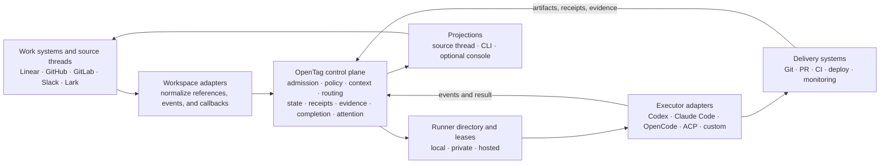
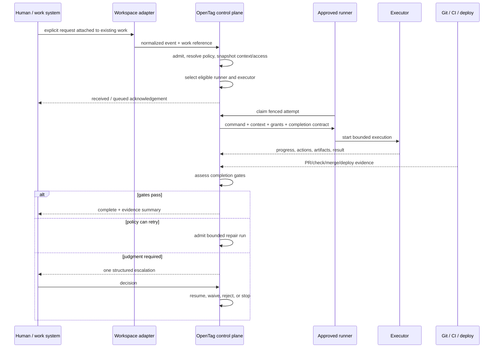

# OpenTag Software Factory Control Plane

## Status

Draft architecture proposal, updated 2026-07-21.

This document defines the proposed product and architecture direction for
OpenTag as an open control plane for governed software factories. It builds on
the current runtime; it is not a claim that all factory capabilities described
here are implemented.

Current implementation truth remains in:

- [OpenTag Design](./design.md)
- [Agent Work Protocol](./agent-work-protocol.md)
- [Thread Runtime Alignment](./thread-runtime-design.md)
- the protocol schemas in `packages/core`;
- the durable runtime in `packages/store`, `packages/dispatcher`,
  `packages/local-runtime`, and `packages/runner`.

The product and interaction-design contract for this direction is
[DESIGN.md](../DESIGN.md).

## Executive decision

> OpenTag is the open control plane for governed software factories.

OpenTag connects systems where work is defined to agents and environments where
work is executed. It governs admission, context, access, routing, durable
execution state, external actions, evidence, completion, and human attention.

OpenTag does not become the whole factory. It does not replace the planning
system, source-code host, coding agent, runner, CI/CD system, deployment system,
or observability stack. It supplies the shared control protocol and durable
governance record between them.

The architecture must preserve three existing boundaries:

- **source-thread-native**: work begins and returns where the team already works;
- **local-first**: code, credentials, and execution may remain in a
  user-controlled environment;
- **executor-neutral**: governance does not depend on one model, agent, or agent
  runtime.

The immediate product change is not “add batch agents.” It is:

> Make a single work item complete only when configured evidence proves it,
> then scale that governed loop across runners and workstreams.

## Definitions

### Software factory

A software factory is a configured system that repeatedly turns externally
defined work into accepted software outcomes through agents, tools, execution
environments, policies, evidence, and human judgment.

The term does not imply full autonomy. A governed factory may deliberately stop
for approval, clarification, exception handling, or acceptance.

### Control plane

The control plane decides and records:

- whether work may start;
- what context and authority it receives;
- where and how it may execute;
- what external effects are authorized;
- what happened during execution;
- what evidence exists;
- whether the work is complete;
- what needs human judgment;
- how the factory is performing.

The control plane does not perform repository work itself. That belongs to the
execution plane.

### Work loop

A work loop is the governed path from an explicit external work reference or
source request to an accepted completion assessment. It may contain several
runs and attempts.

A work loop is not a replacement work item. OpenTag represents it by promoting
the existing `WorkThread` into a durable governance root: an external
`WorkItemReference`, one or more `ConversationAnchor` values, and references to
the runs, completion contracts, assessments, and escalations OpenTag owns.

`WorkThread` never owns priority, assignee, sprint, roadmap, or canonical
business status. Those remain in the external work system.

### Run and attempt

- A **run** is one admitted execution request with a stable context and policy
  snapshot.
- An **attempt** is one lease-bound execution of that run on a specific runner.
- A run can succeed while the work loop remains incomplete.
- A later run can add missing evidence or repair a failed gate in the same work
  loop.

### Completion

Completion is evaluation of a versioned contract over verified evidence. It is
not a synonym for a successful process exit, an executor's final message, a
created PR, or a ticket-state mutation.

## Product boundary and systems of record

OpenTag should be the execution-governance system of record while leaving each
domain's existing system authoritative.

| Domain | Canonical owner | OpenTag responsibility |
| --- | --- | --- |
| Priority, roadmap, assignee, business status | Linear, Jira, GitHub/GitLab Issues, or another work system | Store stable references and normalized snapshots needed for execution; do not create a shadow backlog |
| Source code and change history | Git and the source-control host | Route to an approved workspace, record artifact references and action receipts |
| Agent session and tool execution | Codex, Claude Code, OpenCode, ACP runtime, or custom executor | Supply bounded input and permissions; record declared capabilities, attempts, events, and results |
| Local files, credentials, and build tools | User-controlled runner and secret manager | Refer to them through bindings and secret references; do not centralize them by default |
| Tests, checks, merge, release, and deployment | CI/CD, source-control, deployment, and observability systems | Normalize their outputs as evidence and evaluate configured completion gates |
| Admission, policy, routing, leases, receipts, completion, and escalation | OpenTag | Be the durable source of truth and explanation for execution governance |
| Human discussion and decisions | Existing source thread plus configured operator surfaces | Project concise decision requests and outcomes back to the originating context |

Two invariants follow:

1. OpenTag must not silently create or promote an internal work object as the
   planning source of truth.
2. External providers must not silently become the source of truth for OpenTag
   admission, permission, routing, or completion decisions.

## Current baseline and proposed delta

OpenTag already has much of the control-plane substrate.

| Capability | Current baseline | Proposed delta |
| --- | --- | --- |
| Work identity | `WorkItemReference`, `ConversationAnchor`, `WorkThread` currently attached primarily through runs | Promote `WorkThread` to a durable governance root across runs; do not add a shadow ticket |
| Admission | Explicit `RunAdmissionDecision`, duplicate handling, follow-up queue, one active run per scope | Resolve versioned policy and access-profile inputs; expose a complete explanation |
| Context | Stable `ContextPacket` snapshot passed to executors | Add policy provenance, retention classification, and managed/local disclosure rules |
| Permission | Grants, capability contracts, action permission requests, receipts, reconciliation | Resolve grants through an agent access profile and organization/repository policy snapshot |
| Execution | Runner claims, leases, fencing, attempts, cancellation, timeouts, executor capability snapshots | Add an explainable routing decision over eligible runners and executors |
| Output | Artifacts, verification evidence, structured run results, callbacks | Evaluate evidence against completion gates independent of run conclusion |
| Human handling | `needs_human`, `needs_approval`, source-thread commands | Add a durable, deduplicated escalation model that distinguishes approval, missing input, configuration, verification, reconciliation, and security |
| Metrics | Run, repository, work-thread, artifact, noise, and approval metrics | Add accepted-completion, queue, retry, intervention, evidence, and cost metrics |
| Factory orchestration | Durable single-scope queue and follow-up promotion | Add optional recipes, concurrency budgets, workstream admission, and evals only after the single-loop contract is proven |

This is an additive evolution. Existing adapters and executors should continue
to work under a compatibility completion contract that treats a successful run
as the only required gate until a repository or organization configures
stronger requirements.

### Terminology note: conversation control surface

The current `ConversationAnchor` schema uses a `controlPlane` field to identify
the primary human interaction and approval surface. That field does not mean the
anchor is OpenTag's architectural control plane. Avoid the double meaning in new
documentation and interfaces by calling it the **primary interaction anchor**.
Keep the existing field for compatibility until a normal versioned migration is
justified.

## Design principles

### Control existing systems; do not replace them

Every new feature must attach to a real control responsibility. Planning views,
generic chat, source hosting, build execution, and deployment execution remain
outside OpenTag.

### Separate execution outcome from work completion

`OpenTagRunResult.conclusion` continues to describe execution. A separate
`CompletionAssessment` describes whether the work loop satisfies its configured
completion contract.

### Evidence is typed and attributable

Evidence must identify its subject, source, assurance, time, and provenance.
Agent-reported evidence is allowed but cannot silently satisfy a gate requiring
provider-verified evidence.

### Human attention is policy-controlled

People receive structured escalations, not raw agent confusion. Every human
interruption must have a subject, blocking impact, correct audience, expiry,
next action, and—when applicable—bounded options.

### Local execution is not degraded hosted execution

Local and user-controlled runners are first-class factory nodes. If policy
requires local execution and no eligible local runner exists, OpenTag waits or
asks for a decision; it does not silently move the work to a hosted runner.

### Decisions are deterministic before they are optimized

Admission, eligibility, and completion use explicit rules first. Historical
performance may rank eligible execution targets later, but cannot override hard
capability, locality, permission, or policy requirements.

### Stable snapshots make history explainable

The run keeps the exact context, policy, access, capability, and routing
snapshots used at decision time. Reading an old run must not reinterpret it
under today's configuration.

### One deep governance module, not package theater

OpenTag as a whole is the control plane. The new code capability should enter
through one `@opentag/governance` module with a small command/query interface.
Policy resolution, routing, completion, and attention coordination may be
internal modules. They become independent public packages only after they have
independent callers or adapter implementations.

## System shape



### Layer ownership

#### Workspace adapters

Workspace adapters own provider-specific ingress, identity normalization,
context pointers, work-item references, callback routes, and native rendering.
They do not decide completion or runner selection.

#### Governance module

`@opentag/governance` owns domain orchestration:

- admission and idempotency;
- policy resolution and snapshotting;
- context contract creation;
- access-profile resolution;
- runner/executor eligibility and routing;
- run/attempt lifecycle coordination;
- action and evidence ingestion;
- completion assessment;
- human-escalation projection;
- work-loop and factory projections.

It consumes store, policy-source, executor-directory, evidence-resolver, and
projection interfaces. It does not invoke provider SDKs directly.

#### Store

The store remains the durable implementation for runs, attempts, leases, events,
receipts, artifacts, assessments, decisions, and metrics. It enforces identity,
idempotency, monotonic transitions, and fencing.

The store should not decide product policy. It persists already-resolved
decisions and enforces hard storage invariants.

#### Runner and executor adapters

The runner owns the real workspace and invokes an executor adapter. Executor
adapters declare capabilities and translate the stable OpenTag execution input
into an executor-specific session. They report normalized progress, actions,
artifacts, evidence, and results.

#### Evidence adapters

Evidence adapters normalize externally verified facts such as PR state,
required checks, merge state, deployment state, or monitoring state into
`VerificationEvidence`. They do not decide whether that evidence is sufficient;
the completion contract does.

#### Projection sinks

Projection sinks render semantic status, decisions, evidence, and outcomes into
source threads, CLI output, or an optional console. They may suppress routine
progress according to attention policy, but must not change the underlying
state.

## Proposed governance module

Introduce `@opentag/governance`. It is a code/domain module, not a user
interface or operator console. Its programmatic interface should stay
intentionally small:

```ts
type GovernanceCommand =
  | AdmitWorkCommand
  | ClaimWorkCommand
  | ReportAttemptCommand
  | IngestEvidenceCommand
  | ReconcileActionCommand
  | ResolveHumanEscalationCommand
  | StopWorkCommand;

type GovernanceQuery =
  | GetRunQuery
  | GetWorkLoopQuery
  | ListHumanEscalationsQuery
  | ExplainAdmissionQuery
  | ExplainRoutingQuery
  | ExplainCompletionQuery
  | GetFactoryMetricsQuery;

interface OpenTagGovernance {
  execute(command: GovernanceCommand): Promise<GovernanceCommandResult>;
  read(query: GovernanceQuery): Promise<GovernanceView>;
}
```

This interface is a design target, not a requirement to rewrite all current
dispatcher routes at once. Phase 1 may first place the interface over existing
repository operations and migrate one vertical flow through it.

The package seam is justified because the hosted dispatcher and local runtime
must make identical governance decisions. It must not become a collection of
provider pass-through functions or absorb source adapters, persistence
implementation, executor implementations, or UI rendering.

### Internal seams

The governance implementation may use these private interfaces:

```ts
interface PolicySource {
  resolve(input: PolicyResolutionInput): Promise<ResolvedPolicySnapshot>;
}

interface ExecutorDirectory {
  listEligible(input: ExecutorEligibilityInput): Promise<ExecutorCandidate[]>;
}

interface EvidenceResolver {
  resolve(input: ExternalEvidenceInput): Promise<VerificationEvidence[]>;
}

interface GovernanceRepository {
  transact<T>(operation: GovernanceTransaction<T>): Promise<T>;
}
```

Do not publish each internal interface as a separate package until at least two
real implementations require the seam.

## Canonical governed work loop



### Step-by-step semantics

1. **Resolve identity.** Normalize the source event, actor, agent target, external
   work reference, conversation anchor, and project target.
2. **Admit.** Deduplicate the event, enforce one-active-run semantics, resolve
   policy and access eligibility, and decide start, queue, reject, or human
   escalation.
3. **Snapshot input.** Persist the Context Packet, policy snapshot, access
   profile snapshot, requested capabilities, and completion contract.
4. **Route.** Filter candidates by project binding, locality, health,
   capability, access, concurrency, and policy. Record the complete decision.
5. **Lease.** An eligible runner claims an attempt through the existing fenced
   lease contract.
6. **Execute.** The runner invokes the selected executor with bounded context,
   permissions, workspace settings, and reporting interfaces.
7. **Record effects.** Material external actions pass through permission and
   receipt flows. Unknown or stale outcomes remain unresolved and block any gate
   that depends on them.
8. **Collect evidence.** Artifacts and provider callbacks become typed evidence
   with explicit assurance.
9. **Assess completion.** Evaluate every configured gate independently of the
   executor conclusion.
10. **Continue or stop.** Policy may accept, retry within budget, request human
    judgment, or close incomplete.
11. **Project.** Send a concise outcome and next action to the source thread;
    retain full detail in audit/status projections.
12. **Measure.** Derive factory metrics from durable timestamps, decisions,
    attempts, evidence, and completion outcomes.

## Durable model

### Reuse existing objects

The following existing protocol objects remain foundational:

- `OpenTagEvent`
- `WorkItemReference`
- `ConversationAnchor`
- `WorkThread`
- `ContextPacket`
- `PermissionGrant`
- `CapabilityContract`
- `OpenTagRun`
- `Attempt`
- `RunEvent`
- `MaterialActionReceipt`
- `Artifact`
- `VerificationEvidence`
- `OpenTagRunResult`
- `NextAction`

### Promote `WorkThread`; do not add a shadow work item

Phase 1 should not introduce a new mutable `WorkItem` table with title,
priority, status, assignee, or roadmap fields.

It should add durable `WorkThread` storage for the OpenTag-owned state that must
survive several runs:

```text
WorkThread
├── external WorkItemReference
├── primary and secondary ConversationAnchor values
├── active and historical Run references
├── CompletionContract versions
├── CompletionAssessment history
├── open HumanEscalation references
└── governance lineage and audit references
```

This is a governance aggregate, not a project-management object. External work
metadata is read from its canonical source when needed and may be snapshotted
only as bounded execution or policy input.

Expose a derived work-loop projection over that durable root:

```ts
type WorkLoopPhase =
  | "ready"
  | "queued"
  | "executing"
  | "verifying"
  | "waiting_human"
  | "complete"
  | "closed_incomplete";

type WorkLoopView = {
  workThread: WorkThread;
  phase: WorkLoopPhase;
  activeRunId?: string;
  runIds: string[];
  latestCompletionAssessment?: CompletionAssessment;
  openHumanEscalationIds: string[];
  evidenceSummary: {
    verified: number;
    reported: number;
    unverifiable: number;
  };
  updatedAt: string;
};
```

`WorkLoopView` is computed from the durable `WorkThread` and its related
records. It may be cached later, but its cache must not become a second planning
system of record.

### New protocol objects

The first new protocol surface should contain only three first-class objects:

1. `CompletionContract`
2. `CompletionAssessment`
3. `HumanEscalation`

Routing and access-profile details remain future snapshots or structured audit
events until the multi-runner phase proves their public interface. This keeps
the first protocol change focused on cross-run completion and human attention.
`CompletionGate`, `CompletionGateResult`, and the attributed
`CompletionWaiver` are bounded value objects inside that surface, not additional
governance aggregates.

## Completion governance

Completion is the highest-priority new capability because it turns the current
governed execution loop into a governed delivery loop.

### Completion contract

```ts
type CompletionGate =
  | {
      id: string;
      kind: "artifact";
      artifactKind: ArtifactKind;
      minimum: number;
    }
  | {
      id: string;
      kind: "verification";
      evidenceKind: string;
      subject?: string;
      requiredOutcome: "passed";
      minimumAssurance: "verified" | "reported";
    }
  | {
      id: string;
      kind: "external_state";
      provider: string;
      resourceRef: string;
      requiredState: string;
      minimumAssurance: "verified" | "reported";
    }
  | {
      id: string;
      kind: "material_action";
      actionFamily: string;
      requiredOutcome: "succeeded";
    }
  | {
      id: string;
      kind: "human_acceptance";
      requiredRole: string;
    };

type CompletionContract = {
  id: string;
  version: number;
  workThreadId: string;
  resolvedFrom: Array<{
    scope: PolicyScope;
    ref: string;
    version?: string;
  }>;
  gates: CompletionGate[];
  maxAutomaticRetries: number;
  onSatisfied:
    | "report_only"
    | "propose_work_item_transition"
    | "apply_transition_by_policy";
  createdAt: string;
};
```

The first version intentionally uses a finite gate vocabulary. It must not be an
arbitrary expression DSL, script engine, or general policy language. Provider
adapters normalize facts into artifacts, receipts, and verification evidence;
the contract evaluates that stable vocabulary. New gate kinds require explicit
schema evolution. `apply_transition_by_policy` still passes through the existing
capability, permission, material-action, reconciliation, and receipt flow; it is
not authority to mutate a work item directly.

### Gate and assessment result

```ts
type CompletionGateResult = {
  gateId: string;
  state: "passed" | "failed" | "missing" | "unknown" | "waived";
  evidenceIds: string[];
  reasonCode: string;
  reason: string;
  evaluatedAt: string;
};

type CompletionAssessment = {
  id: string;
  workThreadId: string;
  triggeredByRunId?: string;
  contractId: string;
  state: "pending" | "satisfied" | "unsatisfied" | "blocked" | "waived";
  gateResults: CompletionGateResult[];
  assessedAt: string;
  assessedBy: "opentag" | "human";
  supersedesAssessmentId?: string;
};
```

Assessments are immutable. New evidence creates a new assessment that
supersedes the previous one. This preserves an explainable history. A governed
assessment also records a cycle, monotonic sequence, deterministic input digest,
and resolved target bindings. Gates that describe delivery reference the same
target key, so a pull request artifact, check result, and merge observation from
different pull requests or head revisions can never be combined into a satisfied
assessment.

### Required semantic separation

Examples:

| Executor/run result | Completion assessment | Meaning |
| --- | --- | --- |
| `succeeded` | `pending` | Agent finished, but required checks or merge evidence have not arrived |
| `succeeded` | `unsatisfied` | Agent finished, but a required check failed |
| `succeeded` | `satisfied` | All configured evidence gates passed; the work loop is complete |
| `needs_human` | `blocked` | Execution or a gate requires judgment |
| `failed` | `pending` | A later bounded repair run is allowed by policy |
| `failed` | `unsatisfied` | Retry budget ended or policy makes the failure terminal |
| any | `waived` | An authorized human accepted scoped missing or failed gates; the waiver remains visible |

Existing run statuses must not be renamed to completion statuses. Completion is
a separate aggregate and projection.

### Evidence assurance

The current `VerificationEvidence.assurance` values remain useful:

- `verified`: OpenTag or a trusted adapter observed the provider state;
- `reported`: an executor or user reported the state;
- `unverifiable`: the claim cannot currently be checked.

Each verification or external-state gate declares the minimum assurance it
accepts. A gate that requires `verified` evidence cannot pass from an executor
summary.

### Default compatibility contract

Repositories without explicit completion configuration use one gate:

```text
verification(executor.conclusion == succeeded, assurance >= reported)
```

This preserves current behavior while making the distinction explicit. The
first recommended governed profile should add source-control and check evidence.

### First vertical profile

The first complete factory loop should support:

```text
external work item
  -> local agent run
  -> pull request artifact
  -> required checks verified
  -> merge verified
  -> completion satisfied
  -> concise source-thread outcome
```

Deployment evidence should be an optional gate in this slice, not a dependency
of the base implementation.

## Human attention and escalation

`needs_human` is a useful outcome but not a complete interaction contract. Add
a durable escalation object that distinguishes the reason, audience, blocking
impact, next action, and resolution. Not every escalation is an approval or a
question.

```ts
type HumanEscalation = {
  id: string;
  workThreadId: string;
  runId?: string;
  attemptId?: string;
  class:
    | "approval"
    | "missing_input"
    | "configuration"
    | "verification"
    | "reconciliation"
    | "security";
  audience:
    | "requester"
    | "work_item_owner"
    | "repo_owner"
    | "operator"
    | "security";
  subjectRef: string;
  state: "open" | "acknowledged" | "resolved" | "expired" | "superseded";
  blocking: boolean;
  summary: string;
  reason: string;
  options?: Array<{
    id: string;
    label: string;
    consequence: string;
  }>;
  nextAction?: ActionHint;
  dedupeKey?: string;
  openedAt: string;
  expiresAt?: string;
  resolution?: {
    optionId?: string;
    actor: ActorIdentity;
    reason?: string;
    resolvedAt: string;
  };
};
```

This object routes human attention. It does not replace the underlying
action-permission, configuration, reconciliation, or completion record.

### Attention policy

- Deduplicate escalations by work-loop, subject, class, and effective version.
- Send one source-thread message or native card when provider capability allows.
- Keep routine progress audit-visible and pullable.
- A blocking escalation pauses only the affected run or gate, not the entire
  factory.
- Expired authority-expanding requests resolve as denied or closed incomplete,
  never as implicit approval.
- A human waiver records actor, reason, policy scope, affected gates, and expiry.
- Similar open escalations may be grouped in an operator view, but each resolution
  remains individually attributable.

### Agent questions

Agents may ask questions, but OpenTag should normalize them before interrupting
a person:

1. attach the exact work and run context;
2. state whether the question blocks execution or only completion;
3. provide bounded options when possible;
4. include the consequence of no response;
5. deduplicate equivalent questions;
6. resume through a new event or controlled input path that the executor
   capability contract actually supports.

OpenTag must not pretend to inject live input into an executor that does not
support it. The safe fallback is to finish or stop the current attempt and use a
follow-up run with the human response included in a new Context Packet.

## Agent identity and access

The human actor who asks for work and the agent principal that performs work are
different identities.

In the multi-runner phase, add an additive access snapshot. It is not one of the
three new Phase 1 protocol objects:

```ts
type AgentAccessProfileSnapshot = {
  id: string;
  agentPrincipal: {
    id: string;
    kind: "opentag_agent" | "provider_agent" | "custom";
  };
  requestedBy: ActorIdentity;
  projectTargets: string[];
  connectionRefs: ConnectionRef[];
  permissions: PermissionGrant[];
  constraints: {
    locality?: "local_required" | "private_required" | "hosted_allowed";
    maximumRiskTier?: ActionRiskTier;
    allowedExecutorIds?: string[];
    allowedRunnerIds?: string[];
  };
  policySnapshotId: string;
  capturedAt: string;
};
```

Invariants:

- The profile is resolved before routing.
- The runner receives only the credential references and grants it is allowed
  to resolve.
- Human ambient credentials are not borrowed by default.
- Material actions are attributed to both the requesting actor and executing
  agent principal.
- Changes to organization policy do not rewrite an old snapshot.
- Expired or revoked access blocks new attempts and may cancel or quarantine
  active work according to policy.

## Explainable routing

Routing begins as deterministic eligibility plus stable selection, not an
opaque model-based optimizer.

Initially record the decision as a structured `placement.decided` or
`routing.decided` audit event. Promote it to a public `RoutingDecision` schema
only after more than one control-plane caller needs the interface.

```ts
type RoutingCandidate = {
  runnerId: string;
  executorId: string;
  eligible: boolean;
  reasons: Array<{
    code: string;
    message: string;
  }>;
  capacity?: {
    active: number;
    limit: number;
  };
};

type RoutingDecision = {
  id: string;
  runId: string;
  policySnapshotId: string;
  accessProfileSnapshotId: string;
  candidates: RoutingCandidate[];
  selected?: {
    runnerId: string;
    executorId: string;
  };
  reasonCode: string;
  reason: string;
  decidedAt: string;
};
```

Eligibility filters, in order:

1. runner identity and heartbeat are valid;
2. project target is bound to the runner;
3. locality requirement is satisfied;
4. executor capability satisfies context, write, source-control, completion,
   cancellation, and isolation requirements;
5. access profile allows the runner and executor;
6. required credentials and secret references are resolvable;
7. concurrency and organization budgets allow a claim.

Selection among eligible candidates may initially use a stable configured
preference. Later it may consider queue time, accepted-completion rate, cost,
and historical performance. Those signals may rank candidates but must not
override hard filters.

When no candidate is eligible, the decision is `needs_human` or queued according
to policy. OpenTag must not silently relax locality, capability, or permission
requirements.

## Policy model

Policy resolution should extend the current scoped policy vocabulary rather
than introduce a separate rule universe.

Recommended precedence:

```text
organization default
  < workspace/adapter default
  < project or repository policy
  < work item override
  < explicit one-time human decision
```

A lower-level rule may narrow authority by default. Authority expansion must be
explicitly allowed by the higher policy and attributable to an authorized
actor.

Every resolved policy snapshot includes:

- source refs and versions;
- resolution time;
- relevant admission rules;
- context inclusion and retention rules;
- access and permission rules;
- routing constraints;
- completion contract;
- retry and concurrency budgets;
- human-attention rules;
- data-disclosure rules.

Initial policy sources may be local configuration and a repository-owned file.
A managed organization policy adapter can follow without changing the control
plane interface.

## Factory recipes and workstreams

Factory mode is an optional layer above the governed work loop. It must not
enter the first completion milestone.

A recipe may:

- admit a selected set of existing external work items;
- select a completion profile;
- apply concurrency, retry, cost, and locality budgets;
- select a routing preference;
- define review or acceptance checkpoints;
- aggregate metrics by campaign or workstream.

A recipe must not:

- create an internal backlog as canonical truth;
- require a universal issue hierarchy;
- embed provider-specific ticket states in core;
- bypass normal admission, permission, receipt, evidence, or completion rules;
- create a general-purpose agent-chat topology in the human thread.

The initial workstream representation should be a recipe-owned grouping of
`WorkItemReference` or `WorkThread` keys. Dependencies remain in the external
work system or a recipe adapter. OpenTag should not add a general DAG scheduler
until at least two real factory recipes require the same dependency semantics.

## Trust, privacy, and data placement

### Default data placement

| Data | Local/user-controlled default | Managed control-plane default |
| --- | --- | --- |
| Repository contents and uncommitted files | Full access according to runner policy | Not stored |
| Credentials and tokens | Secret manager or local references | Opaque `ConnectionRef` metadata only |
| Raw tool trace and terminal output | Local audit/debug retention | Not stored unless explicitly enabled and redacted |
| Full source-thread transcript | Provider and optional local cache | Not copied by default |
| Context Packet | Full execution snapshot | Redacted summary/pointers only according to policy |
| Run/attempt state | Local cache as needed | Durable normalized state |
| Material action receipts | Full normalized receipt | Durable normalized receipt without secrets |
| Artifacts | Local or provider-owned | Metadata, URI, hashes, and allowed summaries |
| Verification evidence | Provider/local source | Durable normalized evidence and provenance |
| Metrics | Locally derivable | Aggregated operational/product metrics |

The current runtime persists the full Context Packet with the run. A hybrid
managed deployment must therefore implement an explicit custody mode before it
claims that execution context remains local. The proposed default above is a
target contract, not a description of every current relay deployment.

### Security invariants

- Every runner and attempt has stable identity plus lease fencing.
- Every material external write is authorized, receipted, or marked unknown.
- Unknown and stale side effects fail closed for dependent completion gates.
- Permission, policy, capability, context, routing, and completion snapshots are
  immutable historical evidence.
- Secret values never enter durable protocol fields or human-visible output.
- Provider callbacks are idempotent and protected against duplicate storms.
- A hosted relay cannot silently become an execution principal.
- A local-required policy cannot fall back to hosted execution without a new,
  explicit authorization decision.
- Human overrides are scoped, attributable, reasoned, and auditable.

## Presentation and interaction contract

### Source thread

The normal successful loop should produce at most:

1. a native receipt or short acknowledgement;
2. a decision request only if required;
3. a final completion or closed-incomplete summary.

Example completion summary:

```text
Complete — PR #184 merged and all required checks passed.

Evidence: PR #184 · 7/7 required checks · merge commit 7a31…
Run: ot_run_… · Executor: codex · Runner: ming-local
```

Example non-complete execution result:

```text
Execution succeeded; completion is waiting on 2 required checks.

Next: OpenTag will reassess when CI reports. No action is required yet.
Run: ot_run_…
```

Example decision:

```text
Needs your decision — deployment evidence is unavailable.

Choose: retry evidence collection, accept without deployment evidence, or stop.
Waiving the gate will be recorded for this work item only.
```

### CLI

Extend CLI projections conceptually with:

```text
opentag status --work <ref>
opentag explain admission <run-id>
opentag explain route <run-id>
opentag explain completion <work-ref>
opentag decisions list
opentag decisions resolve <decision-id> <option-id>
opentag metrics factory
```

Exact command spelling remains an implementation decision. The interface
requirement is that every control decision is queryable without a web console.

### Optional operator console

A console is a downstream projection, not a new workflow system. Its first
useful views are:

- factory health and exceptions;
- open decisions;
- runner readiness and capacity;
- work-loop/run evidence detail;
- policy explanation;
- accepted-completion and intervention metrics.

Do not build backlog, sprint, roadmap, issue editor, agent chat, or IDE surfaces.

## Failure and recovery semantics

### No eligible runner

- Keep the run queued if policy allows waiting.
- Explain every rejected candidate.
- Create one routing decision request if a human may change locality, executor,
  or target binding.
- Never select an ineligible runner to reduce queue time.

### Executor succeeds, CI fails

- Keep the executor run `succeeded`.
- Create a failed completion assessment for the CI gate.
- If retry policy allows, create a bounded repair follow-up with the failure
  evidence included in a new Context Packet.
- End with `needs_human` or `failed` when the retry budget is exhausted.

### Material action outcome is unknown

- Reconcile against target fingerprint, resource version, and provider state.
- Block completion gates that depend on the action.
- Do not repeat a potentially duplicated external write without proof or a
  scoped human decision.

### Human stops work

- Preserve current cancellation semantics.
- Do not treat stop as successful completion.
- Keep queued follow-ups paused unless policy or a later human action explicitly
  promotes them.

### Runner disappears

- Expire the fenced lease and mark the attempt interrupted.
- Reassign only if policy, workspace isolation, and action reconciliation make
  another attempt safe.
- Include prior artifacts and unresolved side effects in the new Context Packet.

### Evidence arrives late or out of order

- Ingest idempotently using provider event identity and evidence subject/version.
- Recompute a new immutable assessment.
- Never mutate the historical assessment that was shown to a user.

## Metrics and evaluation

Factory metrics must distinguish activity, execution, and accepted outcomes.

### Core metrics

| Metric | Definition | Why it matters |
| --- | --- | --- |
| `admission_to_completion_duration` | Accepted admission to satisfied completion assessment | End-to-end factory cycle time |
| `queue_wait_duration` | Admission to first valid attempt start | Capacity and routing health |
| `autonomous_completion_rate` | Satisfied work loops with no human escalation divided by satisfied work loops | Useful autonomy, not raw invocation volume |
| `first_pass_completion_rate` | Work loops satisfied after the first run | Context and executor quality |
| `human_escalations_per_completion` | Resolved human escalations divided by satisfied work loops | Human attention cost |
| `human_escalation_latency` | Open to resolved escalation duration | Coordination bottleneck |
| `retry_amplification` | Attempts and runs per satisfied work loop | Hidden factory load |
| `evidence_coverage_rate` | Required gates with accepted evidence divided by required gates | Completion trust quality |
| `unknown_material_action_rate` | Unknown or stale material actions divided by material actions | External-write safety |
| `cost_per_accepted_completion` | Tracked execution cost divided by satisfied or explicitly waived work loops | Economic efficiency |
| `executor_acceptance_rate` | Satisfied completions attributable to an executor divided by its completed runs | Better than process success rate alone |
| `thread_noise_ratio` | Human-visible messages divided by audit/debug events | Attention-budget health |

Metrics must be segmentable by organization, project, repository, workstream,
executor, runner locality, completion profile, and time window without exposing
raw work content.

### Evaluation

Factory evaluation should begin with real completion evidence and sampled human
review. Synthetic or replay evaluation can follow once the protocol captures:

- the stable Context Packet;
- policy and access snapshots;
- executor capability and routing decision;
- action receipts;
- artifacts and evidence;
- completion assessment;
- human escalations, resolutions, and corrections.

Do not optimize routing on executor self-reported success. Use accepted
completion, retry load, human correction, cost, and latency.

## Deployment shapes

### Local open-source

```text
provider events -> local dispatcher/control plane -> SQLite -> local runner
```

- Best for individuals, pilots, private repositories, and fully local control.
- All protocol and policy behavior remains available.
- No managed dependency is required after provider ingress is arranged.

### Hybrid managed control plane

```text
managed relay/control metadata <-> authenticated local/private runners
```

- Managed layer owns organization identity, policy distribution, runner
  registry, normalized state, audit retention, decision routing, and metrics.
- Local/private runners retain code, credentials, raw execution trace, and full
  Context Packets unless policy explicitly allows disclosure.
- This is the most plausible commercial deployment.

### Fully self-hosted

- Organizations run ingress, control plane, durable store, policy source, and
  runner registry in their own environment.
- The same protocol and adapters are used as in managed deployment.

### Hosted execution

Hosted runners are an optional execution adapter, not the default definition of
OpenTag. They compete through the same capability, access, routing, receipt,
and completion contracts as local runners.

## Commercial boundary

The open-source product should include:

- protocol schemas;
- local control-plane runtime;
- local runner and executor adapter interface;
- source adapters;
- policy and completion evaluation;
- local audit, evidence, and CLI projections;
- self-hosted deployment path.

A managed offering may provide:

- reliable ingress/relay and callback delivery;
- organization identity and access profiles;
- fleet-wide runner/device registry and readiness;
- centralized policy distribution and explanation;
- retained audit/evidence metadata;
- escalation inbox and audience-aware routing;
- factory metrics and evaluation dashboards;
- enterprise data-residency, retention, and compliance controls.

Raw execution is not the primary commercial moat. Coordinated trust,
governance, and visibility across heterogeneous tools and runners is.

## Implementation plan

### Phase 1 — Completion governance

Goal: prove one work item can reach evidence-backed completion without changing
the current invocation experience.

Deliver:

- durable standalone `WorkThread` storage across runs;
- additive `CompletionContract`, `CompletionGateResult`,
  `CompletionAssessment`, and `HumanEscalation` schemas;
- durable contract, assessment, and escalation records and events;
- compatibility completion contract;
- GitHub PR, required-check, and merge evidence ingestion;
- completion evaluation on new result/evidence/receipt events;
- concise source-thread and CLI completion projections;
- minimal human escalation/waiver path that reuses existing approval
  infrastructure only when the subject is actually an approval;
- one live end-to-end proof from external work item to merged PR and satisfied
  assessment.

Do not deliver:

- batch scheduling;
- historical-performance routing;
- a large web console;
- generic workflow DAGs;
- broad provider parity.

Suggested code ownership:

- `packages/core`: additive protocol schemas and reason codes;
- `packages/store`: durable assessments, events, idempotency, and metrics;
- `packages/governance`: evaluation and command/query orchestration;
- `packages/github`: normalized PR/check/merge evidence;
- `packages/dispatcher`: thin ingress and callback wiring;
- `packages/cli`: status and explanation projection.

Exit gate:

> A run may report success, but OpenTag reports “Complete” only after the
> configured PR/check/merge evidence passes. The assessment is explainable and
> replay-safe.

Phase 1 delivery-epoch boundary:

- the latest run attached to a `WorkThread` is the current delivery epoch;
- run results, artifacts, and material-action receipts are admitted only from
  that latest run;
- external verification evidence must be durably observed during the current
  run epoch before it can satisfy the contract;
- waivers are bound to the current run and cannot satisfy a later run;
- duplicate result/evidence delivery, completion reads, and dispatcher startup
  all deterministically reassess durable inputs so a process crash cannot leave
  a persisted fact permanently detached from its assessment.

This is the smallest replay-safe boundary for Phase 1. A public
`BeginGovernedDeliveryCycle` command, cycle-versioned contracts, and a complete
input-revision ledger remain deferred until OpenTag supports explicit multi-run
delivery cycles instead of inferring the active epoch from the latest run.

### Phase 2 — Human escalation and access identity

Goal: make every blocking exception structured, attributable, and resumable.

Deliver:

- `AgentAccessProfileSnapshot` as an additive future snapshot;
- complete `HumanEscalation` audience and resolution flows;
- source-thread and CLI resolution flows;
- expiry, deduplication, waiver, and audit semantics;
- separation between requesting human and executing agent identity;
- policy snapshot provenance.

Exit gate:

> Every `needs_human` state points to one structured escalation or a stable
> reason why no human resolution is available.

### Phase 3 — Explainable multi-runner routing

Goal: safely route work across several local, private, or hosted execution
targets.

Deliver:

- runner/executor directory backed by current capability and readiness data;
- structured routing/placement decision events, promoted to a public snapshot
  only if multiple callers require it;
- deterministic eligibility filters;
- configured preference and concurrency budgets;
- no-eligible-runner decisions;
- route explanation in audit and CLI;
- accepted-completion metrics by executor and runner.

Exit gate:

> For every run, OpenTag can explain why the selected target was eligible and why
> alternatives were rejected, without relaxing policy implicitly.

### Phase 4 — Factory recipes, workstreams, and evaluation

Goal: scale the proven governed loop without introducing a new planning system.

Deliver only from demonstrated use cases:

- recipe-owned grouping of external work references;
- concurrency, cost, retry, and locality budgets;
- batch admission and quiet exception summaries;
- workstream metrics;
- replay/synthetic evaluation using captured protocol artifacts;
- optional operator console for decisions, runners, policy, evidence, and
  factory health.

Exit gate:

> A team can operate several concurrent work loops with bounded human attention
> and measure accepted outcomes, while Linear/GitHub/Jira remains the planning
> system of record.

## Compatibility and migration

1. Add schemas and tables without changing existing required fields.
2. Preserve `OpenTagRunResult.conclusion` and terminal run statuses.
3. The default completion contract maps current successful runs to satisfied
   completion.
4. Introduce new completion callbacks only when an adapter supports them; keep
   existing final callbacks as a compatibility projection.
5. Route one GitHub vertical slice through `@opentag/governance` before
   migrating all providers.
6. Keep current admission, follow-up, lease, receipt, and callback semantics
   unless a versioned protocol decision explicitly changes them.
7. Derive work-loop views from existing work-thread/run identity before adding
   cached projections.
8. Add managed policy and fleet features behind adapters, not conditionals
   spread across core.

## Verification strategy

### Schema and transition tests

- Old runs parse and render without completion fields.
- Policy and assessment snapshots are immutable.
- Assessment supersession is monotonic and idempotent.
- A run result cannot directly mark completion without gate evaluation.
- Late evidence creates a new assessment.
- Unknown action receipts block dependent gates.
- Human waiver requires actor, scope, reason, and affected gates.

### Control-plane tests

- Duplicate source events do not create duplicate runs or assessments.
- Policy resolution produces the same snapshot in local and hosted entry paths.
- No eligible runner results in queue or a decision, never unsafe fallback.
- Revoked access blocks new attempts.
- Retry budget is enforced under concurrent evidence and result events.
- A stopped run does not auto-pass completion or auto-promote paused follow-ups.

### Adapter contract tests

- GitHub and GitLab evidence adapters normalize equivalent PR/MR concepts
  without leaking provider-specific fields into completion core.
- Provider callbacks render execution success separately from completion pass.
- Unsupported rich UI falls back to equivalent plain text.
- Callback dedupe keys prevent duplicate decision or completion storms.

### Live proof

The first release claiming factory control-plane completion must record a real
proof containing:

- an external work reference and source anchor;
- admission and policy snapshot;
- Context Packet snapshot;
- agent access and routing explanation;
- fenced local attempt;
- PR artifact;
- provider-verified required checks;
- provider-verified merge state;
- satisfied completion assessment;
- concise source-thread projection;
- derived end-to-end metric sample.

Passing unit tests without this live loop is implementation evidence, not
product proof.

## Rejected designs

### All-in-one software factory

Rejected because it would force OpenTag to compete with work systems, IDEs,
source hosts, agent runtimes, and CI/CD products while weakening the open
control-plane seam.

### Internal ticket and workflow database

Rejected because it breaks the promise that existing work remains canonical and
creates synchronization and ownership conflicts.

### “Executor succeeded” means complete

Rejected because process success cannot prove required checks, merge,
deployment, or acceptance.

### Provider-specific completion fields in core

Rejected because `githubPrMerged` or `linearIssueDone` would make completion
non-portable. Provider adapters should emit normalized evidence consumed by
namespaced evaluators.

### Build all factory packages immediately

Rejected because package names are not architecture. Begin with one deep
`@opentag/governance` module and split only around demonstrated independent
seams.

### Autonomous batch scheduling before single-loop proof

Rejected because it multiplies incomplete work, retries, and human attention
before completion semantics are trustworthy.

### Raw agent transcripts as the audit record

Rejected because they are noisy, privacy-sensitive, executor-specific, and
poor evidence of external effects. Durable structured events, receipts,
artifacts, and assessments are the record.

## Decision gates before public repositioning

OpenTag may use the control-plane language internally now. Publicly claiming a
complete software-factory control plane should wait until:

1. one evidence-backed completion loop works live;
2. execution success and work completion are visibly distinct;
3. at least two executor paths use the same governance contract;
4. no-eligible-runner and needs-human paths are structured and recoverable;
5. factory metrics report accepted outcomes rather than only run activity;
6. local/private execution remains a first-class verified path.

Until then, the current public promise remains accurate:

> Turn an existing work thread into a governed agent work loop.

The factory-control-plane direction explains where that loop grows; it should
not overstate current shipping capability.

## Open questions and default assumptions

| Question | Default assumption for implementation | Decision trigger |
| --- | --- | --- |
| First completion provider | GitHub PR + required checks + merge | Change only if another provider has a stronger live pilot |
| Completion contract location | Repository/local config first, managed org adapter second | Required before multi-organization hosted control |
| First UI | Source thread + CLI | Add a web console only when decisions/runners/policy cannot be operated clearly through existing surfaces |
| Work-loop persistence | Durable `WorkThread` governance root plus derived `WorkLoopView` | Add a view cache only after query cost or product navigation requires it |
| Retry behavior | Disabled by default except explicit bounded profiles | Enable when duplicate-side-effect and context-refresh safety are proven |
| Deployment evidence | Optional namespaced gate | Promote to recommended profile after one real deploy integration |
| Batch/workstream dependencies | External system or recipe-owned | Add core dependency semantics only after two independent recipes converge |
| Managed Context Packet retention | Redacted summary and pointers only | Expand only through explicit organization policy and security review |

## Architecture test

The design is successful if OpenTag can truthfully answer these questions for
any governed work loop:

1. What external work and conversation caused this execution?
2. Why was it admitted?
3. What exact context and policy were used?
4. Which agent identity received which authority?
5. Why was this runner and executor selected?
6. What attempts ran, and which leases were valid?
7. What material external actions occurred or remain unknown?
8. Which artifacts and verified evidence exist?
9. Why is the work complete, incomplete, or waiting for a person?
10. How much time, retry load, human attention, and cost did the accepted outcome
    require?

If OpenTag can answer all ten without owning the backlog, code, agent runtime,
or CI/CD system, it is acting as the software factory's control plane.
